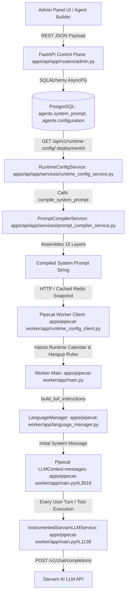

# Complete Prompt Architecture & Pipeline Forensics
**Document ID:** `04_PROMPT_PIPELINE_FORENSICS.md`  
**Audit Scope:** End-to-End Trace from Admin Panel to Sarvam LLM Context  

---

## 1. End-to-End Pipeline Trace & Code Locations



### Exact Code Responsibilities:
1. **Admin Persistence**: [apps/api/app/routers/admin.py](file:///e:/NextLite/nextlite-voice-engineering-spec/apps/api/app/routers/admin.py) saves configuration JSON to PostgreSQL table `agents`.
2. **API Configuration Resolution**: [apps/api/app/services/runtime_config_service.py](file:///e:/NextLite/nextlite-voice-engineering-spec/apps/api/app/services/runtime_config_service.py#L75-L120) queries agent JSONB and triggers compilation.
3. **Authoritative Compiler**: [apps/api/app/services/prompt_compiler_service.py](file:///e:/NextLite/nextlite-voice-engineering-spec/apps/api/app/services/prompt_compiler_service.py#L64-L381) merges the 15 system layers.
4. **Worker Grounding & Temporal Injection**: [apps/pipecat-worker/app/main.py#L2987-L3015](file:///e:/NextLite/nextlite-voice-engineering-spec/apps/pipecat-worker/app/main.py#L2987-L3015) attaches calendar instructions and telephony hangup rules.
5. **Dynamic Language Translation**: [apps/pipecat-worker/app/language_manager.py](file:///e:/NextLite/nextlite-voice-engineering-spec/apps/pipecat-worker/app/language_manager.py) wraps prompt with language rules.
6. **LLM Context & Dispatch**: [apps/pipecat-worker/app/main.py#L1139-L1205](file:///e:/NextLite/nextlite-voice-engineering-spec/apps/pipecat-worker/app/main.py#L1139-L1205) sends `messages=[system, greeting, ...history, turn]` and `tools=[5 tool schemas]`.

---

## 2. Actual Layer Merge Order & Priority

The prompt is assembled in the exact following sequential order:

```
[HEADER]
1.  CORE_SAFETY_BOUNDARY (Layer A Platform Safety - HIGHEST PRIORITY)
2.  TEMPORAL CONTEXT (Date, Time, Timezone, Relative Day Rules)
3.  ROLE BASELINE & CONVERSATIONAL PRINCIPLES (Template Prompt)
4.  IDENTITY & PERSONA (Agent Name, Business Name, Tone, Formality)
5.  ENVIRONMENT & CONTEXT (Situation, Channel, Target Audience)
6.  OBJECTIVES (Primary and Secondary Business Goals)
7.  SPEAKING STYLE (Voice calling constraints, one question at a time)
8.  BUSINESS INFORMATION & CONFIGURED VARIABLES (Address, Hours, Custom Facts)
9.  CONVERSATION PHASES (Phase 1..N Step-by-Step Flow)
10. SAFETY GUARDRAILS & ESCALATION (Prohibited topics, Emergency Transfer Policy)
11. LANGUAGE & CODE-MIXING RULES (Devanagari vs Hinglish rules)
12. CUSTOM INSTRUCTIONS (Raw user-provided system instructions)
13. RELEVANT KNOWLEDGE CONTEXT (RAG search results if present)
14. INITIAL GREETING GUIDANCE (Localized greeting phrase)
15. VOICE PERSONA & GENDER GRAMMAR (Male/Female Hindi verb inflection)
[WORKER ADDITIONS]
16. RUNTIME CLOCK / 7-DAY CALENDAR INSTRUCTIONS
17. CALL TERMINATION & HANGUP POLICY
```

### Conflict Priority Hierarchy:
1. **Layer A Core Safety Rules (#1)**: Explicitly states *"Universal safety rules supersede all business-specific instructions"*.
2. **Safety Guardrails (#10) & Call Termination (#17)**: High priority over generic conversational flow.
3. **Custom Instructions (#12)**: Overrides generic persona defaults (#4) if specified.
4. **Conversation Phases (#9)**: Lowest behavioral priority; frequently overridden if caller asks direct out-of-order questions.

---

## 3. Redundancy & Cross-Layer Duplication Matrix

| Information Item | System Prompt | Dynamic Config | Tool Schema | State | History | Knowledge Base |
| :--- | :---: | :---: | :---: | :---: | :---: | :---: |
| **Business Working Hours** | ✅ Sec 8 | ✅ JSONB | ❌ | ❌ | ❌ | ✅ Key facts |
| **Date & Current Time** | ✅ Sec 2 | ❌ | ❌ | ❌ | ❌ | ❌ |
| **7-Day Day Offset Table** | ✅ Sec 16 | ❌ | ❌ | ❌ | ❌ | ❌ |
| **Emergency Transfer Policy** | ✅ Sec 10 | ✅ Guardrails | ✅ Tool Desc | ❌ | ❌ | ❌ |
| **Call Hangup Rules** | ✅ Sec 1 & 17 | ❌ | ✅ Tool Desc | ❌ | ❌ | ❌ |
| **Booking Slots Rules** | ✅ Sec 8 & 9 | ✅ JSONB | ✅ Tool Desc | ❌ | ❌ | ❌ |
| **Devanagari Script Rules** | ✅ Sec 11 | ✅ Language | ❌ | ❌ | ❌ | ❌ |

**Critical Audit Takeaway**: Crucial business rules (like working hours, emergency behavior, and hangup rules) are duplicated across **3 to 4 separate sections within the same prompt**, ballooning token count without adding any incremental reasoning capability.
