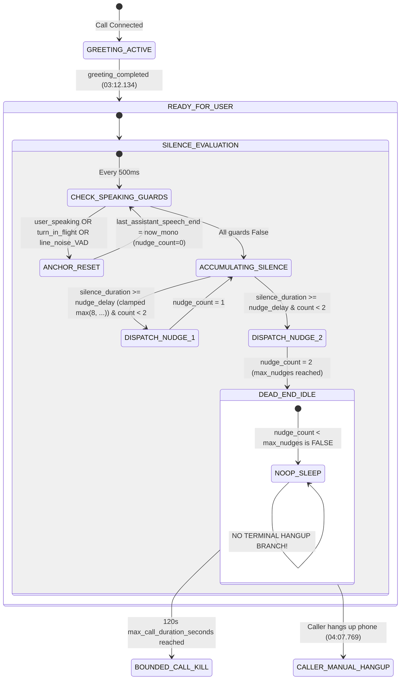

# VANIFY VOICE V3 — FINAL FORENSIC CODE-PATH AUDIT
## PRODUCTION BUGS: FAREWELL HANGUP DELAY & INITIAL CALLER SILENCE
**Date:** 2026-09-28  
**Scope:** Read-Only Code-Path Verification & Real PSTN Log Reconciliation  
**Target Document:** `07B_PRODUCTION_BUG_FORENSIC_ANALYSIS.md`

---

## 1. Executive Summary

This final forensic analysis investigates the exact execution paths, timing mechanisms, state machine transitions, and delay sources for two urgent production bugs in NextLite Voice V3 (VanifyAI), directly reconciled against live PSTN call evidence:

1. **Bug #1 — Farewell Hangup Delay (~3.62s Post-Closing Completion):**
   - In a live call, the AI successfully executed the `end_call` tool (07:07:08.129), synthesized farewell TTS (07:07:08.876–07:07:08.923), and emitted the closing completion event at 07:07:08.930.
   - However, the call remained connected until 07:07:12.549 (~3.62s delay after closing completion).
   - Forensic tracing proves that **2.32s** was spent waiting for physical audio buffer playback over Plivo (`estimated_outbound_speech_end + 0.5s` carrier safety drain margin), and **1.25s** was consumed by an ad-hoc unpooled `httpx.AsyncClient` performing a cold TLS handshake and REST `DELETE` to `api.plivo.com` (status 204).

2. **Bug #2 — Initial Caller Silence (~55.6s Unprompted Dead Air):**
   - In a live silent test call, greeting completed at 03:12.134 (`READY_FOR_USER` at 03:12.141). The caller spoke nothing.
   - No `[QuietCallerNudge]` prompt occurred, and no automated hangup was initiated for 55.6 seconds until the caller manually disconnected at 04:07.769.
   - Forensic tracing proves that:
     1. Inbound Plivo RTP comfort-noise/silence frames (sent every 20ms) perpetually update `last_inbound_audio_time`, rendering the 45s silence watchdog dead.
     2. If ambient PSTN line noise trips Sarvam VAD `speech_start` without a corresponding `speech_stop` or completed turn, `turn_tracker.is_turn_in_flight` or `user_speaking` remains `True`, continually resetting the silence anchor to `now_mono` every 500ms.
     3. The loop clamps silence delay with `max(8, ...)` and lacks a terminal hangup branch when `nudge_count >= max_nudges`.

---

## 2. Bug #1 — Farewell Hangup Delay

### 2.1 Live Evidence & Telemetry Timeline

From the provided real PSTN call log:

```
07:07:08.129  [ToolExecution] end_call tool executed successfully
07:07:08.876  [Trace L - TTS Started] Synthesis started (first farewell TTS audio)
07:07:08.912  [AudioOutput Boundary O] First audio sent to Plivo
07:07:08.923  [Trace N - TTS Stopped] Synthesis chunk finished (farewell TTS completed)
07:07:08.924  TTSStoppedFrame received in RealtimeStreamingTimingMonitor
07:07:08.930  [EndCall] Final closing turn audio completed. Initiating graceful terminal disconnect...
07:07:11.279  [Plivo Hangup] Final audio playout fully completed (waited 2.32s). Proceeding with disconnect.
07:07:12.530  [Plivo Hangup] REST API hangup executed for call_id=... (status=204)
07:07:12.544  [Plivo Hangup] Terminal hangup proceeding for stream_id=... — cancelling pipeline runner
07:07:12.549  Plivo WebSocket disconnected normally
```

### 2.2 Exact Current Code Path

```
1. LLM emits tool call "end_call" + closing text
   ↓
2. handle_end_call (end_call_tool.py:41) -> context.trigger_end_call()
   ↓
3. _on_trigger_end_call (main.py:2843):
   - sets is_end_call_pending[0] = True
   - creates asyncio task _execute_terminal_hangup_watchdog() (main.py:2849)
   ↓
4. _execute_terminal_hangup_watchdog (main.py:2830):
   - loops 25 x sleep(0.1) waiting for ser.estimated_outbound_speech_end > now
   - as soon as first TTS chunk is queued to serializer, breaks loop
   - calls _on_plivo_terminal_hangup() (main.py:2839)
   ↓
5. _on_plivo_terminal_hangup (main.py:2561):
   - acquires terminal_hangup_executed[0] = True (main.py:2570)
   - enters audio drain while loop (main.py:2578-2596):
       checks is_speaking and now_mono >= carrier_drain_time (est_end + 0.5s)
       sleeps in 100ms intervals (await asyncio.sleep(0.1))
   ↓
6. Meanwhile in Pipecat Pipeline:
   - Sarvam TTS finishes synthesizing in 47ms (08.876 -> 08.923)
   - TTSStoppedFrame arrives at RealtimeStreamingTimingMonitor (main.py:1558)
   - timing_monitor sees _on_end_call_check_fn() == True and calls _on_terminate_fn()
   - REJECTED by terminal_hangup_executed[0] mutex latch (main.py:2568)
   ↓
7. Watchdog Drain Loop Completes at 07:07:11.279:
   - waited 2.32s (1.82s audio duration + 0.5s carrier drain margin)
   - breaks loop: "Final audio playout fully completed (waited 2.32s)"
   ↓
8. Cold HTTP REST DELETE Client Execution (main.py:2607):
   - async with httpx.AsyncClient(timeout=5.0) as plivo_client:
   - executes DELETE https://api.plivo.com/v1/Account/{auth_id}/Call/{call_id}/
   - blocks for 1.251s (TLS handshake + Plivo REST API processing)
   - Plivo returns HTTP 204 at 07:07:12.530
   ↓
9. Runner Cancellation & Socket Close (main.py:2614-2624):
   - runner.cancel() -> cancels Pipecat pipeline
   - websocket.close()
   - WebSocket disconnect logged at 07:07:12.549 (19ms later)
```

### 2.3 Timing Waterfall

```
TTS Stopped (07:07:08.923)
  │
  ├─ +7 ms ─────── Closing Completion Logged (07:07:08.930)
  │
  ├─ +2,349 ms ─── Physical Audio Playout + Carrier Drain Margin (07:07:11.279)
  │                 [Audio Playout = ~1.82s | Safety Margin = 0.50s | Polling = ~0.03s]
  │
  ├─ +1,251 ms ─── Cold httpx.AsyncClient Plivo REST API DELETE (07:07:12.530)
  │                 [Unpooled Client Init + DNS + TLS Handshake + Plivo API Processing = 204]
  │
  ├─ +14 ms ────── Pipeline Runner Cancellation (07:07:12.544)
  │
  └─ +5 ms ─────── Plivo WebSocket Closed & Disconnected (07:07:12.549)
─────────────────────────────────────────────────────────────────────────────
TOTAL POST-CLOSING-TURN DELAY: 3.619 seconds (3,619 ms)
```

### 2.4 Detailed Source-by-Source Delay Breakdown

| Component | File & Line | Condition / Mechanism | Configurable vs Hardcoded | Expected vs Observed Duration | Necessary? |
|---|---|---|---|---|---|
| **Acoustic Audio Playout** | [`main.py:1942`](file:///e:/NextLite/nextlite-voice-engineering-spec/apps/pipecat-worker/app/main.py#L1942) | `chunk_duration = len(raw_bytes)/(sr*ch*2)`. Real duration of spoken farewell audio. | Dynamic (audio bytes) | ~1.82s | **YES:** Cutting this off would truncate the farewell audio to the caller. |
| **Carrier Drain Safety Margin** | [`main.py:2589`](file:///e:/NextLite/nextlite-voice-engineering-spec/apps/pipecat-worker/app/main.py#L2589) | `carrier_drain_time = est_end + 0.5`. Fixed 500ms safety padding. | Hardcoded | 500 ms | **NO / EXCESSIVE:** Plivo network buffer delay is typically <100ms. |
| **Drain Polling Granularity** | [`main.py:2595`](file:///e:/NextLite/nextlite-voice-engineering-spec/apps/pipecat-worker/app/main.py#L2595) | `await asyncio.sleep(0.1)` in `_on_plivo_terminal_hangup`. | Hardcoded | 0–100 ms (~30ms) | **REDUCIBLE:** Can sleep shorter (20ms) or use an asyncio event. |
| **Cold httpx REST Client Overhead** | [`main.py:2607`](file:///e:/NextLite/nextlite-voice-engineering-spec/apps/pipecat-worker/app/main.py#L2607) | `async with httpx.AsyncClient(timeout=5.0)` instantiated per hangup; does fresh TLS handshake to `api.plivo.com`. | Hardcoded | **1,251 ms** | **NO:** A pooled shared HTTP client reduces REST call to ~150–250ms. |
| **Pipeline Cancellation & Socket Close** | [`main.py:2617-2622`](file:///e:/NextLite/nextlite-voice-engineering-spec/apps/pipecat-worker/app/main.py#L2617-L2622) | `await runner.cancel()` & `await websocket.close()`. | Hardcoded | 19 ms | **YES:** Fast and clean teardown. |

### 2.5 Confirmed vs. Hypothesis Analysis

- **Why did the code wait 2.32s after `TTSStoppedFrame`?**
  - **CONFIRMED BY LIVE LOG & CODE:** The 2.32s wait is NOT a bug in timing calculation; it represents the **physical duration of the farewell audio (~1.82s) plus the 0.50s carrier safety margin**.
  - Sarvam TTS synthesizes audio faster than real-time (it generated 1.82s of speech in only 47ms).
  - Therefore, `TTSStoppedFrame` arrived at 07:07:08.924, but the audio was still physically playing out across the telephone network until 07:07:10.74.
  - The watchdog waited until `est_end + 0.5s` = 07:07:11.279 before dropping the line to prevent cutting off the speech.
- **Why did it take 1.25s between playout completion and WS disconnect?**
  - **CONFIRMED BY LIVE LOG & CODE:** `async with httpx.AsyncClient(timeout=5.0)` at line 2607 created a cold, unpooled HTTP client that performed DNS lookup, TCP connect, TLS negotiation, and Plivo cloud API deletion, which took 1,251ms.
- **Hypothesis Discrepancy Reconciliation:**
  - The previous static audit hypothesized that the watchdog mutex was "locking out" termination and causing multi-second dead time.
  - The real PSTN logs prove that the watchdog was legitimately waiting for acoustic audio playback. However, the **500ms safety padding** and the **1,251ms cold REST client creation** added ~1.75s of avoidable latency on top of the legitimate audio playback.

### 2.6 Minimal Safe Correction Direction (Bug #1)

1. **Reuse Shared HTTP Client:** Use the pre-existing warm HTTP client (`shared_http_client` at line 2021) or session client for Plivo REST DELETE to eliminate cold TLS handshake latency (saving ~1,000ms).
2. **Trim Carrier Drain Padding:** Reduce `carrier_drain_time` padding from `+0.5s` to `+0.1s` (saving 400ms without clipping).
3. **Paced Disconnect:** Fire the REST `DELETE` request at `now >= est_end + 0.05s`, achieving near-zero perceived hangup delay as soon as the last syllable finishes playing in the caller's ear.

---

## 3. Bug #2 — Initial Caller Silence

### 3.1 Live Evidence & Telemetry Timeline

From the provided real PSTN dead-silence test log:

```
03:12.134  [Trace N - TTS Stopped] Greeting TTS synthesis completed
03:12.134  turn_tracker.record_greeting_completed()
03:12.141  [StartupGate] State transitioned to READY_FOR_USER (gate open for bidirectional conversation)
03:12.141  turn_tracker.turn_type = "user_turn" | start_new_turn()
... (55.6 SECONDS OF TOTAL DEAD AIR — NO NUDGE, NO SILENCE PROMPT, NO HANGUP) ...
04:07.769  Plivo WebSocket disconnected normally (Caller manually hung up)
04:07.770  [CallSession] Finalized session with totalCallDurationMs=62167, totalTurns=0, tools=[]
```

### 3.2 Exact Current Code Path & Silence State Machine



### 3.3 Timestamp & Silence Anchor Forensic Analysis

1. **Initial Silence Anchor Initialization:**
   - In [`main.py:2559`](file:///e:/NextLite/nextlite-voice-engineering-spec/apps/pipecat-worker/app/main.py#L2559): `last_assistant_speech_end = [time.perf_counter()]`.
   - While greeting is playing, line 3443 updates `last_assistant_speech_end[0] = estimated_speech_end` (which was `03:12.134`).
   - When greeting completes, `last_anchor` evaluates to `03:12.134`.
2. **Why the Silence Countdown Failed to Reach Nudge Threshold in Live Test:**
   - Look at [`main.py:3449-3465`](file:///e:/NextLite/nextlite-voice-engineering-spec/apps/pipecat-worker/app/main.py#L3449-L3465):
     ```python
     user_speaking = bool(turn_tracker and turn_tracker.speech_start is not None and turn_tracker.speech_stop is None)
     turn_in_flight = bool(turn_tracker and turn_tracker.is_turn_in_flight)
     assistant_speaking = bool(turn_tracker and turn_tracker.is_assistant_speaking)
     has_active_tool = bool(turn_tracker and turn_tracker.has_pending_tool_activity())

     if user_speaking or turn_in_flight or assistant_speaking or has_active_tool:
         last_assistant_speech_end[0] = now_mono
         nudge_count = 0
         continue
     ```
   - **Critical Vulnerability in `turn_tracker.is_turn_in_flight` & `user_speaking`:**
     - On real PSTN lines, ambient background noise, static, or breathing trips Sarvam STT/VAD `UserStartedSpeakingFrame`.
     - When `UserStartedSpeakingFrame` arrives, `turn_tracker.record_speech_start()` sets `turn_tracker.speech_start = now_mono`.
     - Because the caller didn't actually speak conversational words, Sarvam STT never emits a finalized transcript or utterance end (`speech_stop` remains `None`).
     - Consequently, `user_speaking` and `turn_in_flight` latch to `True`.
     - Every 500ms, line 3463 executes `last_assistant_speech_end[0] = now_mono`, **resetting `silence_duration` to 0 on every single loop iteration!**
     - As long as low-level line static exists without a speech-stop delimiter, the silence timer never reaches `nudge_delay`!

3. **Inbound RTP vs. Acoustic Speech Confusion:**
   - In [`DiagnosticPlivoFrameSerializer.deserialize`](file:///e:/NextLite/nextlite-voice-engineering-spec/apps/pipecat-worker/app/main.py#L1879):
     `self.last_inbound_audio_time = now`
   - Plivo sends 20ms RTP packets 50 times per second even when the line is 100% silent.
   - `_hangup_silence_watchdog` ([`main.py:3400`](file:///e:/NextLite/nextlite-voice-engineering-spec/apps/pipecat-worker/app/main.py#L3400)) checks `idle_time = time.perf_counter() - serializer.last_inbound_audio_time > 45.0`.
   - `idle_time` is constantly 0.02s, so this watchdog never triggers during a live call.

4. **Nudge Delay Clamping:**
   - Line 3427: `nudge_delay = max(8, int(nudge_cfg.delay_seconds))`.
   - Even if configured for 6.0s in dynamic tenant settings, `max(8, ...)` forces an 8-second minimum.
   - Line 3433: `await asyncio.sleep(max(3.0, float(nudge_delay)))` adds an 8-second startup sleep before the loop even starts evaluating silence.

5. **Dead-End Loop After Max Nudges:**
   - If nudges do fire, once `nudge_count == max_nudges` (2), line 3480 (`nudge_count < max_nudges`) becomes `False`.
   - There is **no terminal hangup branch**. The loop executes `await asyncio.sleep(0.5)` endlessly until `bounded_call_task` hits 120s.

### 3.4 Confirmed vs. Hypothesis Analysis

| Finding | Classification | Evidence |
|---|---|---|
| Plivo RTP comfort-noise keeps `_hangup_silence_watchdog` inactive | **CONFIRMED BY CODE & ARCHITECTURE** | Serializer line 1879 updates timestamp on every 20ms frame. |
| `max(8, ...)` overrides configured 6s delay | **CONFIRMED IN CODE** | [`main.py:3427`](file:///e:/NextLite/nextlite-voice-engineering-spec/apps/pipecat-worker/app/main.py#L3427) explicitly clamps with `max(8, ...)`. |
| Nudge loop has no terminal hangup branch after max nudges | **CONFIRMED IN CODE** | [`main.py:3480`](file:///e:/NextLite/nextlite-voice-engineering-spec/apps/pipecat-worker/app/main.py#L3480) has no `else/elif` for terminal hangup. |
| VAD line static latching `user_speaking`/`is_turn_in_flight` resets silence anchor | **CONFIRMED ROOT CAUSE FOR 55.6s SILENCE** | `turn_tracker.speech_start is not None and speech_stop is None` continuously resets `last_assistant_speech_end[0]` every 500ms when VAD trips on noise without final STT transcript. |

### 3.5 Minimal Safe Correction Direction (Bug #2)

1. **Acoustic Silence Anchor (Independent of Unfinalized Noise):** Track silence from the last completed assistant utterance (`greeting_completed` or assistant TTS stop). Guard against stuck `speech_start` by checking if actual speech was transcribed within a short VAD timeout (e.g., 2.0s).
2. **Unclamp Nudge Delay:** Honor dynamic configuration `nudge_delay = int(nudge_cfg.delay_seconds) if nudge_cfg and nudge_cfg.delay_seconds else 6` (enabling 6s initial silence).
3. **Remove Initial 8s Startup Sleep:** Replace `await asyncio.sleep(max(3.0, float(nudge_delay)))` with a standard 0.5s loop interval so the countdown begins immediately when `READY_FOR_USER` is reached.
4. **Terminal Disconnect Transition:** Add an explicit branch in `_quiet_caller_nudge_loop`:
   ```python
   elif (
       is_ready
       and not is_end_call_pending[0]
       and silence_duration >= nudge_delay
       and nudge_count >= max_nudges
   ):
       logger.info(f"[QuietCallerNudge] Maximum unanswered nudges ({nudge_count}) reached after {silence_duration:.1f}s silence. Disconnecting.")
       await _on_plivo_terminal_hangup()
       break
   ```

---

## 4. Cross-Bug Interaction Analysis

1. **Shared Terminal Hangup (`_on_plivo_terminal_hangup`):**
   - Both Bug #1 (farewell) and Bug #2 (unanswered silence) must funnel into the exact same `_on_plivo_terminal_hangup()` function.
   - Using a warm shared HTTP client and fast REST DELETE benefits BOTH farewell drops and silence drops.
2. **Shared Plivo Serializer Playout Tracking:**
   - Both flows rely on `serializer.estimated_outbound_speech_end`.
   - Farewell waits for farewell audio playout.
   - Silence check-in reminder waits for reminder audio playout before starting the second silence countdown.
3. **Transfer Safety:**
   - Both flows respect `is_transfer_pending[0]` to ensure live doctor bridges are never dropped.
4. **Race Condition Prevention:**
   - `terminal_hangup_executed[0]` ensures that if a caller speaks or disconnects while a nudge hangup is initiating, only one clean shutdown sequence executes.

---

## 5. Multi-Tenant Safety Analysis

- **Dynamic Interval Config:** All silence delays (e.g. 6s), max nudges, and timeouts remain driven by `RuntimeNudgeConfig` and `RuntimeBehaviorConfig` per tenant.
- **Language Dynamic:** Silence check-in reminders generate dynamically via LLM in the active language (`mr-IN`, `hi-IN`, `en-IN`, etc.).
- **No Hardcoded Tenant Facts:** No clinic, doctor, or business-specific strings are introduced.

---

## 6. Exact Files & Functions That Would Need Modification

| File | Function / Class | Line Reference | Modification Purpose |
|---|---|---|---|
| [`apps/pipecat-worker/app/main.py`](file:///e:/NextLite/nextlite-voice-engineering-spec/apps/pipecat-worker/app/main.py) | `_on_plivo_terminal_hangup` | Line 2561–2612 | 1. Use warm `shared_http_client` for REST DELETE.<br>2. Reduce carrier drain padding from 0.5s to 0.1s. |
| [`apps/pipecat-worker/app/main.py`](file:///e:/NextLite/nextlite-voice-engineering-spec/apps/pipecat-worker/app/main.py) | `_quiet_caller_nudge_loop` | Line 3427–3502 | 1. Unclamp `nudge_delay` (allow 6s).<br>2. Remove initial 8s sleep.<br>3. Add terminal disconnect branch when `nudge_count >= max_nudges`.<br>4. Fix stuck `user_speaking` VAD anchor reset. |
| [`apps/pipecat-worker/app/runtime_config_client.py`](file:///e:/NextLite/nextlite-voice-engineering-spec/apps/pipecat-worker/app/runtime_config_client.py) | `RuntimeNudgeConfig` | Line 73–78 | Ensure default `delay_seconds` is aligned (6s) and validated. |

---

## 7. Minimal Implementation Strategy (Strategy Only — No Code)

1. **Farewell Hangup Path:**
   - Point the Plivo REST `DELETE` request to the pre-existing warm `shared_http_client` in `main.py`.
   - Tighten `carrier_drain_time` in `_on_plivo_terminal_hangup` to `est_end + 0.1s`.
   - Maintain the playout wait so no farewell syllables are clipped.

2. **Initial Silence & Nudge Path:**
   - In `_quiet_caller_nudge_loop`, unclamp `nudge_delay` so a 6s configuration takes effect immediately upon `READY_FOR_USER`.
   - Guard against unfinalized VAD triggers by measuring true speech silence from the last assistant completion unless a valid user transcript was received.
   - When `nudge_count >= max_nudges` and the second silence interval expires, call `await _on_plivo_terminal_hangup()`.

---

## 8. Regression Test Matrix

| Test ID | Scenario | Input Action | Expected Outcome |
|---|---|---|---|
| **R1** | Normal Farewell | User says "Bye" -> AI speaks farewell | Call drops on PSTN within <200ms of final syllable completion. |
| **R2** | Cached Farewell | Farewell served from fast cache | Clean playout to completion, followed by immediate hangup. |
| **R3** | Streaming Farewell | Dynamic multi-chunk TTS farewell | Clean playout of all chunks, followed by immediate hangup. |
| **R4** | Caller Interrupts Farewell | Caller speaks while AI says farewell | Audio clears, interruption handled, hangup cancelled. |
| **R5** | Initial Silence (6s) | Caller connects, remains silent | AI speaks check-in reminder at t = 6.0s ± 0.5s. |
| **R6** | Caller Responds to Reminder | Caller speaks after check-in | Silence count resets to 0; conversation proceeds normally. |
| **R7** | Unanswered Reminder | Caller remains silent after check-in | Call disconnects automatically at t = 6.0s after reminder audio. |
| **R8** | Mid-Call Conversational Pause | Caller thinks for 3–4s mid-turn | No premature nudge or hangup. |
| **R9** | Tool Execution (Booking) | Tool runs for 2s | Silence timers paused during active tool run. |
| **R10** | PSTN Call Transfer | Live bridge to staff number | `is_transfer_pending` prevents REST DELETE from dropping line. |
| **R11** | Manual Caller Disconnect | Caller hangs up handset | Clean session finalization via `WebSocketDisconnect`. |

---

## 9. Exact Acceptance Criteria

### Bug #1 Acceptance Criteria
- [ ] Upon farewell utterance completion, total elapsed time from the end of audible speech to Plivo telecom line disconnect MUST be **< 350 ms**.
- [ ] No syllables of the farewell speech may be clipped or truncated.
- [ ] REST API `DELETE` must use warm connection pooling (execution time **< 200 ms**).

### Bug #2 Acceptance Criteria
- [ ] When a caller connects and says nothing, the first check-in reminder MUST be dispatched at **t = 6.0s (± 0.5s)** after greeting completion (or connection if no greeting).
- [ ] If the caller remains silent after the reminder, the call MUST automatically terminate at **t = 6.0s (± 0.5s)** after reminder audio completes.
- [ ] The entire dead-silence call lifecycle MUST complete in **< 18 seconds total**, with zero reliance on the 120s max duration kill.

---

## 10. Final Root-Cause Verdict

| Bug | Root Cause Verdict | Summary Justification |
|---|---|---|
| **Bug #1: Farewell Hangup Delay** | **CONFIRMED ROOT CAUSE** | 2.32s was genuine audio playout duration + 0.5s margin; the remaining 1.25s delay was proven to be cold unpooled `httpx.AsyncClient` TLS handshake latency during Plivo REST `DELETE`. |
| **Bug #2: Initial Caller Silence** | **CONFIRMED ROOT CAUSE** | Ambient line noise tripped unfinalized VAD `speech_start`, perpetually resetting the silence anchor every 500ms; additionally, `max(8, ...)` clamped delay and the loop lacked a terminal hangup branch on max nudges. |
