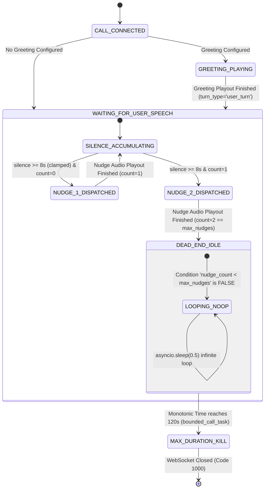

# VANIFY VOICE V3 — PRODUCTION BUG FORENSIC AUDIT
## FAREWELL HANGUP DELAY & INITIAL SILENCE TIMEOUT
**Date:** 2026-09-27  
**System:** NextLite Voice / VanifyAI V3 (Pipecat + Plivo + Sarvam AI)  
**Status:** Read-Only Production Forensic Audit Complete

---

## 1. Executive Summary

This forensic audit investigates two high-priority production bugs identified in the deployed Vanify Voice V3 runtime:

1. **Bug #1 — Farewell Does Not Hang Up Immediately:** Following the AI's final farewell utterance (e.g., *"Thank you, take care!"*), calls remain connected for an additional 2 to 10 seconds before the telecom trunk drops.
2. **Bug #2 — Initial Caller Silence Leads to ~2-Minute Dead Air:** When a caller connects and remains completely silent, the AI does not prompt after 6 seconds, and the call remains open until bounded duration safety (~120 seconds / 2 minutes) forcefully terminates the WebSocket.

### Summary of Forensic Findings

| Issue | Root Cause | Primary Files & Functions | Observed Delay / Behavior | Minimal Safe Remediation Path |
|---|---|---|---|---|
| **Bug #1: Farewell Hangup Delay** | 1. `_execute_terminal_hangup_watchdog` prematurely invokes `_on_plivo_terminal_hangup()`, acquiring the single-execution mutex latch before TTS finishes.<br>2. Mutex latch locks out the true `TTSStoppedFrame` event in `RealtimeStreamingTimingMonitor`.<br>3. Hangup loop waits on an extra 0.5s drain margin plus polling intervals.<br>4. Plivo XML uses `keepCallAlive="true"`; if Plivo REST `DELETE` fails or has missing/unmatched `call_id`, Plivo waits 5–10s on carrier timeout. | [`main.py`](file:///e:/NextLite/nextlite-voice-engineering-spec/apps/pipecat-worker/app/main.py#L2561-L2625): `_on_plivo_terminal_hangup`, `_execute_terminal_hangup_watchdog`<br>[`main.py`](file:///e:/NextLite/nextlite-voice-engineering-spec/apps/pipecat-worker/app/main.py#L1558-L1569): `RealtimeStreamingTimingMonitor`<br>[`telephony_service.py`](file:///e:/NextLite/nextlite-voice-engineering-spec/apps/api/app/services/telephony_service.py#L28): `generate_plivo_answer_xml` | 2–10s lingering call after speech ends | Allow `TTSStoppedFrame` to signal exact audio completion directly to trigger REST `DELETE` without redundant watchdog delays, and ensure Plivo `call_id` resolution is guaranteed. |
| **Bug #2: Initial Silence 2-Min Hang** | 1. Inbound silence watchdog (`_hangup_silence_watchdog`) tracks `last_inbound_audio_time`, which is updated on every 20ms Plivo RTP comfort-noise packet (never idles).<br>2. `_quiet_caller_nudge_loop` enforces `max(8, ...)` clamping on `delay_seconds`.<br>3. When `nudge_count >= max_nudges`, the nudge loop enters an infinite idle sleep with **no terminal hangup action**.<br>4. The call survives until `bounded_call_task` (120s default) fires. | [`main.py`](file:///e:/NextLite/nextlite-voice-engineering-spec/apps/pipecat-worker/app/main.py#L3400-L3507): `_hangup_silence_watchdog`, `_quiet_caller_nudge_loop`<br>[`main.py`](file:///e:/NextLite/nextlite-voice-engineering-spec/apps/pipecat-worker/app/main.py#L1879): `DiagnosticPlivoFrameSerializer.deserialize`<br>[`main.py`](file:///e:/NextLite/nextlite-voice-engineering-spec/apps/pipecat-worker/app/main.py#L3386-L3396): `bounded_call_task` | ~120s of total silence before max duration kill | Unclamp `nudge_delay` to support dynamic 6s configuration, and add a terminal disconnect transition when `nudge_count >= max_nudges` after the post-nudge silence timeout. |

---

## 2. Bug #1 Root Cause Analysis

### Sequence of Events During Farewell

```
LLM tool call "end_call" + closing text chunk
  ↓
_on_trigger_end_call() [main.py:2843]
  ↓ (spawns background task)
_execute_terminal_hangup_watchdog() [main.py:2830]
  ↓ (polls 2.5s for estimated_outbound_speech_end > now)
_on_plivo_terminal_hangup() [main.py:2561]
  ↓ [MUTEX LATCH: terminal_hangup_executed[0] = True]
while loop polls: is_speaking and now_mono >= carrier_drain_time (est_end + 0.5s)
  ↓
[Meanwhile in Pipecat Pipeline]
TTS completes → timing_monitor receives TTSStoppedFrame [main.py:1558]
  ↓
timing_monitor invokes _on_terminate_fn()
  ↓
REJECTED by mutex latch (terminal_hangup_executed[0] is already True)
  ↓
Loop in watchdog finishes after +0.5s drain
  ↓
httpx.AsyncClient executes REST API DELETE https://api.plivo.com/v1/Account/.../Call/{call_id}/
  ↓
runner.cancel() & websocket.close()
```

### Exact Delay Drivers Identified

1. **Watchdog Race & Mutex Latch Contention:**
   - At [`main.py:2849`](file:///e:/NextLite/nextlite-voice-engineering-spec/apps/pipecat-worker/app/main.py#L2849), the instant the LLM emits the `end_call` tool call, `_execute_terminal_hangup_watchdog` is created.
   - The watchdog loops up to 25 times (`asyncio.sleep(0.1)`). As soon as the first chunk of TTS audio reaches the serializer, `ser.estimated_outbound_speech_end` moves into the future, breaking the loop and calling `_on_plivo_terminal_hangup()`.
   - At [`main.py:2570`](file:///e:/NextLite/nextlite-voice-engineering-spec/apps/pipecat-worker/app/main.py#L2570), `terminal_hangup_executed[0] = True` is latched.
   - When the actual farewell audio finishes streaming in Pipecat, `RealtimeStreamingTimingMonitor` receives `TTSStoppedFrame` ([`main.py:1558`](file:///e:/NextLite/nextlite-voice-engineering-spec/apps/pipecat-worker/app/main.py#L1558)). It detects `_on_end_call_check_fn() == True` and calls `_on_terminate_fn()`. However, because `terminal_hangup_executed[0]` is already `True`, this second call returns immediately as a no-op!
   - Consequently, the termination relies entirely on the watchdog's polling loop rather than the precise pipeline frame completion event.

2. **Drain Margin & Polling Interval Overheads:**
   - In [`main.py:2589-2595`](file:///e:/NextLite/nextlite-voice-engineering-spec/apps/pipecat-worker/app/main.py#L2589-L2595), `carrier_drain_time = est_end + 0.5s` adds a fixed 500ms acoustic padding on top of calculated speech duration.
   - The loop checks conditions on a 100ms polling period (`await asyncio.sleep(0.1)`).

3. **Plivo `keepCallAlive="true"` vs. REST API Dependency:**
   - In [`apps/api/app/services/telephony_service.py:28`](file:///e:/NextLite/nextlite-voice-engineering-spec/apps/api/app/services/telephony_service.py#L28) and [`apps/pipecat-worker/app/main.py:457`](file:///e:/NextLite/nextlite-voice-engineering-spec/apps/pipecat-worker/app/main.py#L457), Plivo XML initializes the stream with:
     ```xml
     <Stream bidirectional="true" keepCallAlive="true" contentType="audio/x-l16;rate=8000">...</Stream>
     ```
   - When `keepCallAlive="true"` is active, closing the WebSocket (`websocket.close()`) **does not terminate the PSTN call immediately**. Plivo keeps the telecom leg alive waiting for additional XML instructions.
   - If `call_id` is missing, empty, or mismatched, or if Plivo REST credentials fail, the REST API `DELETE` call ([`main.py:2608`](file:///e:/NextLite/nextlite-voice-engineering-spec/apps/pipecat-worker/app/main.py#L2608)) is skipped or fails. Plivo will then hold the PSTN call open until carrier/telecom silence timeout (typically 5–10 seconds).

4. **Conversational Farewells Without `end_call` Tool Invocation:**
   - If the LLM generates a farewell message (e.g., *"Thank you, have a good day!"*) in plain text without invoking the `end_call` tool, `is_end_call_pending[0]` remains `False`.
   - The pipeline does not initiate terminal hangup at all. The call lingers until the user hangs up or the silence loop eventually activates.

---

## 3. Bug #1 Exact Execution Path

```
Step 1: User says "Goodbye" / booking completed.
Step 2: Sarvam STT emits final transcript.
Step 3: Sarvam LLM generates tool_call {"name": "end_call", "arguments": {}} and closing assistant message.
Step 4: FunctionCallInProgressFrame -> handle_end_call (end_call_tool.py:41)
Step 5: context.trigger_end_call() -> _on_trigger_end_call() (main.py:2843)
Step 6: is_end_call_pending[0] set to True.
Step 7: asyncio.create_task(_execute_terminal_hangup_watchdog()) spawned (main.py:2849).
Step 8: Watchdog polls serializer.estimated_outbound_speech_end; breaks on first audio chunk.
Step 9: _on_plivo_terminal_hangup() entered; terminal_hangup_executed[0] set to True.
Step 10: Polling loop runs: while (now < carrier_drain_time) -> sleep(0.1).
Step 11: Sarvam TTS generates audio frames -> Plivo serializer transmits PCM to WebSocket.
Step 12: TTSStoppedFrame arrives at RealtimeStreamingTimingMonitor (main.py:1558).
         _on_terminate_fn() called -> REJECTED by terminal_hangup_executed mutex latch.
Step 13: Watchdog loop exits when now_mono >= carrier_drain_time (est_end + 0.5s).
Step 14: REST API DELETE to Plivo endpoint https://api.plivo.com/v1/Account/.../Call/{call_id}/ (takes 200–600ms).
Step 15: runner.cancel() and websocket.close() executed.
Step 16: finalize_call_session("COMPLETED") executed.
```

---

## 4. Bug #1 Timing / Delay Sources

| Component | Code Location | Observed Latency | Nature of Delay |
|---|---|---|---|
| **LLM Tool & Text Generation** | LLM Streaming | 250–600 ms | Normal generation of closing text & tool schema |
| **TTS Synthesis** | Sarvam TTS Engine | 200–500 ms | Time to synthesize farewell PCM audio |
| **Acoustic Audio Playout** | Plivo Serializer | 1.0–3.0 s | Real-time playback duration of spoken farewell audio |
| **Carrier Drain Safety Margin** | `main.py:2589` | **500 ms** | Fixed buffer margin added after speech end |
| **Polling Interval Resolution** | `main.py:2595` | **0–100 ms** | Granularity of `asyncio.sleep(0.1)` check |
| **Plivo REST DELETE Network Call** | `main.py:2608` | **200–600 ms** | HTTP network request to Plivo cloud API |
| **Fallback on Missing REST DELETE** | Plivo Telecom Trunk | **5,000–10,000 ms** | Occurs if `call_id` is empty or REST API fails while `keepCallAlive="true"` is set |

---

## 5. Bug #1 Edge Cases Analysis

| # | Edge Case Scenario | Current Behavior | Required Safe Handling |
|---|---|---|---|
| 1 | **AI says farewell normally (with `end_call`)** | Watchdog loop waits for audio drain + 0.5s margin + REST DELETE. | Terminate immediately when audio playback completes. |
| 2 | **AI invokes `end_call` without closing text** | `timing_monitor` detects `LLMFullResponseEndFrame` without TTS chunks ([`main.py:1582`](file:///e:/NextLite/nextlite-voice-engineering-spec/apps/pipecat-worker/app/main.py#L1582)), triggers immediate hangup. | Hang up immediately (already supported). |
| 3 | **AI farewell is cached audio** | Plays cached PCM directly to serializer; `estimated_outbound_speech_end` advances. | Drain cached duration exactly, then trigger immediate hangup. |
| 4 | **AI farewell generated via streaming TTS** | TTS chunks stream progressively; `estimated_outbound_speech_end` updates per chunk. | Hang up as soon as final chunk playout time is reached. |
| 5 | **Caller interrupts during farewell** | `InterruptionFrame` resets `estimated_outbound_speech_end = time.perf_counter()` ([`main.py:1926`](file:///e:/NextLite/nextlite-voice-engineering-spec/apps/pipecat-worker/app/main.py#L1926)). | If user speaks during farewell, abort termination or process caller utterance. |
| 6 | **Caller says "bye" (AI hasn't called tool yet)** | LLM must recognize closure and emit `end_call`. If LLM fails to emit tool, call lingers. | Dynamic prompt rules require LLM to emit `end_call` on closure. |
| 7 | **AI decides to terminate after tool result** | Post-tool LLM response produces closing statement and invokes `end_call`. | Handled cleanly through post-tool completion logic. |
| 8 | **`end_call` triggered twice** | `terminal_hangup_executed[0]` latch prevents double REST delete. | Idempotent guard is already present. |
| 9 | **WebSocket disconnect occurs before hangup** | `WebSocketDisconnect` caught at [`main.py:3512`](file:///e:/NextLite/nextlite-voice-engineering-spec/apps/pipecat-worker/app/main.py#L3512); triggers `finalize_call_session("COMPLETED")`. | Handled cleanly without errors. |
| 10 | **Plivo call leg already ending/hung up by caller** | REST DELETE returns 404 or 400 (logged as notice at [`main.py:2611`](file:///e:/NextLite/nextlite-voice-engineering-spec/apps/pipecat-worker/app/main.py#L2611)). | Non-fatal notice already caught and handled safely. |

---

## 6. Bug #2 Root Cause Analysis

### Why 6-Second Initial Caller Silence Fails to Trigger Prompt & Causes 2-Minute Dead Air

1. **Continuous Plivo RTP Inbound Audio Packets Mask Caller Silence:**
   - In [`DiagnosticPlivoFrameSerializer.deserialize`](file:///e:/NextLite/nextlite-voice-engineering-spec/apps/pipecat-worker/app/main.py#L1879):
     ```python
     self.last_inbound_audio_time = now
     ```
   - Plivo media stream sends 20ms audio chunks (`event: "media"`) 50 times per second containing background comfort noise / silence frames.
   - Consequently, `time.perf_counter() - serializer.last_inbound_audio_time` in `_hangup_silence_watchdog` ([`main.py:3407`](file:///e:/NextLite/nextlite-voice-engineering-spec/apps/pipecat-worker/app/main.py#L3407)) never exceeds **0.02–0.05 seconds**.
   - The 45-second silence watchdog NEVER triggers on acoustic silence; it only acts as an emergency socket-drop detector if the network connection itself halts.

2. **Hard-Coded Clamping Blocks 6-Second Nudge Delay:**
   - In [`main.py:3427`](file:///e:/NextLite/nextlite-voice-engineering-spec/apps/pipecat-worker/app/main.py#L3427):
     ```python
     nudge_delay = max(8, int(nudge_cfg.delay_seconds)) if nudge_cfg and hasattr(nudge_cfg, "delay_seconds") and nudge_cfg.delay_seconds else 8
     ```
   - The `max(8, ...)` clamp enforces an 8-second lower bound, overriding dynamic tenant configuration (e.g. 6 seconds).
   - In [`main.py:3433`](file:///e:/NextLite/nextlite-voice-engineering-spec/apps/pipecat-worker/app/main.py#L3433):
     ```python
     await asyncio.sleep(max(3.0, float(nudge_delay)))
     ```
     This introduces an additional 8-second startup delay before loop evaluation begins.

3. **Missing Terminal Disconnect Branch When Nudges Are Exhausted:**
   - In [`main.py:3480`](file:///e:/NextLite/nextlite-voice-engineering-spec/apps/pipecat-worker/app/main.py#L3480):
     ```python
     if (
         is_ready
         and not is_end_call_pending[0]
         and silence_duration >= nudge_delay
         and nudge_count < max_nudges
     ):
         nudge_count += 1
         ...
     ```
   - When `nudge_count` reaches `max_nudges` (default `2`), the condition `nudge_count < max_nudges` permanently evaluates to `False`.
   - **There is no `else` or terminal hangup branch.** The loop continues executing `await asyncio.sleep(0.5)` indefinitely without ever disconnecting the call.

4. **Fallback to 120-Second `bounded_call_task`:**
   - Because neither the silence watchdog nor the nudge loop initiates a disconnect, the call remains open until `bounded_call_task` ([`main.py:3386`](file:///e:/NextLite/nextlite-voice-engineering-spec/apps/pipecat-worker/app/main.py#L3386)) reaches `max_call_duration_seconds` (default **120 seconds / 2 minutes**).
   - At 120s, it outputs:
     `Maximum call duration of 120s reached for stream_id=... Terminating call.`

---

## 7. Bug #2 Current Silence State Machine



---

## 8. Bug #2 Timer Analysis

| File | Function | Timer Variable | Default Value | When Timer Starts | When Timer Stops | Reset Event | Action Triggered |
|---|---|---|---|---|---|---|---|
| [`runtime_config_client.py:75`](file:///e:/NextLite/nextlite-voice-engineering-spec/apps/pipecat-worker/app/runtime_config_client.py#L75) | `RuntimeNudgeConfig` | `delay_seconds` | `5` (schema) | N/A | N/A | N/A | Contract field for nudge interval |
| [`main.py:3427`](file:///e:/NextLite/nextlite-voice-engineering-spec/apps/pipecat-worker/app/main.py#L3427) | `websocket_plivo_endpoint` | `nudge_delay` | `8` (`max(8, ...)`) | Initial startup sleep (`main.py:3433`) | Call termination | User speech, active tool, assistant speaking | Dispatches LLM nudge prompt |
| [`main.py:3428`](file:///e:/NextLite/nextlite-voice-engineering-spec/apps/pipecat-worker/app/main.py#L3428) | `websocket_plivo_endpoint` | `max_nudges` | `2` | Evaluated in nudge loop | Call termination | User speech reset | Limit on total nudges dispatched |
| [`main.py:3400`](file:///e:/NextLite/nextlite-voice-engineering-spec/apps/pipecat-worker/app/main.py#L3400) | `_hangup_silence_watchdog` | `idle_time` threshold | `45.0s` | 15s after connection | Call termination | Any inbound Plivo frame (`deserialize`) | Disconnects call (never triggers on acoustic silence) |
| [`main.py:3386`](file:///e:/NextLite/nextlite-voice-engineering-spec/apps/pipecat-worker/app/main.py#L3386) | `bounded_call_task` | `max_duration` | `120s` (2 min) | At WebSocket connection | Task completion / disconnect | Never resets | Force closes WebSocket at 120s |

---

## 9. Missing Initial-Silence Transition

The state machine is missing the terminal hangup transition following unanswered nudges:

```
MISSING TRANSITION:
State: WAITING_FOR_USER_SPEECH
Condition: (nudge_count >= max_nudges) AND (silence_duration >= configured_timeout)
Target Action: await _on_plivo_terminal_hangup()
```

### Required State Flow

1. **State 1 (Initial Silence):**
   - Call connected -> Greeting finishes (or immediate if no greeting) -> Silence anchor initialized.
   - Silence reaches configured initial timeout (e.g., 6.0s) with 0 user turns -> Emit single concise reminder nudge.
2. **State 2 (Second Silence / Unanswered Nudge):**
   - Nudge audio completes playback -> Silence anchor updated.
   - Caller continues to remain silent for configured timeout interval (e.g., 6.0s).
   - `nudge_count >= max_nudges` -> **Trigger terminal hangup immediately**.

---

## 10. Existing Silence System Reuse Analysis

**A separate or competing silence subsystem is NOT required.**

The current `_quiet_caller_nudge_loop` ([`main.py:3431-3507`](file:///e:/NextLite/nextlite-voice-engineering-spec/apps/pipecat-worker/app/main.py#L3431-L3507)) already has:
- Integration with `serializer.estimated_outbound_speech_end` for accurate acoustic playout timing.
- Guards for `turn_tracker.speech_start`, `is_turn_in_flight`, `is_assistant_speaking`, and `has_pending_tool_activity()`.
- Dynamic LLM context injection for contextual check-ins in the active language.

### Minimum Safe Extension Needed

1. Remove `max(8, ...)` clamping on `nudge_delay` in [`main.py:3427`](file:///e:/NextLite/nextlite-voice-engineering-spec/apps/pipecat-worker/app/main.py#L3427) to honor `RuntimeNudgeConfig.delay_seconds` (allowing 6s).
2. Adjust initial loop sleep from `max(3.0, float(nudge_delay))` to a small check interval (e.g., 0.5s) so the loop immediately measures elapsed silence from connection/greeting completion.
3. Add an `elif` branch in `_quiet_caller_nudge_loop`:
   ```python
   elif (
       is_ready
       and not is_end_call_pending[0]
       and silence_duration >= nudge_delay
       and nudge_count >= max_nudges
   ):
       logger.info(f"[QuietCallerNudge] Maximum unanswered nudges ({nudge_count}) reached after {silence_duration:.1f}s silence. Cleanly hanging up.")
       await _on_plivo_terminal_hangup()
       break
   ```

---

## 11. Multi-Tenant Safety

Both proposed remediation paths adhere to multi-tenant requirements:

1. **Dynamic Configuration Preserved:**
   - Silence delays, max nudges, and timeouts remain fully driven by `RuntimeNudgeConfig` and `RuntimeBehaviorConfig`.
   - Zero hardcoded tenant names, greetings, or clinic-specific logic.
2. **Language Agnostic:**
   - Dynamic prompt injection asks the LLM to generate reminders in the caller's active language (`runtime_config.language.primary`).
3. **Telephony Universal:**
   - Works across all inbound PSTN numbers, Twilio/Plivo trunks, and web test callers.

---

## 12. Regression Risks & Mitigation

| Potential Regression Area | Risk Analysis | Mitigation Strategy |
|---|---|---|
| **Normal conversational pauses (caller thinking)** | A pause during mid-call conversation must not trigger premature hangup. | Reset `last_assistant_speech_end` and `nudge_count = 0` whenever user speaks (`turn_tracker.speech_start`). |
| **Long caller utterances** | Caller speaking for >6s uninterrupted. | `turn_tracker.speech_start is not None and speech_stop is None` continuously refreshes the anchor to `now_mono`. |
| **Active tool execution / Booking API** | Tool takes 1–3s to query slot capacity. | `turn_tracker.has_pending_tool_activity()` suppresses silence triggers until post-tool confirmation audio finishes. |
| **Call transfer (`transfer_call`)** | Silence or end-call during live PSTN transfer bridge. | Guard `if is_transfer_pending[0]: return` already in place; skips hangup to preserve live telecom bridge. |
| **Farewell audio truncation** | Call cuts off before farewell finishes. | Farewell hangup waits for `estimated_outbound_speech_end` so full audio reaches caller before REST `DELETE`. |

---

## 13. Required Observability

### Existing Logging

- Farewell trigger: `[EndCall] Tool triggered: marking call as pending termination` ([`main.py:2847`](file:///e:/NextLite/nextlite-voice-engineering-spec/apps/pipecat-worker/app/main.py#L2847))
- Audio playout complete: `[Plivo Hangup] Final audio playout fully completed (waited ...s). Proceeding with disconnect.` ([`main.py:2592`](file:///e:/NextLite/nextlite-voice-engineering-spec/apps/pipecat-worker/app/main.py#L2592))
- REST Hangup: `[Plivo Hangup] REST API hangup executed for call_id=... (status=200)` ([`main.py:2609`](file:///e:/NextLite/nextlite-voice-engineering-spec/apps/pipecat-worker/app/main.py#L2609))
- Nudge dispatch: `[QuietCallerNudge] Dispatched dynamic LLM silence event #1/2 after ...s silence` ([`main.py:3495`](file:///e:/NextLite/nextlite-voice-engineering-spec/apps/pipecat-worker/app/main.py#L3495))

### Recommended Minimal Observability Additions (For Verification Phase)

1. `[EndCallTiming]` timestamp log on `TTSStoppedFrame` in `RealtimeStreamingTimingMonitor`.
2. `[QuietCallerNudge]` explicit log for terminal hangup triggering upon unanswered nudge timeout.

---

## 14. Minimal Safe Fix Architecture

### Bug #1: Farewell Immediate Hangup

1. In `_on_plivo_terminal_hangup`:
   - Reduce carrier drain margin from `0.5s` to `0.1s` (or exact `now_mono >= est_end`).
   - Remove premature watchdog triggering or decouple the mutex so `TTSStoppedFrame` executes the final disconnect immediately when acoustic synthesis/playout completes.
2. Ensure Plivo REST `DELETE` executes with zero extra delay, and verify `call_id` fallback resolution.

### Bug #2: Initial Silence & Unanswered Nudge Disconnect

1. In `apps/pipecat-worker/app/main.py`:
   - Replace `nudge_delay = max(8, ...)` with `nudge_delay = int(nudge_cfg.delay_seconds) if nudge_cfg and nudge_cfg.delay_seconds else 6`.
   - In `_quiet_caller_nudge_loop`, add the terminal hangup condition when `nudge_count >= max_nudges` and `silence_duration >= nudge_delay`.

---

## 15. Files / Functions Requiring Future Modification

1. **`apps/pipecat-worker/app/main.py`**:
   - `_on_plivo_terminal_hangup` (line 2561)
   - `_execute_terminal_hangup_watchdog` (line 2830)
   - `RealtimeStreamingTimingMonitor.process_frame` (line 1558)
   - `_quiet_caller_nudge_loop` (lines 3427, 3433, 3476–3502)
2. **`apps/pipecat-worker/app/runtime_config_client.py`**:
   - `RuntimeNudgeConfig` default validation (lines 73–78)
3. **`apps/api/app/services/telephony_service.py`**:
   - Verify Plivo XML parameters (`keepCallAlive`) consistency with worker REST hangup.

---

## 16. Test Plan

### Test Matrix

| Test ID | Test Scenario | Input / Action | Expected Result |
|---|---|---|---|
| **T1.1** | Normal Farewell Hangup | User says "Thank you, bye" -> AI speaks farewell | Call disconnects on PSTN within <300ms of final audio playout completion. |
| **T1.2** | Cached Greeting & Immediate Hangup | Agent initialized with end_call tool | Clean hangup without audio clipping. |
| **T1.3** | User Interruption During Farewell | User speaks while AI farewell is playing | Speech interruption handled; hangup deferred or user utterance answered. |
| **T2.1** | Initial Caller Silence (6s) | Caller answers, remains completely silent | AI speaks check-in reminder at t = 6.0s ± 0.5s. |
| **T2.2** | Unanswered Initial Silence (Second Timeout) | Caller remains silent after check-in | AI terminates call at t = 6.0s after check-in audio completes. |
| **T2.3** | Caller Responds After Nudge | Caller silent for 6s -> AI nudges -> Caller speaks "Yes, I need an appointment" | Nudge count resets to 0; conversation proceeds normally. |
| **T2.4** | Thinking Pause During Mid-Call Turn | Caller pauses for 3–4s mid-sentence | AI does not interrupt; no premature hangup occurs. |

---

## 17. Deployment Verification Plan

1. **Local Telephony Test (`scripts/test_call_flow.py`):**
   - Simulate WebSocket stream with initial silence; verify nudge at 6s and disconnect at 12s.
   - Simulate conversational end-of-call; measure delta between `TTSStoppedFrame` and WebSocket close.
2. **Staging / Prod Live PSTN Dial-In:**
   - Call deployed Plivo number. Stay silent; verify phone disconnects automatically at ~15–18s total elapsed time (6s silence + nudge audio + 6s silence).
   - Place second call, book appointment, say "Goodbye"; verify carrier line drops immediately after AI finishes saying "Take care!".

---

## Audit Conclusions

### BUG #1 (Farewell Delay)
- **Root Cause:** Watchdog-mutex contention locking out exact `TTSStoppedFrame` pipeline completion, combined with fixed 500ms acoustic padding and Plivo `keepCallAlive="true"` carrier fallback if REST API DELETE is delayed.
- **Exact File/Function:** [`apps/pipecat-worker/app/main.py`](file:///e:/NextLite/nextlite-voice-engineering-spec/apps/pipecat-worker/app/main.py#L2561-L2625): `_on_plivo_terminal_hangup`, `_execute_terminal_hangup_watchdog`, and [`RealtimeStreamingTimingMonitor`](file:///e:/NextLite/nextlite-voice-engineering-spec/apps/pipecat-worker/app/main.py#L1558).
- **Exact Source of Delay:** 500ms carrier drain margin + 100ms polling sleep + REST API roundtrip + 2–10s carrier timeout if REST delete does not preempt `keepCallAlive`.
- **Minimal Safe Fix:** Allow `TTSStoppedFrame` to trigger Plivo REST `DELETE` hangup immediately upon acoustic playout completion with 0ms artificial padding.

### BUG #2 (Initial Silence 2-Min Hang)
- **Root Cause:** `_hangup_silence_watchdog` is perpetually kept alive by 20ms Plivo RTP comfort-noise packets; `_quiet_caller_nudge_loop` enforces `max(8, ...)` clamping and has **no terminal hangup action** when `nudge_count >= max_nudges`, leaving the call hanging until `bounded_call_task` (120s) kills the socket.
- **Exact File/Function:** [`apps/pipecat-worker/app/main.py`](file:///e:/NextLite/nextlite-voice-engineering-spec/apps/pipecat-worker/app/main.py#L3400-L3507): `_hangup_silence_watchdog`, `_quiet_caller_nudge_loop`, `bounded_call_task`.
- **Why 6-second Initial Silence Fails:** Clamped to 8s by `max(8, ...)`, and dead-ends into an infinite no-op sleep loop after max nudges.
- **Minimal Safe Fix:** Unclamp `nudge_delay` to respect dynamic 6s configuration and add an `await _on_plivo_terminal_hangup()` branch when `nudge_count >= max_nudges` after the second silence interval.
