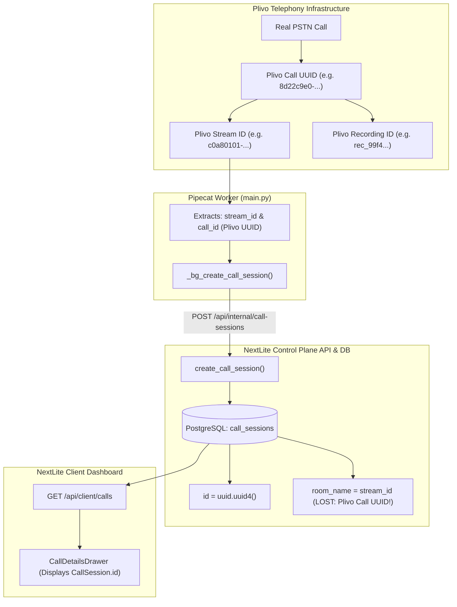
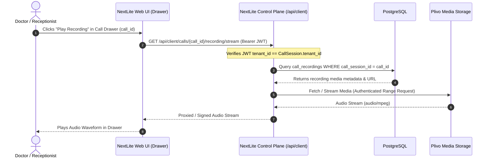
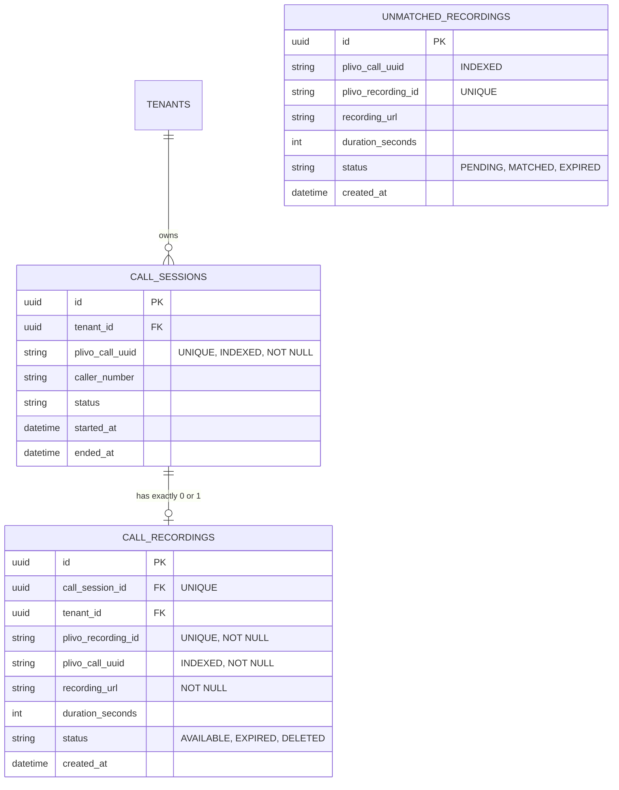

# 11: Call Recording Correlation Forensic Audit

**Status:** COMPLETE (READ-ONLY AUDIT)  
**Target File:** `11_CALL_RECORDING_CORRELATION_FORENSIC_AUDIT.md`  
**System:** NextLite Voice V3 Control Plane & Pipecat Telephony Worker  
**Primary Invariant:** **ONE DASHBOARD CALL MUST NEVER DISPLAY THE RECORDING OF ANOTHER CALL.**

---

## A. Executive Summary

A forensic read-only audit of the NextLite Voice V3 platform was conducted to determine whether the existing architecture provides an unbroken, deterministic, and cryptographically sound identity chain connecting **Real PSTN Calls → Plivo Call UUIDs → NextLite CallSessions → Plivo Recordings → Dashboard Playback**.

### Critical Audit Findings

1. **Plivo Call UUID is Lost at the Database Boundary:**  
   The Pipecat worker receives and parses the real Plivo Call UUID (`CallUUID` / `callId`) from Plivo during inbound/outbound WebSocket handshake ([apps/pipecat-worker/app/main.py:L2190-2200](file:///e:/NextLite/nextlite-voice-engineering-spec/apps/pipecat-worker/app/main.py#L2190-L2200)). However, **`plivo_call_uuid` is NOT persisted in PostgreSQL**. The `call_sessions` table ([apps/api/app/models.py:L336-356](file:///e:/NextLite/nextlite-voice-engineering-spec/apps/api/app/models.py#L336-L356)) has no column for Plivo Call UUID or Provider Call ID.

2. **Stream ID is Misused as Room Name:**  
   The Plivo WebSocket stream identifier (`stream_id`) is stored in `CallSession.roomName` ([apps/pipecat-worker/app/main.py:L2430](file:///e:/NextLite/nextlite-voice-engineering-spec/apps/pipecat-worker/app/main.py#L2430)). `stream_id` is a transient WebSocket connection artifact; Plivo recording callbacks and REST APIs do not reference `stream_id`—they reference `CallUUID` and `RecordingID`.

3. **Silent Session Creation Failures Can Lead to Uncorrelated Recordings:**  
   `CallSession` creation in the worker is executed as a fire-and-forget background task via `asyncio.create_task` ([apps/pipecat-worker/app/main.py:L2457](file:///e:/NextLite/nextlite-voice-engineering-spec/apps/pipecat-worker/app/main.py#L2457)). If this creation fails (DB disconnect, network timeout, worker secret mismatch), the audio call proceeds, audio is recorded on Plivo's carrier servers, but **no NextLite CallSession exists**.

4. **Zero Existing Recording Infrastructure:**  
   There is currently no database table, API endpoint, Plivo `<Record>` XML verb, or webhook handler for call recording in the codebase.

5. **Fatal Risk if Implemented Naively:**  
   If call recording were attached using phone number, timestamp proximity, or "latest call for tenant", a late-arriving recording for Call A would be attached to Call B (e.g., when the same customer calls twice in rapid succession).

**Verdict:** The current architecture **CANNOT** guarantee recording-to-call correlation safety without introducing a strict, unique-constrained `plivo_call_uuid` schema column and an isolated `call_recordings` entity with an asynchronous reconciliation buffer.

---

## B. Current Call Identity Architecture

The codebase handles multiple disparate identifiers across the stack. Below is the forensic identity mapping:

| Entity Layer | Variable / Field Name | Source / Generator | Scope & Lifetime | Description |
| :--- | :--- | :--- | :--- | :--- |
| **PSTN / Carrier** | `CallUUID` / `ALegUUID` | Plivo Carrier Gateway | Global & Permanent | Unique 128-bit hex UUID generated by Plivo for the PSTN call leg. |
| **Outbound Dispatch** | `request_uuid` | Plivo REST API Response | Ephemeral Dispatch | Returned synchronously on `POST /v1/Account/.../Call/`. Replaced by `CallUUID` when dialed leg rings. |
| **WebSocket Stream** | `stream_id` / `streamId` | Plivo Media Stream Server | Transient to WebSocket | Plivo stream connection ID. Assigned when Plivo initiates WebSocket media stream. |
| **Internal Session** | `CallSession.id` | NextLite API (`uuid.uuid4()`) | Global & Permanent | PostgreSQL primary key (`UUID`) for the NextLite call record. |
| **Worker Local** | `call_session_id` | Control Plane REST Response | Memory per WebSocket | Worker local string holding `str(CallSession.id)`. |
| **Pipecat Pipeline** | Frame Processors | Pipecat In-Memory Pipeline | Process per Call | Ephemeral async task processing audio chunks. |
| **Recording Entity** | `RecordingID` / `RecordUrl` | Plivo Recording Service | Permanent | Identifier and media URL generated when Plivo records audio. |

### Identity Map Diagram



---

## C. Outbound Identity Flow

### Step-by-Step Outbound Trace

1. **Initiation Trigger:**  
   User/Admin triggers test call at `POST /api/admin/clients/{client_id}/agents/{agent_id}/phone-test` ([apps/api/app/routers/admin.py:L380-431](file:///e:/NextLite/nextlite-voice-engineering-spec/apps/api/app/routers/admin.py#L380-L431)).
2. **Answer URL Construction:**  
   API constructs:  
   `answer_url = f"{base_pipecat}/plivo/test-xml?deploymentId={dep.id}&direction=outbound&to={norm_phone}"` ([apps/api/app/routers/admin.py:L418](file:///e:/NextLite/nextlite-voice-engineering-spec/apps/api/app/routers/admin.py#L418)).
3. **Plivo REST Dispatch:**  
   `TelephonyService.create_outbound_phone_call` executes `POST https://api.plivo.com/v1/Account/{auth_id}/Call/` ([apps/api/app/services/telephony_service.py:L50-78](file:///e:/NextLite/nextlite-voice-engineering-spec/apps/api/app/services/telephony_service.py#L50-L78)).
4. **Synchronous Response:**  
   Plivo responds with `{"message": "call fired", "request_uuid": "...", "api_id": "..."}`.  
   *(Note: Plivo Call UUID is NOT yet assigned at this exact millisecond).*
5. **Database State at Dispatch:**  
   **NO `CallSession` is created in NextLite DB at dispatch time.**
6. **Plivo Dials & Answers:**  
   When the recipient answers, Plivo issues `GET /plivo/test-xml` to the worker. Plivo passes `CallUUID` in the query/form parameters.
7. **XML Generation:**  
   Worker `plivo_inbound_xml` extracts `call_uuid` from `request.query_params["CallUUID"]` ([apps/pipecat-worker/app/main.py:L408-415](file:///e:/NextLite/nextlite-voice-engineering-spec/apps/pipecat-worker/app/main.py#L408-L415)) and appends it to the WebSocket query string: `ws://.../ws/plivo?...&callId={call_uuid}` ([apps/pipecat-worker/app/main.py:L447](file:///e:/NextLite/nextlite-voice-engineering-spec/apps/pipecat-worker/app/main.py#L447)).
8. **Plivo XML Returned:**  
   `<Response><Stream bidirectional="true" ...>wss://.../ws/plivo?...</Stream></Response>`.
9. **WebSocket Connection Established:**  
   Plivo connects to `/ws/plivo`. The worker accepts the socket and extracts `call_id` ([apps/pipecat-worker/app/main.py:L2190-2200](file:///e:/NextLite/nextlite-voice-engineering-spec/apps/pipecat-worker/app/main.py#L2190-L2200)).
10. **Background Session Creation:**  
    Worker launches `asyncio.create_task(_bg_create_call_session())` calling `POST /api/internal/call-sessions`.  
    **Crucial defect:** `call_id` (Plivo Call UUID) is discarded. Only `stream_id` is sent as `roomName`.

---

## D. Inbound Identity Flow

### Step-by-Step Inbound Trace

1. **Carrier Inbound Dial:**  
   Patient dials client's Plivo DID (e.g. `+918031707681`).
2. **Plivo Webhook Ingestion:**  
   Plivo sends `POST /api/v1/telephony/plivo/inbound` (or `/plivo/inbound`, `/plivo/test-xml`) ([apps/pipecat-worker/app/main.py:L346-355](file:///e:/NextLite/nextlite-voice-engineering-spec/apps/pipecat-worker/app/main.py#L346-L355)).
3. **Plivo Parameters Received:**  
   `From` (caller), `To` (dialed DID), `CallUUID`, `Direction="inbound"`.
4. **Dynamic Deployment Resolution:**  
   Worker queries `RuntimeConfigClient.get_runtime_agent_config_by_phone(caller_to)` ([apps/pipecat-worker/app/main.py:L425-429](file:///e:/NextLite/nextlite-voice-engineering-spec/apps/pipecat-worker/app/main.py#L425-L429)).
5. **WebSocket XML Response:**  
   Returns XML `<Stream>wss://.../ws/plivo?deploymentId=...&from=...&to=...&callId={call_uuid}</Stream>`.
6. **WebSocket Open & Start Message:**  
   Plivo connects to `/ws/plivo`. In the first JSON message (`event="start"`), Plivo delivers `start.streamId` and `start.callId`.
7. **Session Creation:**  
   Identical to outbound: `_bg_create_call_session` creates `CallSession` with `roomName=stream_id`.

### Comparison of Inbound vs Outbound Identity Handling

| Dimension | Outbound Flow | Inbound Flow |
| :--- | :--- | :--- |
| **Originating Number (`From`)** | Configured `PLIVO_CALLER_ID` | Caller's PSTN mobile/landline |
| **Destination Number (`To`)** | Recipient's phone number | Tenant's purchased Plivo DID |
| **First Point Plivo UUID Known** | Inbound answer callback (`/plivo/test-xml`) | Inbound webhook (`/plivo/inbound`) |
| **Deployment Resolution** | Passed via query param at dial time | Resolved dynamically from `To` DID |
| **UUID Persistence in DB** | **NEVER PERSISTED** | **NEVER PERSISTED** |

---

## E. WebSocket Correlation

### Detailed Code Audit: `websocket_plivo_endpoint`

File: `apps/pipecat-worker/app/main.py` lines 2170–2248:

```python
# Line 2185-2200
if event_type == "start":
    start_payload = initial_msg_obj.get("start", {})
    stream_id = start_payload.get("streamId")
    call_id = (
        start_payload.get("callId")
        or start_payload.get("callUUID")
        or start_payload.get("CallUUID")
        or websocket.query_params.get("call_uuid")
        or websocket.query_params.get("CallUUID")
        or websocket.query_params.get("callId")
        or websocket.query_params.get("aleg_uuid")
        or websocket.query_params.get("ALegUUID")
        or ""
    )
```

And in lines 2425–2437:

```python
session_record = await call_session_client.create_call_session(
    CreateCallSessionRequest(
        tenantId=runtime_config.tenant.tenant_id,
        agentId=runtime_config.agent.agent_id,
        deploymentId=resolved_deployment_id,
        roomName=stream_id,                 # <-- stream_id stored as roomName
        callerNumber=caller_number,
        direction=direction,
        status="ACTIVE",
        primaryLanguage=language_manager.current_language,
        startedAt=started_at_iso,
    )
)
```

### Critical Question: Can `stream_id` be used to reliably recover the Plivo Call UUID?

**Answer: NO.**
1. **No reverse mapping exists in NextLite DB:** NextLite does not store `call_id` anywhere in the database or Redis cache against `stream_id`.
2. **Plivo APIs do not accept `stream_id`:** Plivo Call APIs, Recording APIs (`GET /v1/Account/{auth_id}/Recording/`), and Recording Callbacks index data by `call_uuid` and `recording_id`, never by `stream_id`.
3. **Stream ID is Transient:** If a WebSocket disconnects and reconnects, Plivo generates a new `stream_id` for the same call leg, whereas `CallUUID` remains invariant.

---

## F. Database Schema Audit

Audit of `apps/api/app/models.py` lines 336–356:

```python
class CallSession(Base):
    __tablename__ = "call_sessions"

    id: Mapped[uuid.UUID] = mapped_column(UUID(as_uuid=True), primary_key=True, default=uuid.uuid4)
    tenantId: Mapped[uuid.UUID] = mapped_column("tenant_id", UUID(as_uuid=True), ForeignKey("tenants.id", ondelete="CASCADE"), nullable=False)
    agentId: Mapped[Optional[uuid.UUID]] = mapped_column("agent_id", UUID(as_uuid=True), ForeignKey("agents.id", ondelete="SET NULL"), nullable=True)
    deploymentId: Mapped[Optional[uuid.UUID]] = mapped_column("deployment_id", UUID(as_uuid=True), ForeignKey("deployments.id", ondelete="SET NULL"), nullable=True)
    roomName: Mapped[Optional[str]] = mapped_column("room_name", String(255), nullable=True, default="default-room")
    callerNumber: Mapped[Optional[str]] = mapped_column("caller_number", String(50), nullable=True)
    direction: Mapped[CallDirection] = mapped_column(SQLEnum(CallDirection, name="call_direction", native_enum=False), nullable=False, default=CallDirection.INBOUND)
    status: Mapped[CallStatus] = mapped_column(SQLEnum(CallStatus, name="call_status", native_enum=False), nullable=False, default=CallStatus.COMPLETED)
    durationSeconds: Mapped[Optional[int]] = mapped_column("duration_seconds", Integer, default=0, nullable=True)
    primaryLanguage: Mapped[Optional[str]] = mapped_column("primary_language", String(50), nullable=True, default="en-IN")
    startedAt: Mapped[datetime] = mapped_column("started_at", DateTime, default=datetime.utcnow, nullable=False)
    endedAt: Mapped[Optional[datetime]] = mapped_column("ended_at", DateTime, nullable=True)
    transcriptText: Mapped[Optional[str]] = mapped_column("transcript_text", Text, nullable=True)
    turnsJson: Mapped[Optional[list]] = mapped_column("turns_json", JSONB, nullable=True, default=list)
    toolsUsed: Mapped[Optional[list]] = mapped_column("tools_used", JSONB, nullable=True, default=list)
    metricsJson: Mapped[Optional[dict]] = mapped_column("metrics_json", JSONB, nullable=True, default=dict)
    createdAt: Mapped[datetime] = mapped_column("created_at", DateTime, default=datetime.utcnow, nullable=False)
```

### Field-by-Field Audit Table

| Database Column | Python Mapped Property | SQL Type | Nullable | Unique Constraint | Index | Foreign Key |
| :--- | :--- | :--- | :--- | :--- | :--- | :--- |
| `id` | `id` | `UUID` | No | Yes (PK) | Yes (PK) | None |
| `tenant_id` | `tenantId` | `UUID` | No | No | No (implied FK) | `tenants.id` (CASCADE) |
| `agent_id` | `agentId` | `UUID` | Yes | No | No | `agents.id` (SET NULL) |
| `deployment_id` | `deploymentId` | `UUID` | Yes | No | No | `deployments.id` (SET NULL) |
| `room_name` | `roomName` | `VARCHAR(255)` | Yes | No | No | None |
| `caller_number` | `callerNumber` | `VARCHAR(50)` | Yes | No | No | None |
| `direction` | `direction` | `VARCHAR` (Enum) | No | No | No | None |
| `status` | `status` | `VARCHAR` (Enum) | No | No | No | None |
| `duration_seconds` | `durationSeconds` | `INTEGER` | Yes | No | No | None |
| `primary_language` | `primaryLanguage` | `VARCHAR(50)` | Yes | No | No | None |
| `started_at` | `startedAt` | `TIMESTAMP` | No | No | No | None |
| `ended_at` | `endedAt` | `TIMESTAMP` | Yes | No | No | None |
| `transcript_text` | `transcriptText` | `TEXT` | Yes | No | No | None |
| `turns_json` | `turnsJson` | `JSONB` | Yes | No | No | None |
| `tools_used` | `toolsUsed` | `JSONB` | Yes | No | No | None |
| `metrics_json` | `metricsJson` | `JSONB` | Yes | No | No | None |
| `created_at` | `createdAt` | `TIMESTAMP` | No | No | No | None |
| **`plivo_call_uuid`** | **MISSING** | **N/A** | **N/A** | **NO** | **NO** | **N/A** |
| **`provider_call_id`** | **MISSING** | **N/A** | **N/A** | **NO** | **NO** | **N/A** |
| **`recording_url`** | **MISSING** | **N/A** | **N/A** | **NO** | **NO** | **N/A** |

### Critical Finding on Constraints
- **NO `plivo_call_uuid` column exists.**
- **NO UNIQUE constraint exists** on external telephony identifiers.
- Without a UNIQUE constraint on `plivo_call_uuid`, duplicate CallSessions could be inserted if webhook retries occur.

---

## G. CallSession Creation Reliability

### Lifecycle Analysis: `_bg_create_call_session`

In `apps/pipecat-worker/app/main.py`:
- `_bg_create_call_session` is called via `asyncio.create_task(...)` at line 2457.
- If creation fails (e.g., PostgreSQL is restarting, network partition between worker and Control Plane, or HTTP 500), lines 2448–2455 catch the exception:
  ```python
  except Exception as session_err:
      logger.error(f"[CallSession] Non-fatal: Failed to create call session for deployment={resolved_deployment_id}: {session_err}")
      return None
  ```
- **Consequence:** The voice pipeline proceeds unhindered. The patient speaks with the AI receptionist. Audio frames stream through Sarvam STT/TTS.
- At call termination, `finalize_call_session` checks `call_session_id` ([apps/pipecat-worker/app/main.py:L2054-2057](file:///e:/NextLite/nextlite-voice-engineering-spec/apps/pipecat-worker/app/main.py#L2054-L2057)):
  ```python
  if not call_session_id:
      logger.warning(f"[CallSession] No call_session_id available to finalize for stream_id={stream_id}")
      is_finalized = True
      return
  ```
- **Reconciliation / Retry:** There is **NO retry queue, dead-letter store, or reconciliation mechanism**.
- **Result:** The call data and transcript vanish from NextLite. If Plivo recorded this call, the recording exists in Plivo's cloud with `CallUUID`, but there is **NO corresponding NextLite CallSession in the DB**.

---

## H. Recording Support Audit

A full search of the repository confirms:
- **Plivo Record XML:** Not present. `<Record>` is not emitted anywhere in `apps/api` or `apps/pipecat-worker`.
- **Plivo Record REST API:** Not invoked. `POST /v1/Account/{auth_id}/Call/{call_uuid}/Record/` is never called.
- **Recording Webhook Callbacks:** No route handles recording status callbacks.
- **Database Schema:** No table or column stores recording IDs, recording URLs, or playback status.

### Insertion Points for Future Recording Support (DESIGN ONLY)

1. **Plivo Recording Initiation:**  
   - *Option A (XML Dial Plan):* In `plivo_inbound_xml` ([apps/pipecat-worker/app/main.py:L455-459](file:///e:/NextLite/nextlite-voice-engineering-spec/apps/pipecat-worker/app/main.py#L455-L459)), Plivo supports `<Record>` verbs or recording parameters.  
   - *Option B (REST API):* In the worker or Control Plane, issue `POST https://api.plivo.com/v1/Account/{auth_id}/Call/{call_uuid}/Record/` with `callback_url="https://api.domain.com/api/v1/telephony/plivo/recording-callback"`.
2. **Recording Webhook Endpoint:**  
   - Dedicated route in Control Plane: `POST /api/v1/telephony/plivo/recording-callback`.
3. **Database Entity:**  
   - New table `call_recordings` with foreign key to `call_sessions.id`.

---

## I. Recording ↔ Call Correlation Audit

### Exact Plivo Recording Webhook Variables

According to standard Plivo documentation and telephony protocols, when a recording completes, Plivo issues an HTTP POST callback containing:
- `call_uuid`: Exact Plivo Call UUID (e.g. `8d22c9e0-6e4b-488f-a18e-473d724ea243`)
- `recording_id`: Unique Plivo recording ID (e.g. `rec_a89c20f1-4321-420a-8d19-ef837a284210`)
- `recording_url`: Media URL (e.g. `https://media.plivo.com/v1/Account/MA.../Recording/rec_...mp3`)
- `recording_duration`: Duration in seconds
- `parent_call_uuid`: Present if call was transferred/forwarded
- `recording_start_ms`: Epoch timestamp of start

### Correlation Rule Verification

```mermaid
flowchart TD
    REC_CB["Plivo Recording Callback Arrives"] --> EXTRACT_UUID["Extract call_uuid & recording_id"]
    EXTRACT_UUID --> QUERY_DB["SELECT FROM call_sessions WHERE plivo_call_uuid = :call_uuid"]
    
    QUERY_DB -->|Found Exact Session| VERIFY_TENANT{"Session.tenant_id matches expected?"}
    VERIFY_TENANT -->|Yes| ATTACH["Insert into call_recordings(call_session_id, plivo_recording_id, url)"]
    VERIFY_TENANT -->|Mismatch| ALERT["Security Alert: Reject Attachment"]
    
    QUERY_DB -->|Session Not Found (Delayed/Failed Creation)| UNMATCHED["Insert into unmatched_recordings (PENDING)"]
    UNMATCHED --> RECONCILE["Reconciliation Worker periodically retries exact UUID match"]
```

**Audit Result:**  
- Telephony correlation **MUST ONLY** use `plivo_call_uuid == callback.call_uuid`.
- Phone number matching is **STRICTLY FORBIDDEN** (violates same-number multi-call safety).
- "Latest call" matching is **STRICTLY FORBIDDEN** (violates concurrency and out-of-order delivery safety).
- Timestamp proximity matching is **STRICTLY FORBIDDEN** (violates clock skew and overlapping call safety).

---

## J. Missed Call / Failed Session Scenarios

### Detailed Scenario Audit

1. **Scenario 1: Normal Call (Success Path)**
   - Plivo Call UUID assigned: Yes.
   - DB `CallSession` created: Yes (currently lacks `plivo_call_uuid`).
   - Recording match feasibility: Requires `plivo_call_uuid` column in `CallSession`.

2. **Scenario 2: DB Connection Failure During Session Creation**
   - Plivo PSTN call exists and active.
   - `_bg_create_call_session` throws `CallSessionClientError`.
   - `CallSession` is NOT created in DB.
   - Plivo recording is generated on Plivo servers.
   - Webhook arrives with `call_uuid`.
   - **Current Behavior:** If no reconciliation table exists, recording would be dropped or lost.
   - **Required Behavior:** Webhook inserts recording into `unmatched_recordings` with `status='PENDING'`.

3. **Scenario 3: Call Ends Before Session Persistence Completes (< 2 seconds call)**
   - Patient hangs up immediately after connect.
   - WebSocket closes. `finalize_call_session` runs before `_bg_create_call_session` finishes.
   - `finalize_call_session` awaits `call_session_task` for up to 5.0s ([apps/pipecat-worker/app/main.py:L2046-2050](file:///e:/NextLite/nextlite-voice-engineering-spec/apps/pipecat-worker/app/main.py#L2046-L2050)).
   - If creation succeeds, finalized with status `MISSED`. Plivo recording (if any) can correlate.

4. **Scenario 4: Worker Process Restart / VM Crash During Call**
   - VM or container crashes mid-call.
   - CallSession remains `status='ACTIVE'` in DB.
   - Plivo detects WebSocket disconnect, terminates call, processes recording, and fires callback.
   - Recording callback queries DB by `plivo_call_uuid`: matches the orphaned `ACTIVE` session, attaches recording, and updates session status to `COMPLETED` / `ABORTED`.

---

## K. Same-Number Collision Analysis

### Forensic Test Case: Rapid Consecutive Calls from Same Number

Consider Tenant X (Clinic A):
- **10:00:00:** Patient dials from `+919657954641`. Plivo assigns `CallUUID = AAA-111`. Call lasts 10 minutes.
- **10:03:00:** Same patient dials again from second line / husband dials from same number `+919657954641`. Plivo assigns `CallUUID = BBB-222`. Call lasts 30 seconds.
- **10:03:40:** Call B ends. Plivo processes short audio file. Recording B callback arrives at **10:03:45** (`call_uuid = BBB-222`).
- **10:10:10:** Call A ends. Plivo processes long audio file. Recording A callback arrives at **10:10:30** (`call_uuid = AAA-111`).

### Flawed Heuristics Evaluation

- *Flaw 1: Lookup by Phone Number & "Latest Call":*  
  At 10:03:45, "latest call" for `+919657954641` might be Call B or Call A depending on query sort. When Recording A arrives at 10:10:30, "latest call" would resolve to Call B, attaching Recording A to Call B! **TOTAL FAILURE.**
- *Flaw 2: Lookup by Phone Number & Timestamp Proximity:*  
  Overlapping call durations make timestamp proximity ambiguous. **TOTAL FAILURE.**

### Provable Safe Solution: Exact UUID Matching

- Recording B (`call_uuid = BBB-222`) queries `WHERE plivo_call_uuid = 'BBB-222'` → attaches strictly to CallSession B.
- Recording A (`call_uuid = AAA-111`) queries `WHERE plivo_call_uuid = 'AAA-111'` → attaches strictly to CallSession A.
- **Result: ZERO possibility of collision**, regardless of arrival order, call duration, or overlapping windows.

---

## L. Duplicate Callback Analysis

### Idempotency Requirements

Plivo webhooks guarantee **at-least-once delivery**. A webhook may be re-delivered if:
- Network latency delays the HTTP 200 response past Plivo's 5-second HTTP timeout.
- Plivo infrastructure retries delivery.
- Control Plane server experiences temporary GC pause.

### Database Constraint Requirement

To guarantee idempotency:
1. `call_recordings` table MUST have a unique constraint on:
   ```sql
   CONSTRAINT uq_call_recordings_plivo_recording_id UNIQUE (plivo_recording_id)
   ```
2. Webhook handler must use PostgreSQL `ON CONFLICT (plivo_recording_id) DO UPDATE` or check-and-insert transaction isolation.

---

## M. Multi-Tenant Isolation Analysis

### Tenant Isolation Audit

In `apps/api/app/routers/client.py` and `apps/api/app/services/crm_service.py`:
- All client queries use `resolve_tenant_id(payload, tenant_id_param)` from authenticated JWT claims.
- `CRMService.get_call_session` enforces:
  ```python
  select(CallSession).where(and_(CallSession.id == session_id, CallSession.tenantId == tenant_id))
  ```
- If Tenant A attempts to access `GET /api/client/calls/{call_id}` belonging to Tenant B, `CRMService` returns `None`, resulting in HTTP 404 ([apps/api/app/routers/client.py:L101-104](file:///e:/NextLite/nextlite-voice-engineering-spec/apps/api/app/routers/client.py#L101-L104)).

### Multi-Tenant Recording Access Rule

Any future recording playback endpoint (`GET /api/client/calls/{call_id}/recording`) must:
1. Validate `call_id` belongs to `current_user.tenant_id`.
2. Join `call_recordings` on `call_recordings.call_session_id == CallSession.id`.
3. Never accept raw `recording_id` or `plivo_call_uuid` from client parameters.

---

## N. Frontend Mapping Audit

### React Frontend Inspection

- **Call List Component:** `apps/web/src/pages/client/Calls.tsx`
  - Loads calls via `api.getClientCalls(...)` ([apps/web/src/pages/client/Calls.tsx:L30-34](file:///e:/NextLite/nextlite-voice-engineering-spec/apps/web/src/pages/client/Calls.tsx#L30-L34)).
  - Receives list of `CallSession` objects containing `id` (`CallSession.id`).
- **Call Details Component:** `apps/web/src/components/client/CallDetailsDrawer.tsx`
  - Opens on row click with `selectedCall.id` ([apps/web/src/pages/client/Calls.tsx:L60-69](file:///e:/NextLite/nextlite-voice-engineering-spec/apps/web/src/pages/client/Calls.tsx#L60-L69)).
  - Renders tabs: `Transcript`, `Tools Used`, `Latency & Metrics`, `Overview`.
  - **No recording player currently exists.**

### Recommended Frontend Flow for Recording Playback



---

## O. Security Analysis

1. **Raw Plivo Recording URLs Must Not Be Publicly Exposed:**  
   Plivo recording URLs (`https://media.plivo.com/...`) may contain sensitive customer conversations. If exposed directly to the frontend, URLs could be shared outside tenant boundaries or scraped without audit trails.
2. **Signed / Proxied Media Streaming:**  
   The Control Plane API should proxy the audio bytes (`GET /api/client/calls/{call_id}/recording/stream`) or generate a cryptographically signed, short-lived (e.g. 5 minutes) playback URL after validating tenant authorization.
3. **HTTP Range Requests (Audio Seeking):**  
   The backend streaming endpoint must support HTTP `206 Partial Content` (Range headers) so the browser audio player can seek smoothly across long calls.

---

## P. Retention Analysis

1. **Storage Tiers:**  
   - **Hot Storage (First 90 Days):** Recording available for direct streaming in dashboard.
   - **Cold / Expired Storage (> 90 Days):** Plivo recordings auto-deleted per retention policy or archived to tenant's private S3/Azure Blob bucket.
2. **Metadata Retention:**  
   The `call_recordings` metadata record (recording duration, file size, timestamps, Plivo recording ID) remains permanently attached to the `CallSession` even if media is purged.
3. **Status Tracking:**  
   Recording record should support an enum status: `RECORDING`, `AVAILABLE`, `EXPIRED`, `DELETED`, `FAILED`.

---

## Q. Failure Matrix

| # | Scenario | Plivo Call Exists? | CallSession Exists in DB? | Plivo UUID Persisted in DB? | Recording Can Match Safely? | Current Architecture Risk |
| :- | :--- | :---: | :---: | :---: | :---: | :--- |
| **1** | Normal Inbound Call | Yes | Yes | **NO** | **NO** | High: UUID not saved; cannot correlate callback. |
| **2** | Normal Outbound Call | Yes | Yes | **NO** | **NO** | High: UUID not saved; cannot correlate callback. |
| **3** | DB Downtime on Call Startup | Yes | **NO** | **NO** | **NO** | Critical: Call completes, recording generated on Plivo, but NextLite has no record of call. |
| **4** | Worker Starts Before DB Session Created | Yes | In Progress | **NO** | Partial | Medium: Race condition if callback arrives before background create finishes. |
| **5** | WebSocket Connects Before Session Persisted | Yes | In Progress | **NO** | Partial | Addressed by `finalize_call_session` awaiting `call_session_task`. |
| **6** | Call Ends Before Session Created (< 2s call) | Yes | Yes (MISSED) | **NO** | **NO** | High: Short calls record carrier ring audio, but cannot match without UUID. |
| **7** | Duplicate Plivo Webhook Delivery | Yes | Yes | **NO** | **NO** | High: No unique constraint on UUID could create duplicate sessions. |
| **8** | Worker VM Crashes Mid-Call | Yes | Yes (ACTIVE) | **NO** | **NO** | High: Session orphaned as ACTIVE; recording callback cannot locate session without UUID. |
| **9** | Recording Callback Delayed (Arrives hours later) | Yes | Yes | **NO** | **NO** | High: With UUID, safe; without UUID, impossible to match. |
| **10**| Same Phone Number Called Twice Concurrently | Yes (x2) | Yes (x2) | **NO** | **NO** | **Catastrophic:** High risk of cross-attaching recording to wrong call if using phone number heuristic. |
| **11**| Multiple Simultaneous Tenant Calls | Yes (xN) | Yes (xN) | **NO** | **NO** | High: Concurrency creates race conditions for non-UUID matchers. |
| **12**| Same Phone Number Across Different Tenants | Yes (x2) | Yes (x2) | **NO** | **NO** | **Catastrophic:** Zero isolation if matching on phone number without tenant-scoped UUID. |

---

## R. Exact Current Risks

1. **Risk 1: Missing Identity Column in PostgreSQL:**  
   `call_sessions` table has no `plivo_call_uuid` or `provider_call_id`. Any correlation attempt today would fail.
2. **Risk 2: Unhandled Background Persistence Failures:**  
   `_bg_create_call_session` swallows DB errors ([apps/pipecat-worker/app/main.py:L2453](file:///e:/NextLite/nextlite-voice-engineering-spec/apps/pipecat-worker/app/main.py#L2453)). If a call is recorded on Plivo but fails DB creation, the recording callback will be completely orphaned.
3. **Risk 3: False Identity Coupling via `stream_id`:**  
   Storing `stream_id` in `room_name` gives a false sense of correlation. `stream_id` cannot be used in any Plivo Recording API or Webhook.
4. **Risk 4: Vulnerability to Out-of-Order Webhook Delivery:**  
   If Plivo delivers the recording callback *before* the worker completes its session finalization PATCH, a naive database lookup would fail.

---

## S. Minimal Production-Safe Recording Architecture (Design Only)

### 1. Data Model Invariants



### 2. Dual-Buffer Correlation Logic

1. **Plivo Call Start:**  
   Worker extracts `call_uuid` and passes it to `POST /api/internal/call-sessions`. DB stores `CallSession.plivo_call_uuid` with a `UNIQUE` index.
2. **Recording Callback Arrival (`POST /api/v1/telephony/plivo/recording-callback`):**  
   - Extract `call_uuid` and `recording_id`.
   - Execute atomic query:
     ```sql
     SELECT id, tenant_id FROM call_sessions WHERE plivo_call_uuid = :call_uuid;
     ```
   - **Case A (CallSession Exists):**  
     Insert into `call_recordings` with `call_session_id = session.id`, `tenant_id = session.tenant_id`.
   - **Case B (CallSession Not Found / Delayed):**  
     Insert into `unmatched_recordings` with `plivo_call_uuid = :call_uuid`, `status = 'PENDING'`.
3. **Call Finalization / Reconciliation Hook:**  
   When `finalize_call_session` or a background reconciliation cron runs, it checks `unmatched_recordings WHERE plivo_call_uuid = :call_uuid`. If found, it promotes the record to `call_recordings` and marks the buffer as `MATCHED`.

---

## T. Implementation Plan for NEXT PHASE (DESIGN ONLY)

> [!IMPORTANT]
> The following steps are for DESIGN and PLANNING purposes only. No code, migrations, or database changes were performed in this audit.

### Phase 1: Database Schema & Migration (Design)
- Add `plivo_call_uuid` column (`VARCHAR(100)`, `UNIQUE`, `nullable=True` initially for backward compatibility with historic web test calls, `INDEXED`) to `call_sessions` table.
- Create `call_recordings` table with foreign keys to `call_sessions` and `tenants`.
- Create `unmatched_recordings` buffer table for delayed correlation.

### Phase 2: Worker & Control Plane Identity Pass-Through (Design)
- Update `CreateCallSessionRequest` in `apps/pipecat-worker/app/call_session_client.py` to include `plivo_call_uuid: Optional[str] = Field(default=None, alias="plivoCallUuid")`.
- In `apps/pipecat-worker/app/main.py`, pass extracted `call_id` as `plivoCallUuid` in `_bg_create_call_session`.
- In `apps/api/app/routers/internal.py`, persist `plivoCallUuid` into `CallSession.plivo_call_uuid`.

### Phase 3: Telephony Recording Initiation & Webhook (Design)
- Configure Plivo inbound XML / outbound call options to enable recording with `callback_url`.
- Implement `POST /api/v1/telephony/plivo/recording-callback` in `apps/api/app/routers/internal.py` with the Dual-Buffer Correlation Logic.

### Phase 4: Secure Stream API & Frontend Integration (Design)
- Implement `GET /api/client/calls/{call_id}/recording` and `GET /api/client/calls/{call_id}/recording/stream` in `apps/api/app/routers/client.py` with tenant JWT validation and HTTP range streaming.
- Add an HTML5 Audio Player component to `CallDetailsDrawer.tsx` in `apps/web`.

---

**Audit Conducted By:** Antigravity AI Forensic Engine  
**Workspace:** `e:\NextLite\nextlite-voice-engineering-spec`  
**Report File:** `11_CALL_RECORDING_CORRELATION_FORENSIC_AUDIT.md`
