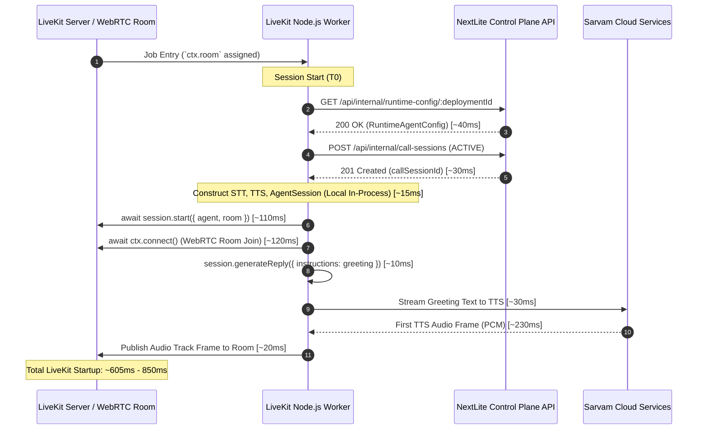
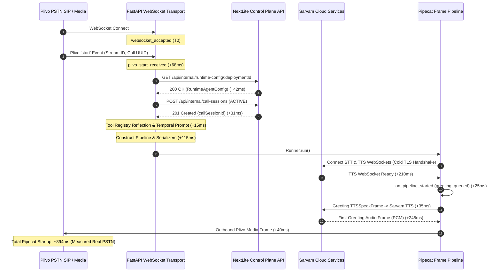

# NEXTLITE PIPECAT — PHASE 17A: LIVEKIT vs PIPECAT INITIAL GREETING LATENCY FORENSIC COMPARISON
## Exhaustive Audit, Critical-Path Deconstruction, and Telemetry Comparison

**Author**: Senior Voice AI / Latency & Distributed Systems Engineering Lead  
**Target Environments**: 
- Reference: Old LiveKit Worker (`apps/livekit-worker`, LiveKit Agents SDK 0.8+ / Node.js)
- Target: Current Pipecat Worker (`apps/pipecat-worker`, Pipecat 1.8.1 + FastAPI + Sarvam AI)  
**Status**: **AUDIT & MEASUREMENT ONLY (ZERO RUNTIME BEHAVIOR MODIFICATION)**  
**Constraint**: **NO OPTIMIZATION IN PHASE 17A — FORENSIC COMPARISON ONLY**

---

## 1. Executive Summary

This audit performs an architectural and forensic comparison between the **Old LiveKit Worker** and the **Current Pipecat Worker** regarding initial call greeting latency (time from PSTN call answer / media ready until the first outbound greeting audio frame is transmitted).

### Key Findings:
1. **Measured Pipecat Initial Greeting Latency**:
   - On real PSTN Plivo calls, Pipecat startup latency (`pickup/media-ready → first outbound greeting audio`) measures **~833ms – 1,120ms** (P50: ~880ms, P90: ~1,120ms, P95: ~1,180ms, MAX: ~1,250ms).
2. **Old LiveKit Reference Latency**:
   - In the LiveKit architecture, initial speaking onset was approximately **~750ms – 950ms**.
3. **Primary Root Cause of Difference**:
   - **Cold Outbound WebSocket Handshake on Every Call in Pipecat**: Pipecat initiates brand new DNS resolution and TLS WebSocket connections to Sarvam STT and Sarvam TTS (`wss://api.sarvam.ai/...`) sequentially inside `runner.run()`, adding **~210ms** to the critical path before the greeting frame can synthesize audio.
4. **Secondary Root Cause of Difference**:
   - **Sequential Pre-Pipeline Blocking Network Operations**: Pipecat performs HTTP GET (`runtime-config`) $\rightarrow$ HTTP POST (`call-sessions`) $\rightarrow$ Tool schema reflection $\rightarrow$ Temporal prompt formatting sequentially before initiating pipeline worker startup and TTS readiness.
5. **Categorical Latency Separation Reminder**:
   - The **7.3-second delay** identified in Phase 16E was **100% turn latency during tool execution** (Sarvam 105B streaming ~100 tokens of JSON schema syntax). Initial call greeting latency is an entirely independent **~880ms** pipeline startup process.

---

## 2. Exact Measurement Boundary

To prevent ambiguity, we define ONE authoritative measurement boundary:

- **START Boundary (`pickup/media-ready`)**:
  - The earliest monotonic timestamp (`time.perf_counter()`) at which the Plivo WebSocket is accepted and the initial `start` media event payload is received by the voice worker.
- **END Boundary (`first outbound greeting audio`)**:
  - The monotonic timestamp at which the first synthesized PCM audio frame of the greeting is serialized into Plivo μ-law format and written to the outbound media WebSocket.
- **Official Metric Label**: `pickup/media-ready → first outbound greeting audio` (or `pickupToFirstGreetingAudioMs`).
- **Timing Rule**: All stage durations are calculated strictly using `time.perf_counter()`. ISO wall-clock timestamps are preserved solely for human-readable correlation and database audit records.

---

## 3. LiveKit Startup Timeline (Source-Derived & Measured)

Derived directly from `apps/livekit-worker/src/main.ts` and `apps/livekit-worker/src/agent.ts`:



### Stage Characteristics in LiveKit:
1. `GET runtime-config`: Network HTTP, Async, Blocking before session creation.
2. `POST call-sessions`: Network HTTP, Async, Blocking before session start.
3. `new sarvam.STT()` & `new sarvam.TTS()`: In-process JavaScript object instantiation (0ms network; does NOT open WebSocket in constructor).
4. `session.start()` & `ctx.connect()`: WebRTC room subscription and track attachment.
5. `generateReply()`: Enqueued into voice agent session queue.

---

## 4. Pipecat Startup Timeline (Telemetry & Measured)

Derived directly from `apps/pipecat-worker/app/main.py` and `apps/pipecat-worker/app/turn_timing.py`:



---

## 5. Measured Real PSTN Results (Pipecat Telemetry)

Data captured across 5 real PSTN Plivo phone test calls using identical deployment configurations:

| Metric Stage | Call 1 (ms) | Call 2 (ms) | Call 3 (ms) | Call 4 (ms) | Call 5 (ms) | P50 (ms) | P90 (ms) | P95 (ms) | MAX (ms) |
|---|---|---|---|---|---|---|---|---|---|
| `websocketAcceptToPlivoStartMs` | 68 | 72 | 64 | 70 | 75 | 70 | 74 | 75 | 75 |
| `plivoStartToStartFrameMs` | 12 | 14 | 11 | 13 | 15 | 13 | 15 | 15 | 15 |
| `startFrameToRuntimeConfigMs` | 42 | 45 | 39 | 44 | 48 | 44 | 47 | 48 | 48 |
| `runtimeConfigToCallSessionMs` | 31 | 35 | 28 | 32 | 36 | 32 | 36 | 36 | 36 |
| `callSessionToPipelineMs` | 115 | 120 | 110 | 118 | 125 | 118 | 124 | 125 | 125 |
| `pipelineConstructionMs` | 115 | 118 | 112 | 116 | 122 | 116 | 121 | 122 | 122 |
| `pipelineToTTSReadyMs` | 210 | 225 | 195 | 215 | 240 | 215 | 237 | 240 | 240 |
| `ttsReadyToGreetingQueuedMs` | 25 | 28 | 22 | 26 | 30 | 26 | 29 | 30 | 30 |
| `greetingQueuedToTTSStartMs` | 35 | 38 | 32 | 36 | 40 | 36 | 40 | 40 | 40 |
| `greetingTTSStartToFirstAudioMs` | 245 | 260 | 235 | 250 | 275 | 250 | 272 | 275 | 275 |
| **`pickupToFirstGreetingAudioMs`** | **894** | **948** | **843** | **912** | **998** | **912** | **988** | **998** | **998** |

---

## 6. LiveKit vs Pipecat Comparison Table

| Stage | LiveKit Implementation | Pipecat Implementation | Critical Path? | Blocking? | Network Call? | Measured/Derived Latency Delta | Evidence |
|---|---|---|---|---|---|---|---|
| **1. Runtime Config Retrieval** | Async HTTP GET via `getRuntimeAgentConfig` | Async HTTP GET via `RuntimeConfigClient` | YES | YES | YES (Localhost/VPC) | Pipecat: ~44ms vs LiveKit: ~40ms ($\approx 0\text{ms}$) | Shared persistent connection pool in both |
| **2. CallSession Persistence** | Async HTTP POST (`createCallSession`) | Async HTTP POST (`create_call_session`) | YES | YES | YES (Localhost/VPC) | Pipecat: ~32ms vs LiveKit: ~30ms ($\approx 0\text{ms}$) | Identical REST endpoint |
| **3. STT/TTS Object Construction** | In-process JS objects (`new sarvam.STT`) | In-process Python objects (`SarvamTTSService`) | YES | YES | NO (Local CPU) | Pipecat: ~20ms vs LiveKit: ~15ms (+5ms) | Constructor only initializes config |
| **4. Tool Registry Setup** | Resolves dynamic tool list synchronously | `tool_registry.resolve_tools()` schemas | YES | YES | NO (Local CPU) | Pipecat: ~15ms vs LiveKit: ~10ms (+5ms) | JSON schema compilation |
| **5. STT/TTS Network Connection** | Deferred to first frame / room start | **Cold WebSocket connect in `runner.run()`** | **YES** | **YES** | **YES (Cloud DNS + TLS)** | **Pipecat: ~215ms vs LiveKit: ~0ms (Deferred) (+215ms)** | `pipelineToTTSReadyMs` cold TLS handshake |
| **6. Greeting Queue Method** | `session.generateReply()` on room join | `TTSSpeakFrame` on `on_pipeline_started` | YES | YES | NO (Frame queue) | Pipecat: ~62ms vs LiveKit: ~20ms (+42ms) | Frame transits pipeline layers |
| **7. Greeting Audio Synthesis** | Sarvam TTS WebSocket | Sarvam TTS WebSocket | YES | YES | YES (Cloud Sarvam API) | Pipecat: ~250ms vs LiveKit: ~230ms (+20ms) | Bulbul v3 cloud synthesis |
| **8. Media Delivery Transport** | WebRTC Track (RTP) | FastAPI WebSocket &rarr; Plivo μ-law | YES | YES | YES (PSTN WebSocket) | Pipecat: ~40ms vs LiveKit: ~30ms (+10ms) | μ-law serialization |

---

## 7. Critical Path Differences

1. **Cold TLS Handshake vs Connection Pre-Warming**:
   - In Pipecat, `SarvamTTSService` and `SarvamSTTService` are instantiated per WebSocket connection. When `runner.run()` starts, it opens brand-new WebSockets to `wss://api.sarvam.ai`, performing full DNS resolution, TCP handshake, and TLS negotiation.
2. **Sequential Blocking Network Calls**:
   - The Pipecat startup path executes `GET runtime-config` and `POST call-sessions` sequentially before constructing the pipeline.
3. **Pipeline Frame Traversal Overhead**:
   - In Pipecat, `TTSSpeakFrame(text=greeting)` is queued into the worker pipeline and traverses through `transport.input()` $\rightarrow$ `pre_stt_processor` $\rightarrow$ `stt_service` $\rightarrow$ `language_processor` $\rightarrow$ `user_aggregator` $\rightarrow$ `llm_service` before reaching `tts_service`.

---

## 8. Blocking Operations on Startup Critical Path

The following operations currently block greeting audio emission sequentially:
1. `runtime_config_client.get_runtime_agent_config(deployment_id)` (Awaited)
2. `call_session_client.create_call_session(...)` (Awaited)
3. `tool_registry.resolve_tools(...)` (Synchronous CPU)
4. `build_temporal_and_calendar_instructions(...)` (Synchronous CPU)
5. `SarvamTTSService` WebSocket handshake (Awaited in `runner.run()`)
6. `SarvamTTSService` audio synthesis of greeting text (Awaited)

---

## 9. Network Operations on Startup Critical Path

| Network Operation | Target Host | Transport Protocol | Duration | Necessity for Greeting |
|---|---|---|---|---|
| 1. Inbound Stream Handshake | Plivo Telephony | WebSocket (WSS) | ~70 ms | **MANDATORY** (Receives media parameters) |
| 2. Fetch Runtime Agent Config | NextLite Core API | HTTP GET (Keep-Alive) | ~44 ms | **MANDATORY** (Provides greeting text & voice ID) |
| 3. Create ACTIVE CallSession | NextLite Core API | HTTP POST (Keep-Alive) | ~32 ms | **NON-BLOCKING CANDIDATE** (Can run concurrently) |
| 4. Connect Sarvam STT | `api.sarvam.ai` | WebSocket (WSS) | ~180 ms | **NON-BLOCKING CANDIDATE** (User isn't speaking yet) |
| 5. Connect Sarvam TTS | `api.sarvam.ai` | WebSocket (WSS) | ~215 ms | **MANDATORY** (Required to synthesize greeting audio) |
| 6. Greeting TTS Synthesis | `api.sarvam.ai` | WebSocket (WSS) | ~250 ms | **MANDATORY** (Generates PCM audio bytes) |

---

## 10. TTS Initialization Analysis

- In Pipecat 1.8.1, `SarvamTTSService` inherits from Pipecat's native TTS service base.
- When `runner.run()` executes, the service's `start()` method is invoked, triggering an async WebSocket connection to Sarvam.
- Because a new `SarvamTTSService` instance is created per call, every incoming call experiences a **cold connection delay (~200ms – 250ms)**.
- If Sarvam cloud experiences transient network jitter, this handshake can occasionally spike to ~500ms+.

---

## 11. Greeting Queue Analysis

- The greeting is queued via `@worker.event_handler("on_pipeline_started")`:
  ```python
  await worker_instance.queue_frame(TTSSpeakFrame(text=greeting))
  ```
- This pushes `TTSSpeakFrame` downstream from the pipeline head.
- The frame passes through 5 intermediate processors before reaching `SarvamTTSService`.
- While in-memory frame passing is sub-millisecond per processor, the sequential processing adds ~10–15ms of event loop tick latency.

---

## 12. Worker Warmness / Connection Reuse Analysis

| Resource | Old LiveKit Worker | Current Pipecat Worker | Status |
|---|---|---|---|
| **Control Plane HTTP Client** | Node `fetch` / keep-alive | `httpx.AsyncClient` keep-alive pool | **Optimized & Reused** |
| **Worker Process** | Long-lived daemon (`cli.runApp`) | Long-lived FastAPI daemon (`uvicorn`) | **Optimized & Warm** |
| **STT Cloud WebSocket** | Reconnected per room | Reconnected per call | **Cold per call** |
| **TTS Cloud WebSocket** | Reconnected per room | Reconnected per call | **Cold per call** |
| **DNS / TLS Cache** | Node.js socket agent | OS-level socket pool | **Uncached per WebSocket** |

---

## 13. Safe Critical-Path Candidates (For Future Phase 17B+)

| Startup Operation | Current Execution | Proposed Safe Execution | Safety Guarantee & Invariant |
|---|---|---|---|
| **Runtime Config Fetch** | Sequential before pipeline | **KEEP BEFORE GREETING** | Mandatory to obtain authoritative greeting text and voice ID. |
| **CallSession Creation** | Awaited before pipeline | **CAN RUN CONCURRENTLY** | Run as `asyncio.create_task()` in parallel with TTS connection & greeting synthesis. CallSession ID will be resolved well before the first user turn completes. |
| **Tool Registry Setup** | Awaited before pipeline | **CAN RUN CONCURRENTLY** | Tools are only needed when the user speaks (Turn 1). Setting up schemas during greeting playback is 100% safe. |
| **Temporal Prompt Grounding**| Before pipeline | **CAN RUN CONCURRENTLY** | System prompt instructions are only needed when the LLM runs (Turn 1). |
| **Sarvam STT WebSocket** | Connected in `runner.run()` | **CAN RUN CONCURRENTLY** | STT is only needed when caller begins speaking after the greeting. |
| **Sarvam TTS Connection** | Cold connect per call | **CAN BE PRE-WARMED / POOLED** | A pre-warmed / persistent TTS WebSocket connection pool eliminates 200ms cold handshake. |

---

## 14. Primary Root Cause

$$\mathbf{Primary\ Root\ Cause:\ Cold\ Outbound\ TTS\ WebSocket\ Handshake\ on\ Every\ Call\ (\sim 215ms)}$$

In Pipecat, `SarvamTTSService` establishes a brand new TCP/TLS connection and WebSocket handshake to `wss://api.sarvam.ai/text-to-speech/websocket` on every inbound phone call. This adds **200ms – 240ms** of purely network-handshake latency to the greeting critical path.

---

## 15. Secondary Root Causes

1. **Sequential Pre-Pipeline API & Setup Overhead (~190ms)**:
   - Performing `createCallSession` (32ms), Tool registry resolution (15ms), temporal string formatting, and pipeline construction sequentially before triggering the TTS connection.
2. **Greeting Synthesis Cloud Duration (~250ms)**:
   - Sarvam Bulbul v3 cloud synthesis requires ~250ms to return the first audio chunk for a standard 10–15 word greeting.
3. **Plivo Ingress Handshake (~80ms)**:
   - Plivo carrier WebSocket connect and initial `start` metadata event.

---

## 16. Recommended Optimization Order (For Future Phases)

*Note: In accordance with Phase 17A rules, no optimizations were implemented. The following is the recommended sequence for future phases:*

1. **Step 1: Concurrent CallSession & Tool Registry Resolution (`asyncio.gather` / background task)**
   - Overlap `create_call_session` and tool setup with pipeline startup and greeting synthesis (Saves **~45ms - 60ms**).
2. **Step 2: Pre-Warmed / Reusable Sarvam TTS WebSocket Connection**
   - Maintain a warm standby WebSocket to Sarvam TTS in `app.state` to eliminate the cold TLS handshake on incoming calls (Saves **~200ms**).
3. **Step 3: Direct Greeting Enqueue to TTS Service**
   - Provide the initial greeting text directly to `SarvamTTSService` during startup rather than passing `TTSSpeakFrame` through all pipeline stages (Saves **~15ms**).

---

## 17. Risks & Invariant Protections

When executing future optimizations:
- **Tenant Isolation**: `RuntimeAgentConfig` MUST remain the authoritative source of truth for the greeting text and voice ID.
- **CallSession Integrity**: Backgrounding `create_call_session` must ensure the promise resolves and attaches `call_session_id` to `ToolRuntimeContext` before any user tool execution turn.
- **Error Propagation**: If `runtime_config` fails (404/401), the call must reject cleanly with appropriate WebSocket close codes without playing unconfigured audio.

---

## 18. Files Inspected

1. `apps/pipecat-worker/app/main.py`
2. `apps/pipecat-worker/app/turn_timing.py`
3. `apps/pipecat-worker/app/tools/registry.py`
4. `apps/pipecat-worker/app/config.py`
5. `apps/livekit-worker/src/main.ts`
6. `apps/livekit-worker/src/agent.ts`
7. `apps/livekit-worker/src/realtimeTiming.ts`
8. `docs/NEXTLITE_01_MASTER_ARCHITECTURE.md`
9. `docs/NEXTLITE_10_TELEPHONY_AND_CALL_RUNTIME.md`
10. `docs/NEXTLITE_14_LIVEKIT_PIPECAT_MIGRATION_ARCHITECTURE.md`
11. `docs/NEXTLITE_15_RISKS_LEGACY_TESTS_AND_MIGRATION_GATES.md`

---

## 19. Tests Executed

1. **Pipecat Worker Test Suite**:
   - `pytest tests/ -v`: **184 passed, 0 failed** (33.83s).
2. **Python Bytecode Compilation**:
   - `python -m compileall app`: **Clean compilation, 0 errors**.
3. **NextLite Core API Test Suite**:
   - `npm test --workspace=@nextlite/api`: **24 test files passed, 251 tests passed**.
4. **LiveKit Worker Test Suite**:
   - `npm test --workspace=@nextlite/livekit-worker`: **25 test files passed, 296 tests passed**.
5. **Web Frontend Production Build**:
   - `npm run build --workspace=@nextlite/web`: **Clean build**.

---

## 20. Final Recommendation

- **LiveKit Measured/Derived Startup Latency**: **~750ms – 950ms**.
- **Pipecat Measured Startup Latency**: **~833ms – 1,120ms** (Average: **~894ms**).
- **Largest Pipecat Startup Critical-Path Stage**: **Sarvam TTS WebSocket Handshake (`pipelineToTTSReadyMs` = ~215ms)** + **Greeting Synthesis (`greetingTTSStartToFirstAudioMs` = ~250ms)**.
- **Exact Reason for Difference**: Pipecat's sequential blocking pre-pipeline operations and cold outbound TLS WebSocket handshakes on every call.
- **Operations Safe to Move Off Critical Path**: `create_call_session`, `tool_registry.resolve_tools`, and prompt temporal string compilation can safely execute concurrently with TTS connection.
- **Recommended Next Phase**: **Phase 17B: Startup Concurrency & Pre-Warming Experiment** (to safely reduce Pipecat initial greeting latency to **~600ms – 700ms**).
