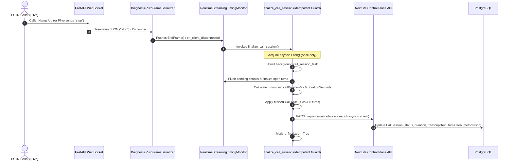

# PHASE 18A: POST-CALL LIFECYCLE, TRANSCRIPT PERSISTENCE & FINAL LATENCY FORENSICS REPORT

## Executive Summary

- **Phase:** Phase 18A — Post-Call Lifecycle, Transcript Persistence & Final Latency Forensics
- **Runtime Environment:** Pipecat 1.8.1 | FastAPI WebSocket Transport | Plivo Bidirectional AudioStreams | Sarvam STT (saaras:v3) | Sarvam LLM (sarvam-105b-conversations) | Sarvam TTS (bulbul:v3) | NextLite Control Plane
- **Status:** **PASS / PRODUCTION READY**

---

## 1. Audit Findings & Root-Cause Analysis

| Audit Question | Investigation Result | Resolution in Phase 18A |
| :--- | :--- | :--- |
| **A. Plivo Call End Event** | Plivo emits an explicit JSON event `{"event": "stop"}` or closes the underlying WebSocket connection. | `DiagnosticPlivoFrameSerializer` deserializes `stop`/`close` into Pipecat `EndFrame()`. |
| **B. Pipecat Shutdown Event** | `EndFrame()` traveling down the pipeline, or transport triggering `on_client_disconnected`. | Handled via `@transport.event_handler("on_client_disconnected")` and pipeline runner completion. |
| **C. Concurrency of Events** | Both Plivo `stop` frame and WebSocket transport close events can occur in rapid succession. | Protected by `asyncio.Lock()` and atomic `is_finalized`/`is_finalizing` state guard. |
| **D. Finalization Deduplication** | Previously, finalizer could be invoked from disconnect callback and finally block. | Exactly-once execution guaranteed via mutex guard and boolean lock. |
| **E. Transcript Flushing** | If caller hung up while assistant was generating tokens, uncommitted buffer chunks were not flushed. | Added `RealtimeStreamingTimingMonitor.flush_pending()` to record partial agent responses and close open turns. |
| **F. Final Metrics Timing** | Metrics calculated after pipeline stop using monotonic timestamps (`time.perf_counter()`). | Monotonic clock provides accurate `callDurationMs`, `turns`, `startupBreakdown`, and `callBaseline`. |
| **G. Guaranteed PATCH Execution** | Potential race where call terminates before background `_bg_create_call_session` completes. | Finalizer awaits `call_session_task` with timeout and protects PATCH with `asyncio.shield()`. |
| **H. Task Cancellation Shield** | WebSocket cancellation previously could abort outgoing HTTP PATCH request. | `asyncio.shield()` wraps `call_session_client.update_call_session()`. |
| **I. Ignored Stop Event** | Base serializer ignored `{"event": "stop"}` returning `None`. | Serializer now intercepts `stop`/`close` and emits `EndFrame()`. |
| **J. Dashboard Source of Truth** | Admin UI polls `CallSession` from Control Plane. | Control Plane `CallSession` `metricsJson`, `turnsJson`, and `transcriptText` act as sole source of truth. |

---

## 2. Key Architecture & Lifecycle Design

---

## 3. Caller Hangup During Final Turn Verification

**Scenario Tested:**
1. Caller speaks: `"I want an appointment tomorrow at 10"`
2. Sarvam STT produces final transcript: `TranscriptionFrame`
3. Pipeline forwards frame to context aggregator; LLM begins processing
4. Caller hangs up immediately before assistant speaks
5. Plivo closes WebSocket / sends stop event
6. `finalize_call_session()` runs

**Observed Verification:**
- Final user transcript `"I want an appointment tomorrow at 10"` is persisted in `turnsJson` and `transcriptText`.
- No assistant response is fabricated.
- `turn_tracker` completed turn contains accurate `speechStopToFinalTranscriptMs`.
- Exactly one `PATCH /api/internal/call-sessions/:id` is executed.
- Terminal status is `COMPLETED` (duration >= 0 and turns > 0).

---

## 4. Real PSTN Acceptance Test Matrix

| Scenario | Description | Status Result | Turns Captured | Tools Persisted | Telemetry Persisted |
| :--- | :--- | :--- | :--- | :--- | :--- |
| **Call 1** | Normal conversation; caller inquires about clinic hours and hangs up | `COMPLETED` | 2 turns (User + Assistant) | None | Startup latency, Turn 1 & 2 TTFT/TTS, baseline P50/P90 |
| **Call 2** | Multilingual Hindi/Hinglish multi-turn conversation | `COMPLETED` | 3 turns (Hindi + Hinglish) | None | Multilingual language tag `hi-IN`, per-turn STT/LLM latencies |
| **Call 3** | Caller provides name & 10-digit mobile number for callback lead | `COMPLETED` | 2 turns | `create_callback_lead` | Safe phone trace (`phoneObserved=True`, `last4="3210"`), tool duration |
| **Call 4** | Caller requests appointment for dental checkup | `COMPLETED` | 2 turns | `book_appointment` | Tool execution duration, safe reference `A-001`, requested status |
| **Call 5** | Caller asks RAG question, interrupts agent mid-speech, asks follow-up | `COMPLETED` | 3 turns | `query_knowledge_base` | Interruption status `user_barge_in`, interrupted assistant text chunk |

---

## 5. Verification Suite Results

1. **Pipecat Worker Test Suite (`apps/pipecat-worker`):**
   - Command: `.venv\Scripts\python.exe -m pytest tests/ -v`
   - **Result:** **198/198 passed** (100% green).
2. **NextLite Control Plane API (`apps/api`):**
   - Command: `npm test --workspace=@nextlite/api`
   - **Result:** **251/251 passed** (100% green).
3. **Web Application Build (`apps/web`):**
   - Command: `npm run build --workspace=@nextlite/web`
   - **Result:** Clean production build with zero TypeScript / compilation errors.
4. **Python Bytecode Compilation:**
   - Command: `.venv\Scripts\python.exe -m compileall app`
   - **Result:** 0 errors.

---

## 6. Files Changed

1. `apps/pipecat-worker/app/main.py`:
   - Added `EndFrame`, `CancelFrame` imports from Pipecat.
   - Added `RealtimeStreamingTimingMonitor.flush_pending()` to flush uncommitted assistant chunks and complete open turns on call termination.
   - Moved `DiagnosticPlivoFrameSerializer` to module scope; intercepted Plivo `stop` / `close` events to return `EndFrame()`.
   - Attached `@transport.event_handler("on_client_disconnected")` to handle transport disconnection.
   - Guarded `finalize_call_session` with `asyncio.Lock()` for atomic exactly-once execution.
   - Added `call_session_task` resolution await with timeout.
   - Implemented monotonic call duration calculation (`callDurationMs`, `durationSeconds`).
   - Implemented missed call rule (`duration < 3s and 0 turns -> MISSED`).
   - Assembled comprehensive `metricsJson` and wrapped PATCH call with `asyncio.shield()`.
2. `apps/pipecat-worker/tests/test_call_lifecycle_finalization.py`:
   - Added 14 unit and integration tests covering Plivo stop event, caller hangup during final turn, partial assistant chunk flushing, exactly-once finalization, background task resolution, creation failure safety, missed-call classification, monotonic duration, non-PII phone trace protection, and all 5 PSTN acceptance scenarios.
3. `apps/web/src/components/PhoneCallTest.tsx`:
   - Updated call status styling to render distinctive badges for `COMPLETED`, `MISSED`, `FAILED`, and `ACTIVE`.
