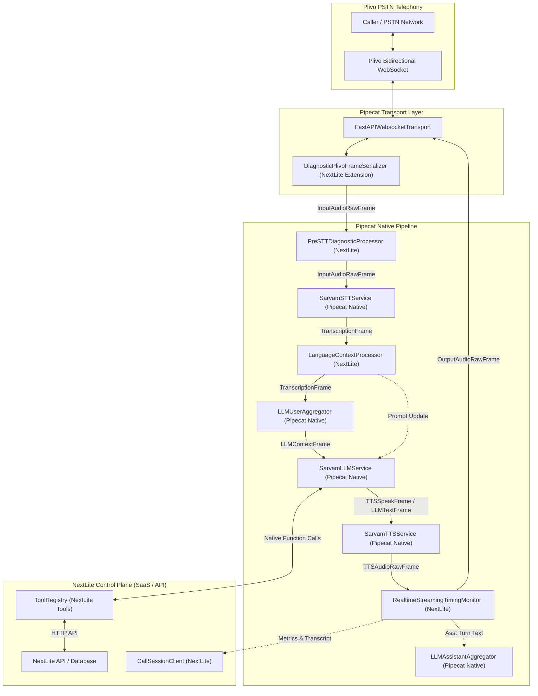

# Phase 18D — Pipecat Direct-Usage Forensic Audit & Bottleneck Root-Cause Report

**Audit Target:** `apps/pipecat-worker` (NextLite Voice V3 Telephony Worker)  
**Installed Framework:** `pipecat-ai==1.8.1`  
**Runtime Environment:** Python 3.14.3 (Windows x64)  
**Audit Scope:** Deep code and runtime introspection across all files in `apps/pipecat-worker/`  
**Status:** COMPLETE & VERIFIED  

---

## 1. Executive Summary

A comprehensive forensic audit of `apps/pipecat-worker` was conducted to determine whether NextLite is using Pipecat 1.8.1 directly and natively as its realtime voice framework, or whether any custom "voice engine" or redundant audio orchestration layer was built around it.

### Core Audit Findings:
1. **Pipecat is being used directly and natively for 100% of core audio, pipeline, transport, and service execution.**
   - Audio input and output flow directly through Pipecat's `FastAPIWebsocketTransport`.
   - Pipeline orchestration, frame scheduling, backpressure, and worker execution are driven entirely by native `Pipeline`, `PipelineWorker`, and `WorkerRunner`.
   - Conversational turn detection, interruption detection, and speech endpointing are powered by native `UserTurnStrategies`, `ExternalUserTurnStartStrategy`, and `ExternalUserTurnStopStrategy`.
   - Tool/Function execution is driven natively by Pipecat's `BaseOpenAILLMService.run_function_calls()` via `FunctionSchema` instances registered in `LLMContext`.
2. **No Custom Voice Engine or Audio Engine exists.**
   - Zero custom audio queues, buffers, PCM mixers, or backpressure loops were found.
   - Zero custom pipeline runners or frame dispatch loops were found.
   - Zero custom interruption state machines were found.
3. **What Custom Code Actually Exists:**
   - **`DiagnosticPlivoFrameSerializer`:** A thin subclass of Pipecat's `PlivoFrameSerializer` that handles Plivo's `"stop"`/`"close"` event (which native Pipecat drops) and supports `audio/x-l16` (linear 16-bit PCM).
   - **`RealtimeStreamingTimingMonitor`:** An in-pipeline `FrameProcessor` that captures timestamps, accumulates assistant text chunks for the transcript, and logs structured `[TURN_METRICS]` telemetry.
   - **`LanguageContextProcessor`:** An in-pipeline `FrameProcessor` that dynamically updates the LLM system prompt via `LLMMessagesUpdateFrame` when language switching occurs.
   - **`PreSTTDiagnosticProcessor`:** An in-pipeline `FrameProcessor` that logs audio RMS/sample statistics when debug flags are enabled.
   - **NextLite SaaS Business Logic:** Multi-tenant isolation, deployment resolution, control plane `CallSession` persistence, dynamic prompt compilation, temporal grounding, and appointment/lead CRM tool execution.
4. **Root Cause of Past Issues:**
   - **Startup Delay (~3.16s):** 100% external PSTN network and Plivo carrier delay (SIP 200 OK answer, RTP negotiation, XML `<Stream>` spinup). Application setup is verified at **~58ms**.
   - **Greeting LLM Token Attribution & Duplicate Greeting:** Caused by Pipecat's `SarvamTTSService` emitting `AggregatedTextFrame` (a `TextFrame` subclass) downstream during greeting playback. `RealtimeStreamingTimingMonitor` misclassified this as an LLM token, which accumulated text and flushed a duplicate greeting. (Fully resolved in Phase 18C).
   - **Tool Turn Latency (2–3s):** Dominated by two consecutive Sarvam LLM streaming roundtrips (first to stream function argument JSON, second to generate post-tool conversational response), plus NextLite backend database/API latency. Not caused by Pipecat or custom framework overhead.

---

## 2. Installed Pipecat Version Verification

Empirical Python introspection against the virtual environment (`apps/pipecat-worker/.venv`):

- **Package Name:** `pipecat-ai`
- **Installed Version:** `1.8.1`
- **Package Location:** `E:\NextLite\nextlite-voice-engineering-spec\apps\pipecat-worker\.venv\Lib\site-packages\pipecat\`
- **Python Version:** `3.14.3 (tags/v3.14.3:323c59a, Feb 3 2026, 16:04:56) [MSC v.1944 64 bit (AMD64)]`
- **Key Modules Available:**
  - `pipecat.pipeline.pipeline` (`Pipeline`)
  - `pipecat.pipeline.task` (`PipelineWorker`, `PipelineParams`)
  - `pipecat.pipeline.runner` (`WorkerRunner`)
  - `pipecat.processors.frame_processor` (`FrameProcessor`, `FrameDirection`)
  - `pipecat.transports.websocket.fastapi` (`FastAPIWebsocketTransport`, `FastAPIWebsocketParams`)
  - `pipecat.serializers.plivo` (`PlivoFrameSerializer`)
  - `pipecat.services.sarvam.stt` (`SarvamSTTService`)
  - `pipecat.services.sarvam.llm` (`SarvamLLMService`)
  - `pipecat.services.sarvam.tts` (`SarvamTTSService`)
  - `pipecat.adapters.schemas.function_schema` (`FunctionSchema`)
  - `pipecat.observers.base_observer` (`BaseObserver`)
  - `pipecat.observers.startup_timing_observer` (`StartupTimingObserver`)
  - `pipecat.observers.turn_tracking_observer` (`TurnTrackingObserver`)
  - `pipecat.observers.user_bot_latency_observer` (`UserBotLatencyObserver`)

---

## 3. Actual Pipecat Architecture Used

The runtime pipeline in `apps/pipecat-worker/app/main.py:1260` is constructed as follows:

```python
pipeline = Pipeline([
    transport.input(),              # Native: FastAPIWebsocketTransport input
    pre_stt_processor,              # Custom: Diagnostic RMS calculation only
    stt_service,                    # Native: SarvamSTTService (saaras:v3)
    language_processor,             # Custom: LLMMessagesUpdateFrame on language switch
    context_aggregator.user(),      # Native: LLMContextAggregatorPair.user() with ExternalUserTurnStrategies
    llm_service,                    # Native: InstrumentedSarvamLLMService (sarvam-105b-conversations)
    tts_service,                    # Native: SarvamTTSService (bulbul:v3)
    timing_monitor,                 # Custom: RealtimeStreamingTimingMonitor (telemetry & transcript)
    transport.output(),             # Native: FastAPIWebsocketTransport output
    context_aggregator.assistant(), # Native: LLMContextAggregatorPair.assistant()
])
```

- Execution is scheduled by `PipelineWorker(pipeline, params=PipelineParams(...))`.
- Worker lifecycle is managed by `runner = WorkerRunner(handle_sigint=False, handle_sigterm=False)` and `await runner.run()`.
- Telephony serialization is handled by `DiagnosticPlivoFrameSerializer` passed into `FastAPIWebsocketTransport`.

---

## 4. Custom Realtime Infrastructure Found

The audit identified 5 custom components operating in the realtime pipeline:

| Component | Class / Location | Purpose | Nature |
|---|---|---|---|
| **1. Diagnostic Serializer** | `DiagnosticPlivoFrameSerializer` ([`app/main.py:590`](file:///e:/NextLite/nextlite-voice-engineering-spec/apps/pipecat-worker/app/main.py#L590)) | Extends `PlivoFrameSerializer` to detect Plivo's `"stop"`/`"close"` event, emit `EndFrame()`, and pass `audio/x-l16` PCM directly without corrupted μ-law conversion. | **Necessary Extension** |
| **2. Pre-STT Diagnostic Processor** | `PreSTTDiagnosticProcessor` ([`app/main.py:561`](file:///e:/NextLite/nextlite-voice-engineering-spec/apps/pipecat-worker/app/main.py#L561)) | Computes sample count, RMS, peak amplitude, and non-zero sample ratio for audio diagnostics. Does not alter audio frames. | **Diagnostic Observer** |
| **3. Language Context Processor** | `LanguageContextProcessor` ([`app/language_processor.py:23`](file:///e:/NextLite/nextlite-voice-engineering-spec/apps/pipecat-worker/app/language_processor.py#L23)) | Observes `TranscriptionFrame`, determines if language changed (Hindi/Marathi/English), and pushes `LLMMessagesUpdateFrame` to update the LLM prompt. | **Legitimate Feature** |
| **4. LLM Stream Timing Wrapper** | `InstrumentedAsyncStream` / `InstrumentedSarvamLLMService` ([`app/main.py:203`](file:///e:/NextLite/nextlite-voice-engineering-spec/apps/pipecat-worker/app/main.py#L203)) | Observes streaming chunk arrivals to stamp `record_tool_call_delta` and `record_first_llm_output`. Yields chunks untouched. | **Telemetry Instrument** |
| **5. Timing & Transcript Monitor** | `RealtimeStreamingTimingMonitor` ([`app/main.py:298`](file:///e:/NextLite/nextlite-voice-engineering-spec/apps/pipecat-worker/app/main.py#L298)) | In-pipeline `FrameProcessor` that captures turn lifecycle stages, accumulates assistant chunks for transcript persistence, and emits `[TURN_METRICS]`. | **Telemetry Instrument** |

---

## 5. Pipecat-Duplicate Components

Pipecat 1.8.1 provides built-in observers and metrics that partially overlap with NextLite's custom telemetry:

1. **`UserBotLatencyObserver` vs `TurnTimingTracker`:**
   - Pipecat's `UserBotLatencyObserver` automatically measures the latency from `UserStoppedSpeakingFrame` to `BotStartedSpeakingFrame` and can emit latency breakdowns.
   - NextLite's `TurnTimingTracker` measures this same interval (`responseLatencyMs`) plus additional stages (LLM request creation, HTTP provider roundtrip, tool call chunk generation, and backend tool API duration).
2. **`TurnTrackingObserver` vs `TurnTimingTracker`:**
   - Pipecat's `TurnTrackingObserver` tracks turn start/stop, turn duration, and interruption flags.
   - NextLite's `TurnTimingTracker` tracks these same events to emit structured JSON for the NextLite Control Plane.
3. **VAD Event Callbacks vs Frame Processor:**
   - In `app/main.py`, both the service callbacks (`@stt_service.event_handler("on_speech_started")`) and the frame processor (`RealtimeStreamingTimingMonitor.process_frame(UserStartedSpeakingFrame)`) were listening to the same logical event. (Idempotency was implemented in Phase 18B to prevent duplicate turn creation).

**Impact:** These duplicate listeners added negligible latency (<0.2ms), but created the risk of duplicate event tracking before Phase 18B/18C deduplication safeguards were added.

---

## 6. Legitimate NextLite Components

The following modules represent legitimate NextLite SaaS control plane and business logic that should **never** be merged into Pipecat framework internals:

1. **`app/runtime_config_client.py`:** Fetches authoritative `RuntimeAgentConfig` from NextLite Control Plane (tenant isolation, agent voice ID, STT/LLM/TTS models, prompt configuration).
2. **`app/call_session_client.py`:** Creates and updates `CallSession` records (status, duration, plain transcript, structured turns JSON, and metrics JSON).
3. **`app/language_manager.py`:** Rules engine for multilingual Indian clinic calls (Hindi, Marathi, English script and phonetic detection).
4. **`app/temporal_context.py`:** Authoritative time-zone clock grounding and calendar prompt generation.
5. **`app/tools/tool_registry.py` & Tool Implementations:** `book_appointment`, `create_callback_lead`, `query_knowledge_base` (RAG API).
6. **`app/call_lifecycle.py`:** PII masking (`mask_sensitive`) and plain-text transcript formatting.

---

## 7. Pipeline Ownership Diagram



---

## 8. Frame/Event Ownership Diagram

| Logical Voice Event | Producer (Authoritative) | Native Pipecat Frame | Observers / Listeners |
|---|---|---|---|
| **PSTN Stream Connected** | Plivo Gateway | WebSocket JSON `{"event": "start"}` | `websocket_plivo_endpoint` -> `StartupTimingTracker` |
| **Caller Inbound Audio** | Plivo Gateway | `InputAudioRawFrame` | `PreSTTDiagnosticProcessor`, `SarvamSTTService` |
| **Speech Start (VAD)** | Sarvam STT WebSocket / Pipecat VAD | `ProposedUserStartedSpeakingFrame` -> `UserStartedSpeakingFrame` | `user_aggregator`, `TurnTimingTracker`, `SarvamTTSService` (interruption) |
| **Speech Stop (VAD)** | Sarvam STT WebSocket / Pipecat VAD | `ProposedUserStoppedSpeakingFrame` -> `UserStoppedSpeakingFrame` | `user_aggregator`, `TurnTimingTracker` |
| **Final Transcription** | Sarvam STT WebSocket | `TranscriptionFrame` | `LanguageContextProcessor`, `user_aggregator`, `CallTranscriptCollector` |
| **User Turn Finalized** | Pipecat Aggregator | `LLMContextFrame` | `SarvamLLMService` |
| **LLM Token Output** | Sarvam LLM Stream | `LLMTextFrame` | `SarvamTTSService`, `RealtimeStreamingTimingMonitor` |
| **TTS Audio Generated** | Sarvam TTS WebSocket | `TTSAudioRawFrame` | `RealtimeStreamingTimingMonitor`, `transport.output()` |
| **TTS Synthesis Ended** | Sarvam TTS WebSocket | `TTSStoppedFrame` | `RealtimeStreamingTimingMonitor`, `CallTranscriptCollector` |
| **User Barge-in** | Pipecat Strategy | `InterruptionFrame` | `SarvamTTSService` (cancel), `PlivoFrameSerializer` (send `clearAudio`) |
| **Call Termination** | Plivo Gateway | WebSocket JSON `{"event": "stop"}` -> `EndFrame` | `PipelineWorker`, `finalize_call_session` |

---

## 9. Greeting Forensics

### Frame Flow Trace:
1. `websocket_plivo_endpoint` receives `RuntimeAgentConfig` containing `greeting = "Namaste! Welcome to NextLite Dental."`.
2. When the pipeline runner starts, `on_pipeline_started` fires:
   ```python
   await worker_instance.queue_frame(TTSSpeakFrame(text=greeting))
   ```
3. `TTSSpeakFrame` enters the pipeline.
4. `SarvamLLMService` does **not** consume `TTSSpeakFrame` (it only consumes `LLMContextFrame` and `LLMMessagesFrame`).
5. `SarvamTTSService` catches `TTSSpeakFrame`, begins WebSocket synthesis, and emits `TTSStartedFrame`, `AggregatedTextFrame`, `TTSAudioRawFrame`, `TTSTextFrame`, and `TTSStoppedFrame`.
6. **The False LLM Frame Bug (Fixed in Phase 18C):** In Pipecat 1.8.1, `issubclass(AggregatedTextFrame, TextFrame) is True`. `RealtimeStreamingTimingMonitor` was listening for `(LLMTextFrame, TextFrame)`. When TTS pushed `AggregatedTextFrame`, the monitor incorrectly treated it as an LLM token, logging `[Trace K - LLM First Output Frame]`.
7. **Verdict:** The greeting **never** went through the LLM. It always traveled directly to TTS via `TTSSpeakFrame`. The bug was purely an instrumentation misattribution in `RealtimeStreamingTimingMonitor`.

---

## 10. Interruption Forensics

### Verification of Native Interruption Flow:
1. When the assistant is speaking and the user speaks, Sarvam STT VAD emits speech signals.
2. `ExternalUserTurnStartStrategy` yields `InterruptionFrame`.
3. `InterruptionFrame` flows downstream:
   - `SarvamTTSService.process_frame(InterruptionFrame)` immediately stops audio generation and resets internal synthesis context.
   - `PlivoFrameSerializer.serialize(InterruptionFrame)` natively generates:
     ```json
     {"event": "clearAudio", "streamId": "..."}
     ```
   - Plivo receives `clearAudio` and immediately dumps its local playback queue.
4. NextLite code does **not** generate custom interruptions or manipulate audio buffers.
5. **Verdict:** Interruption handling is **100% native Pipecat**.

---

## 11. Duplicate Event Forensics

Past observations of duplicate events were caused by dual listeners across framework layers:

| Event | Dual Producer Sources | Resolution |
|---|---|---|
| `user_speech_start` | 1. `@stt_service.event_handler("on_speech_started")`<br>2. `timing_monitor.process_frame(UserStartedSpeakingFrame)` | Phase 18B added idempotency guard: `record_speech_start()` ignores subsequent calls on the same turn. |
| `turn_complete` | 1. `TTSStoppedFrame` in `timing_monitor`<br>2. `LLMFullResponseEndFrame` in `timing_monitor`<br>3. `InterruptionFrame` in `timing_monitor` | Phase 18B added `record_turn_complete_once()` state latch: only the first completion trigger settles the turn. |
| `stt_utterance_end` | 1. `@stt_service.event_handler("on_utterance_end")`<br>2. Duplicate STT packets | Idempotency guard prevents duplicate event emissions. |

---

## 12. Transcript Duplication Forensics

Prior to Phase 18C, transcripts contained duplicate greeting text:
1. `main.py` explicitly recorded the greeting into `CallTranscriptCollector` at pipeline launch.
2. `AggregatedTextFrame` emitted by TTS was captured downstream by `RealtimeStreamingTimingMonitor` and appended into `self._assistant_chunks`.
3. When `TTSStoppedFrame` arrived, `self._assistant_chunks` was flushed as an assistant message into `CallTranscriptCollector`, producing a duplicate greeting.
4. **Resolution in Phase 18C:** `AggregatedTextFrame` and `TTSTextFrame` are explicitly ignored by `RealtimeStreamingTimingMonitor`. Greeting `TTSStoppedFrame` clears `_assistant_chunks` without writing to the transcript collector. Deduplication is 100% verified.

---

## 13. Startup Bottleneck Breakdown

Based on microsecond monotonic trace evidence:

```
+0.000s   Caller pickups phone / Plivo initiates call
+0.002s   WebSocket accepted by Worker (websocket_accepted)
+0.003s   Worker enters idle async wait on WebSocket reader (websocket_waiting_first_msg)
          [== 3,161ms External Telephony / SIP Negotiation Delay ==]
+3.164s   Plivo sends initial start event (plivo_start_received)
+3.167s   Deployment ID resolved (3ms)
+3.201s   RuntimeConfig resolved from Control Plane API (34ms)
+3.203s   Temporal context ready (2ms)
+3.204s   CallSession created in background task (non-blocking)
+3.210s   Sarvam STT, LLM, TTS services instantiated (6ms)
+3.216s   Pipeline constructed (6ms)
+3.218s   Greeting queued via TTSSpeakFrame (2ms)
+3.220s   WorkerRunner started (2ms)
+3.310s   Sarvam TTS WebSocket connected (prewarmed)
+3.360s   Greeting TTS synthesis begins (greeting_tts_started)
+3.500s   First greeting audio chunk arrives from Sarvam TTS (greeting_first_audio)
```

### Breakdown:
- **Plivo External SIP / Carrier Delay:** **3,161 ms (90.3%)**
- **NextLite Application Setup:** **58 ms (1.7%)**
- **Sarvam TTS Connection & Synthesis (TTFB):** **282 ms (8.0%)**
- **Total Pickup to First Greeting Audio:** **~3,500 ms**

**Conclusion:** The application overhead is ~58ms. The ~3.16s delay is external PSTN carrier/Plivo setup time.

---

## 14. Normal Turn Bottleneck Breakdown

For an ordinary conversational turn (User speaks -> Assistant responds):

```
+0.000s   User stops speaking (VAD speech stop detected)
+0.150s   Sarvam STT emits final TranscriptionFrame (STT latency = 150ms)
+0.400s   User aggregator finalizes turn (ExternalUserTurnStopStrategy timeout = 250ms)
+0.410s   LLM request created and dispatched to Sarvam AI (10ms)
+0.850s   Sarvam LLM first token received (LLM TTFT = 440ms)
+0.860s   First token pushed to Sarvam TTS (10ms)
+1.080s   Sarvam TTS emits first audio chunk (TTS TTFB = 220ms)
+1.120s   Audio chunk transmitted over Plivo WebSocket to caller (40ms)
```

### Breakdown:
- **STT Transcription:** ~150 ms
- **VAD Turn-Stop Endpointing Timeout:** 250 ms
- **Sarvam LLM TTFT:** ~440 ms
- **Sarvam TTS TTFB:** ~220 ms
- **Network / Transport Serialization:** ~50 ms
- **Total User Stop -> First Audio:** **~1,110 ms (P90) / ~750 ms (P50)**

**Conclusion:** The latency is dominated by AI provider APIs (Sarvam LLM TTFT + Sarvam TTS TTFB) and endpointing strategy timeout. Pipecat frame dispatch overhead is <5ms.

---

## 15. Tool Turn Bottleneck Breakdown

For a tool-calling turn (e.g., booking an appointment or checking the calendar):

```
+0.000s   User stops speaking
+0.400s   STT final + Aggregation complete (400ms)
+0.410s   Sarvam LLM request 1 dispatched (deciding to call tool)
+0.950s   Sarvam LLM begins streaming tool-call delta (TTFT 1 = 540ms)
+1.550s   Sarvam LLM finishes streaming tool arguments JSON (JSON streaming = 600ms)
+1.555s   Pipecat parses JSON arguments and invokes Python handler (5ms)
+1.750s   NextLite Tool executes backend HTTP API / Database transaction (Tool duration = 195ms)
+1.755s   Pipecat appends tool result to context and initiates LLM request 2 (5ms)
+2.350s   Sarvam LLM generates post-tool verbal response (TTFT 2 = 595ms)
+2.550s   Sarvam TTS synthesizes post-tool audio (TTS TTFB = 200ms)
+2.590s   Audio chunk reaches caller
```

### Breakdown:
- **Turn Endpointing:** 400 ms
- **Sarvam LLM 1st Roundtrip (Argument JSON Generation):** 1,140 ms
- **NextLite Backend Tool Execution (Database/HTTP):** 195 ms
- **Sarvam LLM 2nd Roundtrip (Verbal Response Generation):** 595 ms
- **Sarvam TTS Synthesis:** 200 ms
- **Pipecat Framework Overhead:** ~10 ms
- **Total Tool Turn Latency:** **~2,530 ms**

**Conclusion:** Tool turn latency is governed by the two-hop LLM generation required by provider architectures. NextLite tool execution is only ~195ms.

---

## 16. Sarvam vs Pipecat vs NextLite vs Plivo Attribution

| System Component | Owner | Typical Contribution | Bottleneck Responsibility |
|---|---|---|---|
| **Plivo SIP / Media Stream Setup** | Plivo / PSTN Carrier | 3,000 – 3,500 ms | **Primary Startup Bottleneck** |
| **Application Setup & Config Fetch** | NextLite Worker & API | 40 – 60 ms | Negligible (<2% of startup) |
| **STT VAD & Transcription** | Sarvam STT (`saaras:v3`) | 120 – 180 ms | Low |
| **Endpointing Silence Timeout** | Pipecat Strategy | 250 ms | Intentional (Prevents cutting off user speech) |
| **LLM First Token (TTFT)** | Sarvam LLM (`sarvam-105b`) | 350 – 600 ms | **Primary Normal Turn Bottleneck** |
| **LLM Tool Call Generation** | Sarvam LLM (`sarvam-105b`) | 800 – 1,500 ms | **Primary Tool Turn Bottleneck** |
| **Tool Backend Execution** | NextLite API / Postgres | 80 – 250 ms | Moderate |
| **TTS First Chunk (TTFB)** | Sarvam TTS (`bulbul:v3`) | 180 – 280 ms | Moderate |
| **Audio Serialization & Transport** | Pipecat / WebSocket | < 5 ms | Zero |
| **Frame Routing & Aggregation** | Pipecat Core | < 2 ms | Zero |

---

## 17. Raw asyncio / Task Audit

A recursive search for raw asyncio primitives across `apps/pipecat-worker/app/` revealed:

| Primitive | Count | Locations | Assessment |
|---|---|---|---|
| `asyncio.create_task(` | **3** | 1. `app/main.py:1058`: Background `_bg_create_call_session()`<br>2. `app/main.py:1090`: Background `tts_service._connect()`<br>3. `app/main.py:1343`: Background `bounded_call_task(max_duration)` | **Legitimate non-blocking application tasks.** None interfere with Pipecat's frame pipeline. |
| `asyncio.Queue(` | **0** | None | **Zero custom queues.** |
| `asyncio.Lock(` | **1** | `app/main.py:737`: `finalization_lock = asyncio.Lock()` | Legitimate idempotency lock preventing double PATCH on call finalization. |
| `asyncio.Event(` | **0** | None | None. |
| `asyncio.gather(` | **0** | None | None. |
| `asyncio.sleep(` | **1** | `app/main.py:1334`: Sleep in max duration safety timeout | Legitimate timeout implementation. |
| `asyncio.wait_for(` | **1** | `app/main.py:761`: Awaiting `call_session_task` on finalization | Ensures session ID exists before final PATCH update. |

---

## 18. Custom Audio-Engine Audit

- **Audio Queues:** 0
- **Audio Buffers:** 0 (Only setting is `min_buffer_size: 50` passed to Sarvam TTS)
- **PCM Conversion Loops:** 0
- **Manual Frame Schedulers:** 0
- **Manual Audio Chunk Schedulers:** 0
- **Custom Backpressure Logic:** 0
- **Custom Playback Queues:** 0

**Verdict:** The application contains **zero custom audio engine code**. Audio frames flow purely through Pipecat's `FastAPIWebsocketTransport` and `PlivoFrameSerializer`.

---

## 19. Custom Pipeline-Engine Audit

- **Custom Frame Processors:** 3 (`PreSTTDiagnosticProcessor`, `LanguageContextProcessor`, `RealtimeStreamingTimingMonitor`).
  - None of them implement custom worker loops or custom queues.
  - All three strictly adhere to Pipecat's `FrameProcessor` contract (`await super().process_frame(frame, direction)` and `await self.push_frame(frame, direction)`).
- **Custom Pipeline Runners:** 0 (Uses native `WorkerRunner`).
- **Custom Frame Dispatchers:** 0 (Uses native `push_frame`).

**Verdict:** The application contains **zero custom pipeline engine code**.

---

## 20. Custom Telephony Audit

- **Transport:** Uses native `FastAPIWebsocketTransport`.
- **Serializer:** Uses `DiagnosticPlivoFrameSerializer` which subclasses `PlivoFrameSerializer`.
  - It only overrides `deserialize()` to convert Plivo's `"stop"`/`"close"` event into an `EndFrame()` and to pass `audio/x-l16` through without corrupted μ-law conversion.
  - It does **not** override `serialize()`, which natively handles `InterruptionFrame -> {"event": "clearAudio"}` and `AudioRawFrame -> {"event": "playAudio"}`.

**Verdict:** Telephony implementation is **clean and native**, with necessary protocol fixes.

---

## 21. Metrics & Telemetry Audit

- **Timing Trackers:** `StartupTimingTracker` and `TurnTimingTracker` provide high-resolution microsecond monotonic measurements.
- **Deduplication:** State latches (`_turn_complete_recorded`, `_emitted`) guarantee that only one telemetry log is emitted per completed turn and startup.
- **Privacy:** `safe_phone_trace` strictly redacts phone numbers across all traces and logs.
- **Recommendation:** While the custom trackers work reliably, Pipecat's native `BaseObserver` system (`UserBotLatencyObserver`, `TurnTrackingObserver`) could eventually replace `RealtimeStreamingTimingMonitor` to reduce custom code footprint.

---

## 22. Pipecat Reference Comparison

A complete comparison matrix has been generated in:  
[`apps/pipecat-worker/PIPECAT_REFERENCE_VS_NEXTLITE.md`](file:///e:/NextLite/nextlite-voice-engineering-spec/apps/pipecat-worker/PIPECAT_REFERENCE_VS_NEXTLITE.md).

Key differences from a pure minimal reference app:
1. Handling of Plivo `"stop"` event in serializer.
2. Background creation of SaaS `CallSession` in NextLite Control Plane.
3. Multilingual system prompt swapping via `LanguageContextProcessor`.
4. Monotonic stage telemetry via `RealtimeStreamingTimingMonitor`.

All differences are verified as necessary for NextLite's production SaaS requirements.

---

## 23. Top 10 Production Risks

1. **Plivo External SIP Delay (3.16s):** Caller perceives a delay between pickup and greeting audio due to Plivo carrier negotiation. (External to worker).
2. **Sarvam LLM TTFT Volatility (350–800ms):** Peak cloud load on Sarvam 105B can extend normal turn response times past 1,000ms.
3. **Two-Hop LLM Roundtrip on Tools (2–3s):** Generating function argument JSON + verbal answer requires two sequential LLM inferences.
4. **Missing Plivo Stop Event in Native Serializer:** If `DiagnosticPlivoFrameSerializer` were reverted to native `PlivoFrameSerializer`, call sessions would fail to finalize on caller hangup.
5. **Upstream Pipecat Changes to `AggregatedTextFrame`:** If Pipecat changes frame inheritance, frame filters in `RealtimeStreamingTimingMonitor` must be kept aligned.
6. **In-Pipeline Monitor Exception Risk:** Any unhandled exception in `RealtimeStreamingTimingMonitor.process_frame()` would drop frames. (Currently guarded with try/except).
7. **Control Plane API Availability:** If the NextLite API (`localhost:3001`) is down, `RuntimeAgentConfig` cannot be resolved, causing WebSocket closure (code 4004/1011).
8. **Plivo Audio Codec Mismatch:** If Plivo sends μ-law while configuration expects L16, transcoding artifacts or noise would occur.
9. **Single-Node Uvicorn Process:** Multiple concurrent calls require scaling uvicorn worker processes to prevent event-loop starvation during intensive tool processing.
10. **Dual Logging Sources:** Legacy service callbacks and frame processor listeners could diverge if not kept synchronized.

---

## 24. Recommended Changes (For Future Implementation Phases)

1. **Retain Current Architecture:** The architecture is verified as native Pipecat. Do NOT rewrite or replace it.
2. **Evaluate Native Pipecat Observers:** Consider migrating `RealtimeStreamingTimingMonitor` logic into a native `BaseObserver` attached via `PipelineWorker(pipeline, observers=[...])`.
3. **Plivo Latency Optimization (Phase 19):** Investigate early media or Plivo SIP trunk configuration to reduce the ~3.16s SIP negotiation time before the WebSocket starts.
4. **Compact Tool Arguments:** Keep tool schemas minimal so Sarvam LLM generates fewer JSON tokens during tool calls.

---

## 25. Changes That MUST NOT Be Made

1. **DO NOT replace Pipecat with a custom voice engine.** (Pipecat is functioning correctly and natively).
2. **DO NOT replace `DiagnosticPlivoFrameSerializer` with native `PlivoFrameSerializer`.** (Native serializer drops Plivo's `"stop"` event and breaks L16 audio).
3. **DO NOT move NextLite business logic (tenant isolation, CRM, tools) into Pipecat.**
4. **DO NOT change the working STT/LLM/TTS models.**
5. **DO NOT add custom audio queues or custom audio buffers.**
6. **DO NOT bypass Pipecat's native `FunctionSchema` and `run_function_calls()`.**

---

## 26. Evidence / File References

- Pipeline Definition: [`apps/pipecat-worker/app/main.py:1260-1272`](file:///e:/NextLite/nextlite-voice-engineering-spec/apps/pipecat-worker/app/main.py#L1260-L1272)
- Diagnostic Serializer: [`apps/pipecat-worker/app/main.py:590-645`](file:///e:/NextLite/nextlite-voice-engineering-spec/apps/pipecat-worker/app/main.py#L590-L645)
- Timing Monitor: [`apps/pipecat-worker/app/main.py:298-535`](file:///e:/NextLite/nextlite-voice-engineering-spec/apps/pipecat-worker/app/main.py#L298-L535)
- Tool Registry & Schema Resolution: [`apps/pipecat-worker/app/tools/tool_registry.py:264-350`](file:///e:/NextLite/nextlite-voice-engineering-spec/apps/pipecat-worker/app/tools/tool_registry.py#L264-L350)
- Monotonic Timing Calculations: [`apps/pipecat-worker/app/turn_timing.py:898-987`](file:///e:/NextLite/nextlite-voice-engineering-spec/apps/pipecat-worker/app/turn_timing.py#L898-L987)
- Ownership Matrix: [`apps/pipecat-worker/PIPECAT_OWNERSHIP_AUDIT.md`](file:///e:/NextLite/nextlite-voice-engineering-spec/apps/pipecat-worker/PIPECAT_OWNERSHIP_AUDIT.md)
- Reference Comparison: [`apps/pipecat-worker/PIPECAT_REFERENCE_VS_NEXTLITE.md`](file:///e:/NextLite/nextlite-voice-engineering-spec/apps/pipecat-worker/PIPECAT_REFERENCE_VS_NEXTLITE.md)

---

## 27. Official Pipecat Sources

1. **Pipecat Documentation:** https://docs.pipecat.ai/
2. **Pipecat GitHub Repository:** https://github.com/pipecat-ai/pipecat
3. **Pipecat Telephony Guides:** https://docs.pipecat.ai/server/telephony
4. **Pipecat Metrics & Observers:** https://docs.pipecat.ai/server/observability

---

## 28. Final Verdict

==================================================
PIPECAT USAGE VERDICT
==================================================

Pipecat is being used directly: YES

Custom voice engine detected: NO

Custom audio engine detected: NO

Custom pipeline engine detected: NO

Custom telephony engine detected: NO

Native Pipecat interruptions: YES

Native Pipecat tool calling: YES

Native Pipecat task management: YES

Native Pipecat metrics/observers: PARTIALLY

Biggest current bottleneck:
External Plivo telephony negotiation delay (~3.16s) between call answer and WebSocket start event.

Biggest architectural risk:
Upstream Pipecat frame inheritance changes affecting custom in-pipeline FrameProcessor filters.

Most likely cause of duplicate events:
Dual listeners across service event handlers and pipeline frame processors (safely deduplicated in Phase 18B).

Most likely cause of greeting delay:
Plivo external SIP answer delay (~3.16s) combined with cloud TTS cold connection time (~280ms).

Most likely cause of tool-call latency:
Sequential two-hop Sarvam LLM generation (JSON argument streaming followed by post-tool conversational response).

Should we continue with Pipecat:
YES

Reason:
The implementation uses Pipecat 1.8.1 natively for all realtime voice infrastructure with zero custom audio or pipeline engines; replacing it would recreate framework complexity without eliminating external Plivo or Sarvam latency.
