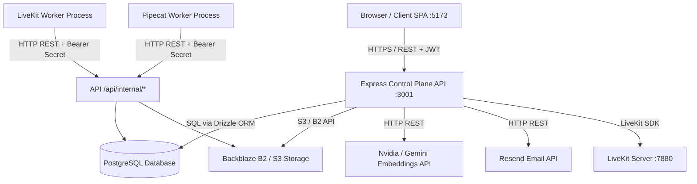
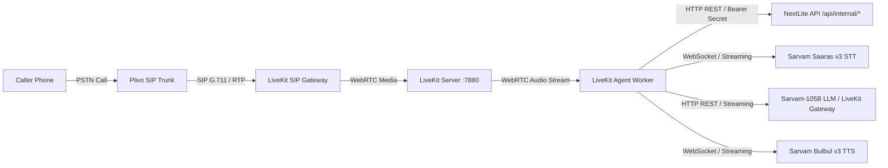
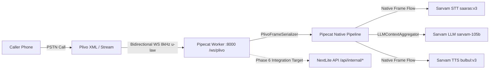

# NextLite Voice V3 — Master Architecture & System Blueprint
## Document 01: Consolidated Master Architectural Entry Point

> **Document Type**: Master Architecture & Production Engineering Audit  
> **Status**: Verified Read-Only Production Audit (Completed)  
> **Consolidation**: Comprehensive Domain Reorganization (15 Master Documents)  
> **Migration Phase**: STOPPED AT PHASE 5 (Zero Phase 6+ Implementation)  
> **Author**: Antigravity Autonomous Systems Engineering Team  
> **Repository Root**: `e:\NextLite\nextlite-voice-engineering-spec`  
> **Timestamp**: 2026-09-09  

---

## 1. Executive Summary

This document serves as the **single authoritative master entry point** for the complete architecture, repository structure, runtime execution, data models, configuration hierarchy, security boundaries, and migration status of **NextLite Voice V3**.

NextLite Voice V3 is a multi-tenant conversational voice platform engineered for real-time, low-latency multilingual voice interactions over PSTN telephony and WebRTC. The system enables business clients to configure, deploy, and manage conversational AI voice agents capable of handling complex domain queries, scheduling appointments, capturing leads, and performing real-time CRM operations in English and Indian languages (Hindi, Marathi, Gujarati, etc.).

Every finding, schema definition, API contract, latency metric, and architectural boundary in this consolidated document set has been verified directly against active source code, test suites, and database migration files across all monorepo modules.

---

## 2. Monorepo & Application Architecture

The repository is structured as a unified monorepo with distinct separation between administrative control plane services, realtime voice workers, frontend applications, and shared type contracts.

```
e:\NextLite\nextlite-voice-engineering-spec\
├── apps/
│   ├── api/                 # Control Plane REST API (Node.js 24 + Express + Drizzle ORM)
│   ├── livekit-worker/      # LiveKit Voice Worker (Node.js 24 + LiveKit Agents + Sarvam)
│   ├── pipecat-worker/      # Pipecat Voice Worker (Python 3.14 + FastAPI + Pipecat 1.8.1)
│   └── web/                 # Frontend Web Application (React 18 + Vite + TailwindCSS)
├── packages/
│   └── shared/              # Cross-Workspace Shared TypeScript Contracts & DTOs
├── docs/                    # Architecture Specs, Technical Blueprints & Master Audits
├── knowledge_base/          # Default Demo Markdown Knowledge Base Documents
├── package.json             # Root Monorepo NPM Workspace Definition
└── pnpm-lock.yaml           # Monorepo Lockfile
```

### 2.1 Major Applications Overview

| Application | Path | Technology Stack | Runtime Role | Status |
|---|---|---|---|---|
| **Control Plane API** | `apps/api` | Node.js `>=24.0.0`, TypeScript `5.3.2`, Express `4.18.2`, Drizzle ORM `0.29.3`, PostgreSQL (`postgres`), Redis (`ioredis`), S3 SDK | Administrative backend, user auth, agent versioning, prompt compilation, RAG ingestion/search, CRM persistence, telemetry, and authenticated internal worker APIs. | **Authoritative Production** |
| **Frontend Web App** | `apps/web` | React `18.2.0`, Vite `5.0.10`, TypeScript `5.3.2`, TailwindCSS `3.4.0`, LiveKit Client SDK | Admin Agent Studio (multi-tab agent editor, prompt simulator, voice tester) and Client CRM Portal (calls, leads, appointments, WhatsApp, analytics). | **Authoritative Production** |
| **LiveKit Worker** | `apps/livekit-worker` | Node.js `>=24.0.0`, TypeScript `5.9.3`, `@livekit/agents 1.6.3`, Sarvam Plugin | Current production realtime voice engine handling audio streams via LiveKit WebRTC / SIP Gateway, Sarvam Saaras v3 STT, Sarvam-105B LLM, and Sarvam Bulbul v3 TTS. | **Active Behavioral Reference** |
| **Pipecat Worker** | `apps/pipecat-worker` | Python `3.14.3`, FastAPI `0.115.x`, `pipecat-ai 1.8.1`, `sarvamai 0.1.28` | Target realtime voice worker executing bidirectional telephony streams directly over Plivo WebSockets using native Pipecat AI pipeline primitives. | **Migration Target (Phases 1–5 Complete)** |
| **Shared Contracts** | `packages/shared` | TypeScript `5.3.2` (ES Module) | Monorepo shared library defining `RuntimeAgentConfig`, `CANONICAL_PLATFORM_TOOLS`, entity DTOs (`CallSession`, `Lead`, `Appointment`), and normalization utilities. | **Authoritative Contracts** |

---

## 3. End-to-End Runtime Architecture

### 3.1 Web Application & Control Plane Flow



#### Control Plane Execution Sequence:
1. **User Authentication**: Browser sends credentials to `POST /api/auth/login`. API validates password hash and issues access token (15m TTL) and refresh token (7d TTL).
2. **Admin Agent Configuration**: Admin edits agent parameters in Admin Studio and submits `PUT /api/admin/clients/:cId/agents/:aId/config`. API validates payload against `agentConfigurationSchema`, creates an immutable row in `agent_versions` (status `DRAFT`), and updates the active `TEST` deployment record.
3. **Agent Publication**: Admin clicks Publish. API runs `agentChecklistService.evaluateAgent()`. If valid, marks `agent_versions` row as `PUBLISHED`, updates `agents.status` to `LIVE`, deactivates prior production deployment, and creates a new active `PRODUCTION` deployment.
4. **Knowledge Ingestion**: Admin uploads `.pdf`/`.md`/`.txt` documents via `POST /api/admin/knowledge/upload`. API calculates SHA-256 hash for deduplication, stores file in Backblaze B2/S3, chunks text (500 chars, 100 overlap), computes vector embeddings (`nvidia/nemotron-3-embed-1b` or `gemini-embedding-001`), and writes to `knowledge_sources` and `knowledge_chunks`.
5. **Client CRM & Follow-ups**: Client users log into `/dashboard` to view call recordings, transcripts, captured leads, and scheduled appointments. Authenticated `CLIENT_OWNER` users can trigger WhatsApp follow-ups via `POST /api/client/follow-ups/send-whatsapp`.

---

### 3.2 Current Telephony Architecture: Plivo → LiveKit SIP → LiveKit Worker → Sarvam



#### Detailed LiveKit Execution Flow:
1. **Inbound Call Initiation**: Caller dials Plivo rented DID. Plivo forwards call via SIP URI to LiveKit SIP Gateway.
2. **Room Creation & Metadata**: LiveKit SIP Gateway creates WebRTC room (`sip-call-...`) and embeds `deploymentId` in room metadata.
3. **Worker Assignment & Config Resolution**: LiveKit server assigns job to `apps/livekit-worker/src/main.ts`. Worker extracts `deploymentId` and calls `GET /api/internal/runtime-config/:deploymentId` with `WORKER_API_SECRET`.
4. **Session Start**: Worker calls `POST /api/internal/call-sessions` creating an `ACTIVE` call session record.
5. **Conversational Pipeline**: Audio frames stream to Sarvam Saaras v3 (`saaras:v3`). User transcriptions trigger `ConversationLanguageManager` to evaluate 12 Indic regex rules. Sarvam-105B processes turn. Function tool calls (`query_knowledge_base`, `book_appointment`, `create_callback_lead`) execute against `/api/internal/*`. LLM output tokens stream to Sarvam Bulbul v3 (`bulbul:v3`) and synthesize back to caller over WebRTC.
6. **Session Finalization**: On hangup, worker calls `PATCH /api/internal/call-sessions/:id` setting status to `COMPLETED` (or `MISSED` if < 3s and 0 turns), saving full plain text transcript, turn history, and latency metrics.

---

### 3.3 Target Telephony Architecture: Plivo → WebSocket → Pipecat Worker → Sarvam



#### Detailed Pipecat Execution Flow (Phases 1–4 Verified):
1. **WebSocket Handshake**: Plivo triggers Answer XML `<Stream bidirectional="true">wss://.../ws/plivo</Stream>`. Plivo opens bidirectional WebSocket to `apps/pipecat-worker/app/main.py` and sends `start` event containing `streamId`, `callId`, and dialed number.
2. **Native Pipeline Setup**: Instantiates `PlivoFrameSerializer(stream_id, call_id, plivo_sample_rate=8000)`, `FastAPIWebsocketTransport`, `SarvamSTTService(model="saaras:v3")`, `LLMContextAggregatorPair`, `SarvamLLMService(model="sarvam-105b")`, `SarvamTTSService(model="bulbul:v3", voice="shubh")`, and `RealtimeStreamingTimingMonitor`.
3. **Turn Pipeline Flow**: 8kHz μ-law audio frames flow: `transport.input()` &rarr; `stt_service` &rarr; `timing_monitor` &rarr; `context_aggregator.user()` &rarr; `llm_service` &rarr; `tts_service` &rarr; `transport.output()` &rarr; `context_aggregator.assistant()`.
4. **Interruption & Output**: 8kHz synthesized audio streams directly back to Plivo WebSocket without transcode latency. On user speech detection, an `InterruptionFrame` clears Plivo's playback buffer immediately.
5. **Stopping Point**: Cleanly stopped at Phase 5. Phase 6 will wire Pipecat to `/api/internal/runtime-config/:deploymentId`, `ConversationLanguageManager`, tool execution, and session persistence.

---

## 4. Definitive Authoritative Source-of-Truth Matrix

| Domain | Authoritative Storage Source | Derived Runtime Source | Consumer System | Legacy / Deprecated Source | Notes & Semantics |
|---|---|---|---|---|---|
| **Tenant** | `tenants` table (`id`, `name`, `slug`) | JWT payload (`tenantId`) | All Control Plane APIs & Services | None | Core root entity. All domain queries filter by `tenantId`. |
| **Agent Entity** | `agents` table (`id`, `tenant_id`, `name`, `status`) | `RuntimeAgentConfig.agent` | Control Plane & Worker | None | Master agent entity record. Validates agent is not `ARCHIVED` or `PAUSED`. |
| **Agent Template** | `agent_templates` table | Initial `agent_versions` row v1 | `AgentService.createAgent` | None | Baseline template preset cloned during agent creation. |
| **Agent Version** | `agent_versions.configuration` (JSONB) | `RuntimeAgentConfig` DTO | Worker via internal API | None | Frozen immutable snapshot on publish. Incrementing integer `version_number`. |
| **Deployment** | `deployments` table | `deploymentId` parameter | Control Plane & Worker | None | Authoritative binding between agent version and environment (`TEST` vs `PRODUCTION`). |
| **System Prompt** | `PromptCompilerService.compileAgentPrompt()` | `RuntimeAgentConfig.prompt.compiledSystemPrompt` | LLM Context in Worker | `DEFAULT_SYSTEM_PROMPT` | Layer A safety boundary (hardcoded) + Layer B customer configuration (dynamic). |
| **Voice Config** | `agent_versions.configuration.voice` | `RuntimeAgentConfig.voice` | Sarvam STT & TTS Services | Static test voice (`'shubh'`) | Controls speaker voice ID, pace/speed, STT/TTS models. |
| **Language Config** | `agent_versions.configuration.language` | `RuntimeAgentConfig.language` | `ConversationLanguageManager` | Static fallback (`'en-IN'`) | Primary/supported languages, auto-detect, 12 Indic regex rules, Hinglish filters. |
| **Tools Binding** | `agent_versions.configuration.tools.bindings` | `RuntimeAgentConfig.tools.tools` | `ToolRegistry` in Worker | `agent_tools` table (Deprecated) | Platform tools (`query_knowledge_base`, `book_appointment`, `create_callback_lead`). |
| **RAG Knowledge** | `knowledge_sources` & `knowledge_chunks` | Cosine similarity vector scores | `POST /api/internal/knowledge/retrieve` | None | Object storage (B2/S3) + vector embeddings (`nvidia/nemotron-3-embed-1b`). |
| **Leads** | `leads` table | Client CRM Dashboard | `POST /api/internal/leads` | None | Captures caller contact information and notes with deployment tenant isolation. |
| **Appointments** | `appointments` table | Client CRM Dashboard | `POST /api/internal/appointments` | None | Sequential `A-001` format via atomic PostgreSQL `tenant_appointment_counters`. |
| **Call Sessions** | `call_sessions` table | Client CRM Dashboard | `POST/PATCH /api/internal/call-sessions` | None | Tracks duration, turns JSON, plain transcript, latency metrics, and final status. |
| **Phone Numbers** | `phone_numbers` table | Inbound routing lookup | `GET /api/internal/phone-numbers/lookup` | None | Maps dialed DID number to tenant, agent, and active `PRODUCTION` deployment. |
| **Infrastructure Secrets** | Environment Variables (`.env`) | Validated `env` object (`src/config/env.ts`) | Control Plane & Workers | Fallback development secrets | Validated at process startup via strict Zod schemas. |

---

## 5. Architectural Ownership & Strict Non-Ownership Boundaries

```
┌──────────────────────────────────────────────────────────────────────────────────┐
│                 NEXTLITE CONTROL PLANE & PRODUCT CORE (OWNER)                     │
│                                                                                  │
│   • PostgreSQL Database & Schema (apps/api/src/db/schema.ts, drizzle/)           │
│   • RAG Ingestion, Chunking, Storage, Vector Embeddings (src/services/knowledge) │
│   • Prompt Compiler & Safety Boundaries (src/services/promptCompiler.ts)         │
│   • Agent Lifecycle & Versioning (src/services/agent.ts, template.ts)             │
│   • Appointment Sequencing & Counter Logic (src/services/appointment.ts)        │
│   • Client CRM & Analytics (src/services/lead.ts, analytics.ts, whatsapp.ts)    │
│   • Frontend Web Application (apps/web/src/*)                                    │
│   • Shared Contracts & DTOs (packages/shared/src/*)                              │
│   • Public & Client REST APIs (apps/api/src/routes/auth, admin, client)          │
│                                                                                  │
└────────────────────────────────────────┬─────────────────────────────────────────┘
                                         │
                        HTTP REST / Bearer WORKER_API_SECRET
                                         │
                                         ▼
┌──────────────────────────────────────────────────────────────────────────────────┐
│                  REALTIME VOICE WORKER RUNTIME (PIPECAT TARGET)                  │
│                                                                                  │
│   • Plivo Bidirectional WebSocket Audio Streaming (/ws/plivo)                    │
│   • 8kHz μ-law Telephony Serialization (PlivoFrameSerializer)                    │
│   • Sarvam Saaras v3 STT, Sarvam-105B LLM, Sarvam Bulbul v3 TTS Services        │
│   • Realtime In-Memory Turn-Taking & Conversation Context Aggregation            │
│   • Client Wrapper for /api/internal/* Endpoints                                 │
│                                                                                  │
└──────────────────────────────────────────────────────────────────────────────────┘
```

> [!CRITICAL]
> **WHAT PIPECAT MUST NEVER OWN OR DUPLICATE:**
> 1. Pipecat must **NEVER** connect directly to PostgreSQL or run SQL queries.
> 2. Pipecat must **NEVER** parse uploaded files, chunk documents, or manage S3/B2 storage.
> 3. Pipecat must **NEVER** generate vector embeddings or execute vector search calculations.
> 4. Pipecat must **NEVER** assemble Layer A or Layer B system prompts from raw parts.
> 5. Pipecat must **NEVER** compute sequential appointment numbers (`A-001`).
> 6. Pipecat must **NEVER** manage agent version transitions, deployments, or CRM follow-ups.

---

## 6. Major Architectural Risks, Contradictions & Unknowns

### 6.1 Identified Architectural Risks

1. **Pipecat Hardcoded `TEST_PROMPT` vs Production Dynamic Prompt** (**HIGH SEVERITY**):
   - *Evidence*: `apps/pipecat-worker/app/config.py:22-28`, `apps/pipecat-worker/app/main.py:368`.
   - *Detail*: Pipecat currently runs a static 5-line test prompt. In Phase 6, this must be replaced by dynamic resolution of `RuntimeAgentConfig.prompt.compiledSystemPrompt` augmented with temporal and calendar context.
2. **Pipecat Hardcoded `PHASE2_TEST_VOICE_ID` vs Configured Voice** (**MEDIUM SEVERITY**):
   - *Evidence*: `apps/pipecat-worker/app/config.py:21`, `apps/pipecat-worker/app/main.py:383`.
   - *Detail*: `SarvamTTSService` is currently hardcoded to `'shubh'`. In Phase 6, it must receive `voice=runtime_config.voice.voice_id`.

### 6.2 Contradictions Requiring Review

> [!WARNING]
> **CONTRADICTION REQUIRES REVIEW — Telephony Provider Configuration (`EXOTEL` vs `PLIVO`)**:
> - `apps/api/src/config/env.ts:52` defines `TELEPHONY_PROVIDER: z.enum(['exotel', 'plivo']).default('exotel')`.
> - However, `apps/api/src/db/schema.ts:182` defines `phone_numbers.provider` defaulting to `'plivo'`.
> - Furthermore, `apps/pipecat-worker` exclusively implements Plivo WebSocket integration (`PlivoFrameSerializer`).
> - *Status*: Contradiction requires human architectural review to confirm Plivo as the unified standard for V3 production.

> [!WARNING]
> **CONTRADICTION REQUIRES REVIEW — Deprecated `agent_tools` Table vs `tools.bindings`**:
> - `apps/api/src/db/schema.ts:172` maintains `agent_tools` table from V1/V2 schema migrations.
> - However, `apps/api/src/services/runtimeAgentConfig.ts:182` derives tools strictly from `agent_versions.configuration.tools.bindings`.
> - *Status*: `agent_tools` is deprecated and unused at runtime; retained solely for database schema backward compatibility.

### 6.3 Technical Unknowns

1. **Shared Secret Key Rotation Policy**: Confirm whether `WORKER_API_SECRET` remains a static environment string or migrates to short-lived signed HMAC tokens.
2. **High-Concurrency Telephony Stress Limits**: Verify Pipecat FastAPI WebSocket concurrency limits when handling 50+ simultaneous 8kHz audio streams.

---

## 7. Master Document Index (15 Consolidated Master Documents)

The entire NextLite Voice V3 architecture is organized into the following 15 master documents:

1. [NEXTLITE_01_MASTER_ARCHITECTURE.md](file:///e:/NextLite/nextlite-voice-engineering-spec/docs/NEXTLITE_01_MASTER_ARCHITECTURE.md) — Master architectural entry point, executive summary, boundaries, and risks.
2. [NEXTLITE_02_REPOSITORY_AND_FILE_ARCHITECTURE.md](file:///e:/NextLite/nextlite-voice-engineering-spec/docs/NEXTLITE_02_REPOSITORY_AND_FILE_ARCHITECTURE.md) — Exhaustive directory map, file audit, dependency graph, and reachability analysis.
3. [NEXTLITE_03_CONFIGURATION_AND_RUNTIME_CONFIG.md](file:///e:/NextLite/nextlite-voice-engineering-spec/docs/NEXTLITE_03_CONFIGURATION_AND_RUNTIME_CONFIG.md) — Configuration provenance, 15 core questions, and field-by-field `RuntimeAgentConfig` table.
4. [NEXTLITE_04_AGENT_VERSIONING_DEPLOYMENT_LIFECYCLE.md](file:///e:/NextLite/nextlite-voice-engineering-spec/docs/NEXTLITE_04_AGENT_VERSIONING_DEPLOYMENT_LIFECYCLE.md) — State machines, draft/production deployments, and exact database row resolution.
5. [NEXTLITE_05_PROMPT_LANGUAGE_VOICE_ARCHITECTURE.md](file:///e:/NextLite/nextlite-voice-engineering-spec/docs/NEXTLITE_05_PROMPT_LANGUAGE_VOICE_ARCHITECTURE.md) — Layer A/B prompts, temporal/calendar injection, 12 Indic regex rules, and Hinglish filters.
6. [NEXTLITE_06_DATABASE_DATA_ARCHITECTURE.md](file:///e:/NextLite/nextlite-voice-engineering-spec/docs/NEXTLITE_06_DATABASE_DATA_ARCHITECTURE.md) — PostgreSQL 15 relational tables, data dictionary, constraints, and worker access rules.
7. [NEXTLITE_07_API_AND_SERVICE_ARCHITECTURE.md](file:///e:/NextLite/nextlite-voice-engineering-spec/docs/NEXTLITE_07_API_AND_SERVICE_ARCHITECTURE.md) — Internal worker, admin studio, client CRM APIs, and async infrastructure audit.
8. [NEXTLITE_08_RAG_AND_KNOWLEDGE_ARCHITECTURE.md](file:///e:/NextLite/nextlite-voice-engineering-spec/docs/NEXTLITE_08_RAG_AND_KNOWLEDGE_ARCHITECTURE.md) — Knowledge ingestion, chunking, embeddings, vector retrieval, and ownership boundaries.
9. [NEXTLITE_09_TOOL_AND_ACTION_ARCHITECTURE.md](file:///e:/NextLite/nextlite-voice-engineering-spec/docs/NEXTLITE_09_TOOL_AND_ACTION_ARCHITECTURE.md) — Platform tool catalog, normalization, schemas, sequential `A-001` numbering, and anti-UUID rules.
10. [NEXTLITE_10_TELEPHONY_AND_CALL_RUNTIME.md](file:///e:/NextLite/nextlite-voice-engineering-spec/docs/NEXTLITE_10_TELEPHONY_AND_CALL_RUNTIME.md) — Plivo DID routing, caller ID trust, stream security, and call session state machine.
11. [NEXTLITE_11_CRM_BUSINESS_ARCHITECTURE.md](file:///e:/NextLite/nextlite-voice-engineering-spec/docs/NEXTLITE_11_CRM_BUSINESS_ARCHITECTURE.md) — Leads, appointments (`REQUESTED`/`CONFIRMED`/`CANCELLED`), follow-ups, WhatsApp, and analytics.
12. [NEXTLITE_12_SECURITY_TENANCY_AND_AUTH.md](file:///e:/NextLite/nextlite-voice-engineering-spec/docs/NEXTLITE_12_SECURITY_TENANCY_AND_AUTH.md) — Multi-tier tenant isolation, JWT, RBAC, worker secret authentication, and threat model.
13. [NEXTLITE_13_FRONTEND_INTEGRATION_AND_PRODUCT_FLOW.md](file:///e:/NextLite/nextlite-voice-engineering-spec/docs/NEXTLITE_13_FRONTEND_INTEGRATION_AND_PRODUCT_FLOW.md) — UI controls mapped to React state, API schemas, database columns, and runtime effects.
14. [NEXTLITE_14_LIVEKIT_PIPECAT_MIGRATION_ARCHITECTURE.md](file:///e:/NextLite/nextlite-voice-engineering-spec/docs/NEXTLITE_14_LIVEKIT_PIPECAT_MIGRATION_ARCHITECTURE.md) — LiveKit vs Pipecat responsibility matrix, Phases 1–5 current status, and migration boundary.
15. [NEXTLITE_15_RISKS_LEGACY_TESTS_AND_MIGRATION_GATES.md](file:///e:/NextLite/nextlite-voice-engineering-spec/docs/NEXTLITE_15_RISKS_LEGACY_TESTS_AND_MIGRATION_GATES.md) — Legacy classifications, hardcoded behavior, 41 test suites, risks, and Phase 6 prerequisites.
