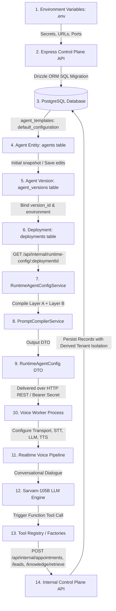

# NextLite Voice V3 — Configuration & Runtime Configuration
## Document 03: Configuration Provenance, Hierarchy & Field-by-Field Specification

> **Document Type**: Configuration Architecture & Runtime DTO Specification  
> **Status**: Verified from Implementation (Read-Only)  
> **Contract Source**: `packages/shared/src/runtimeConfig.ts`  
> **Resolution Service**: `apps/api/src/services/runtimeAgentConfig.ts`  
> **Timestamp**: 2026-09-09  

---

## 1. End-to-End Configuration Provenance Chain

```
Agent Creation (Template defaultConfiguration in agent_templates)
  ↓
Agent Version Draft (agent_versions.configuration JSONB snapshot, version_number = 1)
  ↓
Save Configuration (Admin updates UI -> PUT /api/admin/.../config -> new agent_versions row, version_number = N)
  ↓
Active Deployment (deployments table: binds environment ['TEST' | 'PRODUCTION'] to version_id)
  ↓
Runtime Resolution (GET /api/internal/runtime-config/:deploymentId -> RuntimeAgentConfigService)
  ↓
Prompt Compilation (PromptCompilerService -> Layer A Safety Rules + Layer B Customer Spec)
  ↓
RuntimeAgentConfig DTO (Pure, immutable contract across process/network boundaries)
  ↓
Worker Process (LiveKit / Pipecat Worker consumes RuntimeAgentConfig)
  ↓
Realtime Pipeline (STT, LLM, TTS, Tools, Dynamic Multilingual Language Manager)
```

---

## 2. Answers to the 15 Core Configuration Questions

| # | Question | Verification / Implementation Answer | Evidence File & Line |
|---|---|---|---|
| **1** | **Where is it defined?** | Defined initially in `agent_templates.defaultConfiguration` JSONB, edited via Admin UI (`AgentDetail.tsx`), validated by Zod schema (`agentConfigurationSchema`), and saved as `agent_versions.configuration` JSONB. | `apps/api/src/services/template.ts` (lines 45–196), `apps/api/src/routes/agents.ts` (lines 67–248) |
| **2** | **Where is it stored?** | Stored in PostgreSQL `agent_versions.configuration` (JSONB) associated with an immutable `version_number`. | `apps/api/src/db/schema.ts` (lines 136–145) |
| **3** | **Who changes it?** | Changed by Admin users via `PUT /api/admin/clients/:clientId/agents/:agentId/config`. Every save creates a new `agent_versions` row. | `apps/api/src/services/agent.ts` (lines 113–192) |
| **4** | **Who reads it?** | Read by `RuntimeAgentConfigService.resolveRuntimeAgentConfig(deploymentId)` when resolving runtime config for an active call or test session. | `apps/api/src/services/runtimeAgentConfig.ts` (lines 22–163) |
| **5** | **What transforms it?** | `PromptCompilerService.compileAgentPrompt()` transforms persona, business hours, phases, guardrails, and voice gender into `compiledSystemPrompt`. `buildRuntimeAgentConfig()` transforms the JSONB into `RuntimeAgentConfig`. | `apps/api/src/services/promptCompiler.ts`, `apps/api/src/services/runtimeAgentConfig.ts` (lines 169–281) |
| **6** | **What is the runtime source of truth?** | The **`deployments` table row joined with its linked `agent_versions.configuration` snapshot**. The worker NEVER reads templates or draft unsaved state. | `apps/api/src/services/runtimeAgentConfig.ts` (lines 34–42) |
| **7** | **What is the fallback?** | Fallbacks defined in `buildRuntimeAgentConfig()`: Timezone default `'Asia/Kolkata'`, STT `'saaras:v3'`, TTS `'bulbul:v3'`, voice `'shubh'` or `'priya'`, LLM `'sarvam-105b-conversations'` / `'google/gemma-4-31b-it'`. | `apps/api/src/services/runtimeAgentConfig.ts` (lines 181–280) |
| **8** | **Can frontend override it?** | **NO**. Frontend cannot override runtime configuration during a call. Frontend can only mutate draft configuration by issuing an authenticated API PUT request. | `apps/api/src/routes/agents.ts` (lines 383–403) |
| **9** | **Can database override it?** | **YES**. The database is the authoritative storage source. Directly updating `agent_versions.configuration` or pointing `deployments.version_id` to a different version changes runtime configuration immediately on subsequent resolution. | `apps/api/src/db/schema.ts` (lines 147–165) |
| **10** | **Can environment variables override it?** | Infrastructure secrets (`SARVAM_API_KEY`, `LIVEKIT_URL`, `DATABASE_URL`) originate from environment variables. Business configuration (prompts, voices, languages, tools) is **database-driven** and NOT overridden by env vars. | `apps/api/src/config/env.ts` (lines 6–65) |
| **11** | **Is it hardcoded?** | Layer A core safety rules (turn length max 1–2 sentences, single question, anti-self-talk, reference number sanitization `A-001`) are code-enforced in `PromptCompilerService`. All business attributes are dynamic. | `apps/api/src/services/promptCompiler.ts` (lines 28–41) |
| **12** | **Is it tenant-specific?** | **YES**. Every agent and deployment is strictly bound to a `tenant_id` foreign key. Cross-tenant resolution is rejected. | `apps/api/src/db/schema.ts` (line 128, 149), `apps/api/src/services/runtimeAgentConfig.ts` (line 99) |
| **13** | **Is it agent-specific?** | **YES**. Bound to `agent_id` in `agents`, `agent_versions`, and `deployments`. | `apps/api/src/db/schema.ts` (lines 138, 150) |
| **14** | **Is it deployment-specific?** | **YES**. Resolved strictly by `deploymentId` (distinguishing `TEST` environment from `PRODUCTION` environment). | `apps/api/src/db/schema.ts` (lines 147–165) |
| **15** | **Is it versioned?** | **YES**. Explicit integer versioning (`version_number` 1, 2, 3...) stored in `agent_versions`. Version rows with status `PUBLISHED` are immutable. | `apps/api/src/db/schema.ts` (lines 136–145), `apps/api/src/services/agent.ts` (lines 220–225) |

---

## 3. Configuration Inventory & Provenance Hierarchy Table

| Configuration Group | Field Name | Authoritative Source | Runtime Resolution Path | Fallback Value | Override Priority |
|---|---|---|---|---|---|
| **Identity** | `displayName`, `agentName` | `agent_versions.configuration.identity` | `RuntimeAgentConfig.agent.agentName` | Agent DB record name | DB Version > DB Agent Record |
| **Identity** | `greeting` | `agent_versions.configuration.identity.greeting` | `RuntimeAgentConfig.prompt.greeting` | `"Greet the user in a helpful manner."` | DB Version > Static Default |
| **Business Info** | `timezone` | `agent_versions.configuration.businessInformation.timezone` | `RuntimeAgentConfig.prompt.timezone` | `"Asia/Kolkata"` | DB Version > Default `"Asia/Kolkata"` |
| **Prompt** | `compiledSystemPrompt` | `PromptCompilerService.compileAgentPrompt()` | `RuntimeAgentConfig.prompt.compiledSystemPrompt` | `DEFAULT_SYSTEM_PROMPT` | Compiled Output > `DEFAULT_SYSTEM_PROMPT` |
| **Voice** | `provider` | `agent_versions.configuration.voice.provider` | `RuntimeAgentConfig.voice.provider` | `"sarvam"` | DB Version > `"sarvam"` |
| **Voice** | `voiceId` | `agent_versions.configuration.voice.voiceId` | `RuntimeAgentConfig.voice.voiceId` | `"shubh"` (Male) / `"priya"` (Female) | DB Version > Default Voice |
| **Voice** | `sttModel` | `agent_versions.configuration.voice.sttModel` | `RuntimeAgentConfig.voice.sttModel` | `"saaras:v3"` | DB Version > `"saaras:v3"` |
| **Voice** | `ttsModel` | `agent_versions.configuration.voice.ttsModel` | `RuntimeAgentConfig.voice.ttsModel` | `"bulbul:v3"` | DB Version > `"bulbul:v3"` |
| **Voice** | `speakingSpeed` | `agent_versions.configuration.voice.speakingSpeed` | `RuntimeAgentConfig.voice.speakingSpeed` | `1.0` | DB Version > `1.0` |
| **Language** | `primary` | `agent_versions.configuration.language.primary` | `RuntimeAgentConfig.language.primary` | `"en-IN"` | DB Version > `"en-IN"` |
| **Language** | `supported` | `agent_versions.configuration.language.supported` | `RuntimeAgentConfig.language.supportedLanguages` | `[primary]` | DB Version > `[primary]` |
| **Language** | `autoDetect` | `agent_versions.configuration.language.autoDetect` | `RuntimeAgentConfig.language.autoDetectEnabled` | `true` | DB Version > `true` |
| **Language** | `languageSwitchEnabled` | `agent_versions.configuration.language.languageSwitchEnabled` | `RuntimeAgentConfig.language.languageSwitchingEnabled` | `true` | DB Version > `true` |
| **Runtime LLM** | `modelProvider` | `agent_versions.configuration.runtimeSettings.modelProvider` | `RuntimeAgentConfig.runtime.modelProvider` | `"sarvam"` | DB Version > `"sarvam"` |
| **Runtime LLM** | `llmModel` | `agent_versions.configuration.runtimeSettings.llmModel` | `RuntimeAgentConfig.runtime.llmModel` | `"sarvam-105b-conversations"` | DB Version > Default Model |
| **Runtime LLM** | `modelTemperature` | `agent_versions.configuration.runtimeSettings.modelTemperature` | `RuntimeAgentConfig.runtime.temperature` | `undefined` (Provider default) | DB Version > Provider Default |
| **Interruption** | `interruptionMode` | `agent_versions.configuration.runtimeSettings.interruptionMode` | `RuntimeAgentConfig.runtime.interruptionMode` | `"adaptive"` | DB Version > `"adaptive"` |
| **Preemption** | `preemptiveGenerationEnabled` | `agent_versions.configuration.runtimeSettings.preemptiveGenerationEnabled` | `RuntimeAgentConfig.runtime.preemptiveGenerationEnabled` | `false` | DB Version > `false` |
| **Expressive** | `expressiveModeEnabled` | `agent_versions.configuration.runtimeSettings.expressiveModeEnabled` | `RuntimeAgentConfig.runtime.expressiveModeEnabled` | `true` | DB Version > `true` |
| **Knowledge** | `enabled` | `agent_versions.configuration.knowledge.enabled` | `RuntimeAgentConfig.knowledge.enabled` | `false` | DB Version > `false` |
| **Knowledge** | `topK` | `agent_versions.configuration.knowledge.retrievalConfig.topK` | `RuntimeAgentConfig.knowledge.retrievalConfig.topK` | `5` | DB Version > `5` |
| **Tools** | `bindings` | `agent_versions.configuration.tools.bindings` | `RuntimeAgentConfig.tools.tools` | `[]` (or legacy `(tools as any).tools`) | DB Version > Legacy Shape > `[]` |
| **Variables** | `input`, `output` | `agent_versions.configuration.variables` | `RuntimeAgentConfig.variables` | `[]` | DB Version > `[]` |
| **Infrastructure Secrets**| `SARVAM_API_KEY`, etc. | Environment Variables (`.env`) | Process environment | None (Mandatory startup failure) | Process Env > Fatal Error |

---

## 4. Tabular Field-by-Field `RuntimeAgentConfig` Specification

| Field Path | Type | Source (DB/Entity) | Transformation | LiveKit Worker Usage | Pipecat Intended Usage | Default / Fallback | Scope | Versioned? | Security Notes |
|---|---|---|---|---|---|---|---|---|---|
| `tenant.tenantId` | `string (UUID)` | `deployments.tenantId` | Direct assignment | Tool API calls, call session creation, logs | Tool API calls, call session creation, logs | None (Mandatory) | Tenant | Indirectly (via Deployment) | Authoritatively derived from DB deployment; untrusted caller cannot alter |
| `agent.agentId` | `string (UUID)` | `agents.id` | Direct assignment | Call session creation, logging | Call session creation, logging | None (Mandatory) | Agent | No (Entity ID) | Enforces agent ownership boundary |
| `agent.agentName` | `string` | `agents.name` | Direct assignment | Diagnostic logging, transcript metadata | Diagnostic logging, transcript metadata | `'Test Agent'` | Agent | No | Non-sensitive display name |
| `agent.status` | `string` | `agents.status` | Direct assignment | Validates not `ARCHIVED` or `PAUSED` | Validates not `ARCHIVED` or `PAUSED` | `'active'` | Agent | No | Rejects session if agent is paused |
| `deployment.deploymentId` | `string (UUID)` | `deployments.id` | Direct assignment | Injected into tool runtime context | Injected into tool runtime context | None (Mandatory) | Deployment | No (Deployment ID) | Crucial security token for internal API isolation |
| `deployment.versionId` | `string (UUID)` | `agent_versions.id` | Direct assignment | Session tracking | Session tracking | None (Mandatory) | Version | Yes | Points to frozen immutable snapshot |
| `deployment.versionNumber`| `number` | `agent_versions.versionNumber` | Direct assignment | Diagnostic logging | Diagnostic logging | `1` | Version | Yes | Monotonically incrementing integer |
| `prompt.compiledSystemPrompt` | `string` | `agent_versions.configuration` | Compiled by `PromptCompilerService` | Base system prompt for LLM context | Base system prompt for LLM context | `DEFAULT_SYSTEM_PROMPT` | Version | Yes | Contains non-negotiable Layer A safety boundaries |
| `prompt.greeting` | `string` | `configuration.identity.greeting` | Direct string extraction | Initial turn generation (`generateReply`) | Initial greeting synthesis | `'Greet the user...'` | Version | Yes | Spoken greeting on call connect |
| `prompt.timezone` | `string` | `configuration.businessInformation.timezone` | Direct string extraction | Input to `buildTemporalInstruction()` and `buildCalendarInstruction()` | Input to temporal and calendar context | `'Asia/Kolkata'` | Version | Yes | Must be a valid IANA timezone string |
| `voice.provider` | `string` | `configuration.voice.provider` | Direct string extraction | Selects voice provider adapter | Selects voice provider adapter | `'sarvam'` | Version | Yes | Provider routing |
| `voice.sttModel` | `string` | `configuration.voice.sttModel` | Direct string extraction | Configures `sarvam.STT` model | Configures `SarvamSTTService` model | `'saaras:v3'` | Version | Yes | Fast Indian multilingual STT |
| `voice.ttsModel` | `string` | `configuration.voice.ttsModel` | Direct string extraction | Configures `sarvam.TTS` model | Configures `SarvamTTSService` model | `'bulbul:v3'` | Version | Yes | Indian multilingual TTS |
| `voice.voiceId` | `string` | `configuration.voice.voiceId` | Direct string extraction | Configures TTS speaker; determines Hindi grammar gender in prompt | Configures TTS speaker | `'shubh'` (Male) / `'priya'` (Female) | Version | Yes | Matches registered Sarvam speaker IDs |
| `voice.gender` | `'male' \| 'female' \| 'neutral'` | `configuration.voice.gender` | Voice registry lookup | Prompts masculine/feminine verb agreement | Prompts masculine/feminine verb agreement | `'female'` | Version | Yes | Prevents grammatical errors in Hindi/Marathi |
| `voice.speakingSpeed` | `number` | `configuration.voice.speakingSpeed` | Passed as `pace` option | Configures TTS pace | Configures TTS pace | `1.0` | Version | Yes | Clamped between 0.5 and 2.0 |
| `voice.pitch` | `number` | `configuration.voice.pitch` | Passed to TTS | Reserved for TTS pitch adjustment | Reserved for TTS pitch adjustment | `0` | Version | Yes | Non-critical audio property |
| `language.primary` | `string` | `configuration.language.primary` | Normalized via `normalizeLanguageCode()` | Initial active language in `ConversationLanguageManager` | Initial active language in `ConversationLanguageManager` | `'en-IN'` | Version | Yes | BCP-47 standard tag |
| `language.supportedLanguages` | `string[]` | `configuration.language.supported` | Normalized array | Valid targets for language switching | Valid targets for language switching | `[primary]` | Version | Yes | Prevents switching to unconfigured languages |
| `language.autoDetectEnabled` | `boolean` | `configuration.language.autoDetect` | Defaults to true if not false | Sets initial STT language to `'unknown'` for Saaras v3 | Sets initial STT language to `'unknown'` | `true` | Version | Yes | Controls dynamic speech recognition detection |
| `language.languageSwitchingEnabled` | `boolean` | `configuration.language.languageSwitchEnabled` | Defaults to true if not false | Allows turn-by-turn TTS/LLM updates | Allows turn-by-turn TTS/LLM updates | `true` | Version | Yes | Gates dynamic language switching |
| `runtime.modelProvider` | `string` | `configuration.runtimeSettings.modelProvider` | Direct extraction | Selects LLM class (`SarvamLLM` vs `inference.LLM`) | Selects `SarvamLLMService` | `'sarvam'` | Version | Yes | Supported: `sarvam`, `google`, `openai`, `livekit` |
| `runtime.llmModel` | `string` | `configuration.runtimeSettings.llmModel` | Direct extraction | Configures LLM model identifier | Configures `SarvamLLMSettings.model` | `'sarvam-105b-conversations'` | Version | Yes | Model endpoint routing |
| `runtime.temperature` | `number` | `configuration.runtimeSettings.modelTemperature` | Direct extraction | Passed to LLM options | Passed to LLM options | `undefined` (Provider default) | Version | Yes | Temperature clamped between 0.0 and 2.0 |
| `runtime.interruptionMode` | `'adaptive' \| 'always' \| 'disabled'` | `configuration.runtimeSettings.interruptionMode` | Maps to LiveKit `interruption` config | Configures LiveKit turn detection interruption | Configures Pipecat interruption handling | `'adaptive'` | Version | Yes | Protects speech flow |
| `runtime.preemptiveGenerationEnabled` | `boolean` | `configuration.runtimeSettings.preemptiveGenerationEnabled` | Boolean check | Enables LiveKit speculative token generation | Reserved for LLM streaming preemption | `false` | Version | Yes | Performance latency toggle |
| `runtime.responseEagerness` | `'low' \| 'medium' \| 'high'` | `configuration.runtimeSettings.eagernessToRespond` | Direct extraction | Influences endpointing delay | Influences VAD endpointing delay | `'medium'` | Version | Yes | Adjusts silence threshold |
| `runtime.noiseCancellationModel` | `string` | `configuration.runtimeSettings.noiseCancellationModel` | Direct extraction | Reserved for audio enhancement plugins | Reserved for noise suppression | `undefined` | Version | Yes | Background noise reduction |
| `runtime.expressiveModeEnabled` | `boolean` | `configuration.runtimeSettings.expressiveModeEnabled` | Defaults to true if not false | Enables Sarvam expressive audio synthesis | Enables Sarvam expressive audio synthesis | `true` | Version | Yes | Improves emotional cadence |
| `runtime.maxCallDurationSeconds` | `number` | `configuration.runtimeSettings.maxCallLengthSeconds` | Direct extraction | Worker session timeout watchdog | Worker session timeout watchdog | `undefined` (No hard limit) | Version | Yes | Protects against runaway telephony charges |
| `knowledge.enabled` | `boolean` | `configuration.knowledge.enabled` | Direct boolean extraction | Gates `query_knowledge_base` resolution | Gates `query_knowledge_base` resolution | `false` | Version | Yes | Enables RAG retrieval tool |
| `knowledge.retrievalConfig.topK` | `number` | `configuration.knowledge.retrievalConfig.topK` | Direct number extraction | Maximum knowledge chunks returned | Maximum knowledge chunks returned | `5` | Version | Yes | Vector search limit |
| `knowledge.retrievalConfig.scoreThreshold` | `number` | `configuration.knowledge.retrievalConfig.similarityThreshold` | Direct number extraction | Minimum cosine similarity score | Minimum cosine similarity score | `undefined` (No cutoff) | Version | Yes | Rejection threshold for vector search |
| `tools.enabled` | `boolean` | `configuration.tools.enabled` | Direct boolean extraction | Gates tool registry resolution | Gates tool registry resolution | `false` | Version | Yes | Master tool capability switch |
| `tools.tools` | `RuntimeToolDefinition[]` | `configuration.tools.bindings` | Normalized via `normalizeToolId()` | Resolved by `ToolRegistry` into native tools | Resolved by Pipecat Tool Registry into native functions | `[]` | Version | Yes | Canonical bindings: `query_knowledge_base`, `book_appointment`, `create_callback_lead` |
| `variables.inputVariables` | `RuntimeVariableDefinition[]` | `configuration.variables.input` | Normalized variable list | Injected into runtime context | Injected into runtime context | `[]` | Version | Yes | Input parameter definitions |
| `variables.outputVariables`| `RuntimeVariableDefinition[]` | `configuration.variables.output` | Normalized variable list | Post-call variable extraction target | Post-call variable extraction target | `[]` | Version | Yes | CRM lead extraction targets |
| `variables.runtimeContext` | `Record<string, string>` | Session metadata (callerPhone, etc.) | Injected at runtime | Caller phone, session IDs | Caller phone, session IDs | `{}` | Session | No | Dynamic call attributes |

---

## 5. End-to-End Configuration Dependency Graph



### Detailed Flow Annotations:
- **ENV &rarr; API**: Process secrets (`DATABASE_URL`, `JWT_SECRET`, `SARVAM_API_KEY`, `WORKER_API_SECRET`) validated at startup via `apps/api/src/config/env.ts`.
- **API &rarr; DB**: Schema mapped via Drizzle ORM (`apps/api/src/db/schema.ts`).
- **DB &rarr; Agent**: Template default configuration cloned into version v1 on agent creation.
- **Agent &rarr; Version**: Each edit creates a new incrementing `agent_versions` row (DRAFT).
- **Version &rarr; Deployment**: Binds active version to `TEST` (on save) or `PRODUCTION` (on publish).
- **Deployment &rarr; Resolver**: Worker requests configuration using verified `deploymentId`.
- **Resolver &rarr; Compiler**: Compiles Layer A safety rules and Layer B customer persona into `compiledSystemPrompt`.
- **Compiler &rarr; RuntimeConfig**: Returns strongly typed `RuntimeAgentConfig` DTO.
- **RuntimeConfig &rarr; Worker**: Delivered over HTTP REST with `WORKER_API_SECRET`.
- **Worker &rarr; Pipeline**: Initializes STT, LLM, TTS, and `ConversationLanguageManager`.
- **LLM &rarr; Tools**: Executes function tools injecting trusted `deploymentId` and `callerPhone`.
- **Tools &rarr; Internal API**: Issues authenticated REST calls to `/api/internal/*`.
- **Internal API &rarr; DB**: Derives `tenantId` authoritatively from `deploymentId` and persists records.
