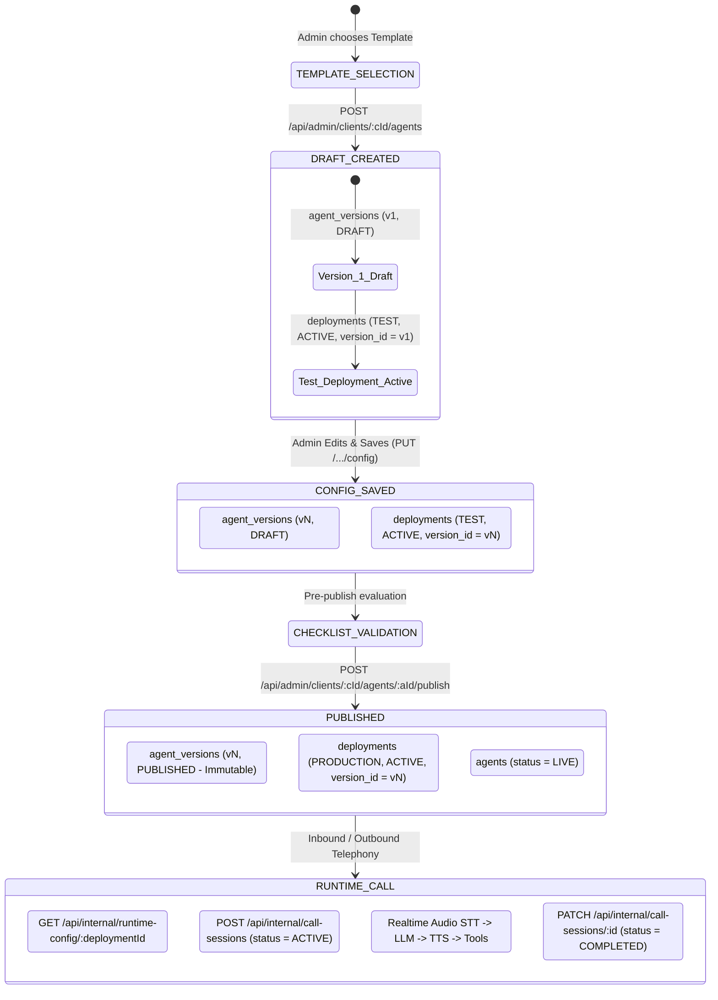

# NextLite Voice V3 — Agent Versioning & Deployment Lifecycle
## Document 04: State Machine, Lifecycle Stages & Database Resolution

> **Document Type**: Agent State Machine & Deployment Architecture  
> **Status**: Verified from Implementation (Read-Only)  
> **Owning Services**: `apps/api/src/services/agent.ts`, `template.ts`, `runtimeAgentConfig.ts`  
> **Database Tables**: `agents`, `agent_versions`, `deployments`, `agent_templates`  
> **Timestamp**: 2026-09-09  

---

## 1. Agent State Machine & Lifecycle Graph

---

## 2. Stage-by-Stage Lifecycle Trace

### Stage 1: Agent Creation from Template
- **Frontend Page**: `apps/web/src/pages/admin/AgentBuilder.tsx`
- **API Endpoint**: `POST /api/admin/clients/:clientId/agents`
- **Request Body**: `{ name: string, templateId: string }`
- **Service Action** (`apps/api/src/services/agent.ts:createAgent`):
  1. Verifies `agentTemplates` row exists.
  2. Inserts new record in `agents` table (`status: 'DRAFT'`).
  3. Deep-clones `template.defaultConfiguration` JSONB.
  4. Inserts new record in `agent_versions` (`versionNumber: 1, status: 'DRAFT'`).
  5. Inserts new record in `deployments` (`environment: 'TEST', status: 'ACTIVE', versionId: version.id`).
- **Database Tables Affected**: `agents` (+1), `agent_versions` (+1), `deployments` (+1).

---

### Stage 2: Configuration Editing & Saving (Draft Iteration)
- **Frontend Page**: `apps/web/src/pages/admin/AgentDetail.tsx` (Tabs: Persona, Identity, Knowledge, Tools, Variables, Settings)
- **API Endpoint**: `PUT /api/admin/clients/:clientId/agents/:agentId/config`
- **Request Body**: `{ configuration: AgentConfiguration, notes?: string }`
- **Service Action** (`apps/api/src/services/agent.ts:saveConfiguration`):
  1. Queries latest `versionNumber` for `agentId`.
  2. Calculates `nextVersion = latestVersion.versionNumber + 1`.
  3. Normalizes tool bindings to canonical format (`tools.bindings`).
  4. Inserts new immutable record in `agent_versions` (`versionNumber: nextVersion, status: 'DRAFT'`).
  5. Updates active `TEST` deployment record in `deployments` table to point `versionId` to the newly created version row (`versionId = newVersion.id, updatedAt = now()`).
- **Semantics**: Saving changes does **NOT** mutate existing version rows; it always creates a new version row and immediately updates the `TEST` deployment. Production calls remain unaffected because the `PRODUCTION` deployment continues pointing to the previously published version.

---

### Stage 3: Testing Deployment (Web Browser / Outbound Phone)
- **Frontend Component**: `apps/web/src/components/WebVoiceTest.tsx` & `PhoneCallTest.tsx`
- **API Endpoints**:
  - Web: `POST /api/admin/clients/:clientId/agents/:agentId/test-token`
  - Phone: `POST /api/admin/clients/:clientId/agents/:agentId/phone-test`
- **Service Action** (`apps/api/src/services/livekit.ts`):
  1. Queries `deployments` for `agentId` where `environment = 'TEST'` and `status = 'ACTIVE'`.
  2. Generates test room name (`test-...` or `phone-test-...`).
  3. Sets room metadata: `JSON.stringify({ deploymentId: testDeployment.id })`.
  4. Dispatches worker to room.
  5. Dials SIP participant if phone test.
- **Worker Execution**:
  - LiveKit Worker receives job, reads `room.metadata`, extracts `deploymentId` (the `TEST` deployment ID).
  - Worker fetches runtime config: `GET /api/internal/runtime-config/:testDeploymentId`.
  - Executes live call testing with the latest saved draft version.

---

### Stage 4: Publication & Production Deployment
- **Frontend Page**: `apps/web/src/pages/admin/AgentDetail.tsx` (Publish Button & Checklist Modal)
- **API Endpoint**: `POST /api/admin/clients/:clientId/agents/:agentId/publish`
- **Service Action** (`apps/api/src/services/agent.ts:publishAgent`):
  1. Retrieves latest draft version for `agentId`.
  2. Evaluates `agentChecklistService.evaluateAgent(latestVersion.configuration)`. If `checklist.canPublish === false`, rejects with `400`.
  3. Updates `agent_versions` row: sets `status = 'PUBLISHED'` (freezing version permanently).
  4. Updates `agents` row: sets `status = 'LIVE'`.
  5. Finds any existing active `PRODUCTION` deployment and sets `status = 'INACTIVE'`.
  6. Inserts a new active `PRODUCTION` deployment in `deployments` table:
     - `environment: 'PRODUCTION'`
     - `status: 'ACTIVE'`
     - `versionId: publishedVersion.id`
- **Database State After Publication**:
  - `agent_versions`: Marked `PUBLISHED`.
  - `agents`: Status `LIVE`.
  - `deployments`: Active `PRODUCTION` deployment row points to the published `versionId`. Active `TEST` deployment row also remains intact for continuous draft editing.

---

### Stage 5: Inbound Phone Telephony Execution (Production Call)
- **Telephony Ingress**: PSTN &rarr; Plivo Inbound Number &rarr; SIP / Stream
- **Routing Resolution**:
  - Plivo number is looked up in `phone_numbers` table (`apps/api/src/services/phoneNumber.ts`).
  - Matches `phone_numbers.deploymentId` (pointing to the active `PRODUCTION` deployment).
- **Worker Resolution**:
  - Worker calls `GET /api/internal/runtime-config/:prodDeploymentId`.
  - `RuntimeAgentConfigService` resolves the exact configuration snapshot:
    1. Selects `deployments` WHERE `id = :prodDeploymentId` AND `status = 'ACTIVE'`.
    2. Joins `deployments.versionId` &rarr; `agent_versions.id`.
    3. Reads `agent_versions.configuration` JSONB snapshot.
    4. Compiles system prompt via `PromptCompilerService`.
    5. Returns `RuntimeAgentConfig` DTO.
- **Worker Session Execution**:
  - Worker calls `POST /api/internal/call-sessions` with `status = 'ACTIVE'`, `deploymentId`, `agentId`, `tenantId`.
  - Streams voice dialogue, processes turns, executes tools (`book_appointment`, `create_callback_lead`, `query_knowledge_base`).
- **Call Session Completion**:
  - On caller hangup / stream termination, worker calls `PATCH /api/internal/call-sessions/:id` setting `status = 'COMPLETED'`, `durationSeconds`, `turnsJson`, `transcriptText`, `metricsJson`.

---

## 3. Authoritative Database Row Determination

### Explicit Answer to Core Architectural Question:

> **"Which exact database configuration does a production call consume?"**

1. The worker does **NOT** use `agent_templates.defaultConfiguration`.
2. The worker does **NOT** use `agents` table fields.
3. The worker does **NOT** use `agent_tools` table (which is deprecated).
4. The worker uses the **exact `agent_versions` row whose primary key `id` equals `deployments.version_id`**, where:
   - `deployments.id` is the `deploymentId` provided in the incoming telephony/SIP/WebSocket session metadata,
   - `deployments.environment = 'PRODUCTION'`,
   - `deployments.status = 'ACTIVE'`.
5. Specifically, the worker consumes the **`agent_versions.configuration` JSONB column** from that row, compiled into a `RuntimeAgentConfig` DTO by `RuntimeAgentConfigService.resolveRuntimeAgentConfig(deploymentId)`.

---

## 4. Rollback & Stale Version Semantics

| Scenario | System Behavior | Evidence File & Function |
|---|---|---|
| **Admin edits config after publishing** | `saveConfiguration()` creates a new draft version `v(N+1)` and updates the `TEST` deployment. The `PRODUCTION` deployment continues pointing to `vN` until `publishAgent()` is explicitly called. Production calls never run unverified draft changes. | `apps/api/src/services/agent.ts:saveConfiguration` (lines 153–185) |
| **Agent Paused / Archived** | `RuntimeAgentConfigService` checks `agent.status`. If `PAUSED` or `ARCHIVED`, throws `RuntimeConfigError('RUNTIME_CONFIG_AGENT_INVALID')`, returning HTTP `409 Conflict`. Worker rejects session initialization. | `apps/api/src/services/runtimeAgentConfig.ts` (lines 108–114) |
| **Deployment Deactivated** | `RuntimeAgentConfigService` checks `deployment.status`. If not `ACTIVE`, throws `RuntimeConfigError('RUNTIME_CONFIG_DEPLOYMENT_INACTIVE')`, returning HTTP `409 Conflict`. | `apps/api/src/services/runtimeAgentConfig.ts` (lines 55–64) |
| **Rollback to Previous Version** | Admin / system creates a new deployment row or updates `deployments.version_id` pointing to an earlier `agent_versions.id`. All subsequent calls immediately resolve that version snapshot. | `apps/api/src/db/schema.ts` (lines 147–165) |
| **Tenant Inconsistency** | `RuntimeAgentConfigService` checks `agent.tenantId === deployment.tenantId`. If mismatched, throws `RuntimeConfigError('RUNTIME_CONFIG_TENANT_MISMATCH')` (`409 Conflict`). | `apps/api/src/services/runtimeAgentConfig.ts` (line 99) |
