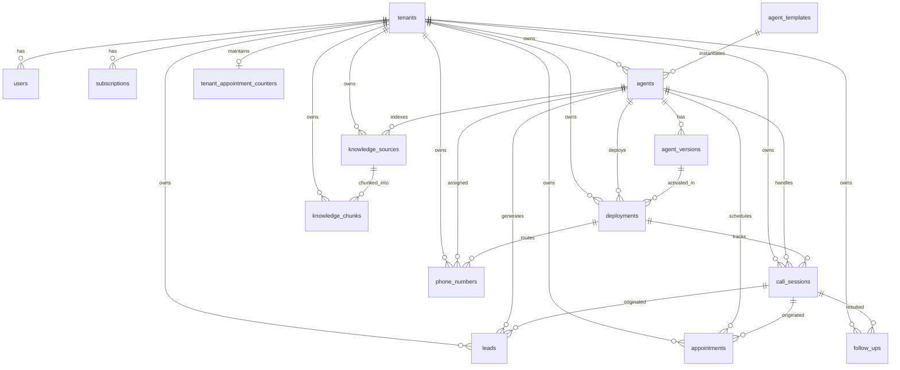

# NextLite Voice V3 — Database & Data Architecture
## Document 06: PostgreSQL Schema, Relational Models & Worker Boundaries

> **Document Type**: Database Architecture & Relational Data Dictionary  
> **Status**: Verified from Implementation (Read-Only)  
> **ORM / Schema File**: `apps/api/src/db/schema.ts`  
> **Migrations Directory**: `apps/api/drizzle/`  
> **Timestamp**: 2026-09-09  

---

## 1. Relational Entity Relationship Diagram

---

## 2. Table-by-Table Data Dictionary & Access Control Matrix

### Table 1: `tenants`
- **Purpose**: Root organization and multi-tenant isolation anchor.
- **Columns**: `id` (UUID PK), `name` (varchar 255), `slug` (varchar 255 UNIQUE), `status` (varchar 50 default 'active'), `created_at` (timestamp), `updated_at` (timestamp).
- **Owner**: Organization Service (`apps/api/src/routes/admin.ts`).
- **Writers**: Admin API on tenant onboarding.
- **Readers**: All services for tenant isolation validation.
- **Source of Truth**: **Authoritative Root Entity**.
- **Worker Access**: **NO DIRECT ACCESS**.

---

### Table 2: `users`
- **Purpose**: User accounts, credentials, and role assignments.
- **Columns**: `id` (UUID PK), `tenant_id` (UUID FK &rarr; `tenants.id`), `email` (varchar 255 UNIQUE), `password_hash` (text), `role` (`user_role`: `'ADMIN' | 'CLIENT_OWNER' | 'CLIENT_VIEWER'`), `email_verified` (boolean), `created_at` (timestamp), `updated_at` (timestamp).
- **Owner**: Auth Service (`apps/api/src/routes/auth.ts`).
- **Writers**: Auth registration and admin user provisioning.
- **Readers**: Auth middleware, JWT verification.
- **Source of Truth**: **Authoritative User Identity**.
- **Worker Access**: **NO DIRECT ACCESS**.

---

### Table 3: `agent_templates`
- **Purpose**: Preset agent templates for quick agent scaffolding across industries.
- **Columns**: `id` (UUID PK), `name` (varchar 255), `description` (text), `industry` (varchar 100), `default_configuration` (JSONB), `is_system` (boolean default true), `created_at` (timestamp).
- **Owner**: Template Service (`apps/api/src/services/template.ts`).
- **Writers**: Seed migrations.
- **Readers**: Template discovery and agent creation wizards.
- **Source of Truth**: **Authoritative Template Presets**.
- **Worker Access**: **NO DIRECT ACCESS**.

---

### Table 4: `agents`
- **Purpose**: Master entity record representing a configured AI voice agent.
- **Columns**: `id` (UUID PK), `tenant_id` (UUID FK &rarr; `tenants.id`), `template_id` (UUID FK &rarr; `agent_templates.id`), `name` (varchar 255), `status` (`agent_status`: `'DRAFT' | 'READY' | 'LIVE' | 'PAUSED' | 'ARCHIVED'`), `created_at` (timestamp), `updated_at` (timestamp).
- **Owner**: Agent Service (`apps/api/src/services/agent.ts`).
- **Writers**: Agent CRUD operations and publication controllers.
- **Readers**: Agent Service, RuntimeAgentConfigService.
- **Source of Truth**: **Authoritative Agent Entity**.
- **Worker Access**: **NO DIRECT ACCESS** (Derived via `RuntimeAgentConfig.agent`).

---

### Table 5: `agent_versions`
- **Purpose**: Immutable snapshot history of agent configurations.
- **Columns**: `id` (UUID PK), `agent_id` (UUID FK &rarr; `agents.id`), `version_number` (integer), `configuration` (JSONB), `status` (`version_status`: `'DRAFT' | 'PUBLISHED' | 'ARCHIVED'`), `created_by` (UUID FK &rarr; `users.id`), `notes` (text), `created_at` (timestamp).
- **Owner**: Agent Service (`apps/api/src/services/agent.ts`).
- **Writers**: Configuration saves (`saveConfiguration`) and publications (`publishAgent`).
- **Readers**: Agent Service, RuntimeAgentConfigService.
- **Source of Truth**: **Authoritative Configuration JSONB Source of Truth**.
- **Worker Access**: **NO DIRECT ACCESS** (Resolved over HTTP REST).

---

### Table 6: `deployments`
- **Purpose**: Active environment pointer binding an agent version to `TEST` or `PRODUCTION`.
- **Columns**: `id` (UUID PK), `tenant_id` (UUID FK &rarr; `tenants.id`), `agent_id` (UUID FK &rarr; `agents.id`), `version_id` (UUID FK &rarr; `agent_versions.id`), `environment` (`deployment_environment`: `'TEST' | 'PRODUCTION'`), `status` (`deployment_status`: `'ACTIVE' | 'INACTIVE' | 'ROLLED_BACK'`), `created_by` (UUID FK &rarr; `users.id`), `deployed_at` (timestamp), `created_at` (timestamp), `updated_at` (timestamp).
- **Constraints / Indices**: `uniqueIndex('active_deployment_per_agent_env_idx').on(table.agentId, table.environment).where(sql`status = 'ACTIVE'`)`.
- **Owner**: Agent Service / Deployment Manager.
- **Writers**: Agent creation, configuration saving, and publication workflows.
- **Readers**: RuntimeAgentConfigService, LiveKit Service, Telephony routing.
- **Source of Truth**: **Authoritative Environment Binding**.
- **Worker Access**: **NO DIRECT ACCESS**.

---

### Table 7: `call_sessions`
- **Purpose**: Realtime call tracking, duration, transcripts, turns, and metrics.
- **Columns**: `id` (UUID PK), `tenant_id` (UUID FK &rarr; `tenants.id`), `agent_id` (UUID FK &rarr; `agents.id`), `deployment_id` (UUID FK &rarr; `deployments.id`), `room_name` (varchar 255), `caller_number` (varchar 50), `direction` (`call_direction`: `'INBOUND' | 'OUTBOUND' | 'WEB_TEST'`), `status` (`call_status`: `'ACTIVE' | 'COMPLETED' | 'FAILED' | 'MISSED'`), `duration_seconds` (integer), `primary_language` (varchar 50), `started_at` (timestamp), `ended_at` (timestamp), `transcript_text` (text), `turns_json` (JSONB), `tools_used` (JSONB), `metrics_json` (JSONB), `created_at` (timestamp).
- **Owner**: Call Session Service (`apps/api/src/services/callSession.ts`).
- **Writers**: Worker process via `POST/PATCH /api/internal/call-sessions`.
- **Readers**: Client CRM Portal (`/api/client/calls`), Analytics Service.
- **Source of Truth**: **Authoritative Call History & Telemetry**.
- **Worker Access**: **REST API ONLY** (`/api/internal/call-sessions`).

---

### Table 8: `leads`
- **Purpose**: Customer callback requests and lead records captured during calls.
- **Columns**: `id` (UUID PK), `tenant_id` (UUID FK &rarr; `tenants.id`), `agent_id` (UUID FK &rarr; `agents.id`), `call_session_id` (UUID FK &rarr; `call_sessions.id`), `customer_name` (varchar 255), `customer_phone` (varchar 50), `customer_email` (varchar 255), `interest_category` (varchar 255), `status` (`lead_status`: `'NEW' | 'CONTACTED' | 'QUALIFIED' | 'CLOSED'`), `notes` (text), `metadata` (JSONB), `created_at` (timestamp), `updated_at` (timestamp).
- **Owner**: Lead Service (`apps/api/src/services/lead.ts`).
- **Writers**: Worker tool execution via `POST /api/internal/leads` or Client CRM.
- **Readers**: Client CRM Portal (`/api/client/leads`), Analytics Service.
- **Source of Truth**: **Authoritative Lead Records**.
- **Worker Access**: **REST API ONLY** (`/api/internal/leads`).

---

### Table 9: `appointments`
- **Purpose**: Business appointment bookings scheduled by callers or staff.
- **Columns**: `id` (UUID PK), `tenant_id` (UUID FK &rarr; `tenants.id`), `agent_id` (UUID FK &rarr; `agents.id`), `call_session_id` (UUID FK &rarr; `call_sessions.id`), `appointment_number` (varchar 50), `customer_name` (varchar 255), `customer_phone` (varchar 50), `title` (varchar 255), `resource_name` (varchar 255), `booking_date` (varchar 50), `booking_time` (varchar 50), `status` (`appointment_status`: `'REQUESTED' | 'CONFIRMED' | 'CANCELLED'`), `notes` (text), `metadata` (JSONB), `created_at` (timestamp), `updated_at` (timestamp).
- **Constraints / Indices**: `uniqueIndex('appointments_tenant_appointment_number_idx').on(table.tenantId, table.appointmentNumber)`.
- **Owner**: Appointment Service (`apps/api/src/services/appointment.ts`).
- **Writers**: Worker tool execution via `POST /api/internal/appointments` or Client CRM.
- **Readers**: Client CRM Portal (`/api/client/appointments`), Analytics Service.
- **Source of Truth**: **Authoritative Booking Records**.
- **Worker Access**: **REST API ONLY** (`/api/internal/appointments`).

---

### Table 10: `tenant_appointment_counters`
- **Purpose**: Concurrency-safe atomic sequential numbering (`A-001`) per tenant.
- **Columns**: `tenant_id` (UUID PK FK &rarr; `tenants.id`), `last_number` (integer default 0), `updated_at` (timestamp).
- **Owner**: Appointment Service (`apps/api/src/services/appointment.ts`).
- **Writers**: `AppointmentService` via atomic `INSERT ... ON CONFLICT DO UPDATE SET last_number = last_number + 1`.
- **Readers**: `AppointmentService`.
- **Source of Truth**: **Authoritative Sequential Counter**.
- **Worker Access**: **NO DIRECT ACCESS**.

---

### Table 11: `phone_numbers`
- **Purpose**: Telephony DID inventory, routing bindings, and tenant allocations.
- **Columns**: `id` (UUID PK), `tenant_id` (UUID FK &rarr; `tenants.id`), `agent_id` (UUID FK &rarr; `agents.id`), `deployment_id` (UUID FK &rarr; `deployments.id`), `phone_number` (varchar 50 UNIQUE), `provider` (varchar 50 default 'plivo'), `status` (varchar 50 default 'ACTIVE'), `created_at` (timestamp), `updated_at` (timestamp).
- **Owner**: Phone Number Service (`apps/api/src/services/phoneNumber.ts`).
- **Writers**: Phone number provisioning controllers.
- **Readers**: Telephony ingress routing (`GET /api/internal/phone-numbers/lookup`), Client Portal.
- **Source of Truth**: **Authoritative Telephony Route Table**.
- **Worker Access**: **REST API ONLY** (`/api/internal/phone-numbers/lookup`).

---

### Table 12: `follow_ups`
- **Purpose**: Log of automated follow-up messages (WhatsApp, SMS, Email).
- **Columns**: `id` (UUID PK), `tenant_id` (UUID FK &rarr; `tenants.id`), `lead_id` (UUID FK &rarr; `leads.id`), `appointment_id` (UUID FK &rarr; `appointments.id`), `call_session_id` (UUID FK &rarr; `call_sessions.id`), `customer_name` (varchar 255), `customer_phone` (varchar 50), `channel` (varchar 50 default 'WHATSAPP'), `provider` (varchar 50 default 'DEMO'), `message_type` (varchar 50 default 'CUSTOM'), `message_text` (text), `status` (`follow_up_status`: `'PENDING' | 'SENT' | 'DELIVERED' | 'FAILED'`), `provider_message_id` (varchar 255), `is_demo` (boolean default true), `sent_at` (timestamp), `delivered_at` (timestamp), `failed_at` (timestamp), `metadata` (JSONB), `created_at` (timestamp), `updated_at` (timestamp).
- **Owner**: WhatsApp / Follow-Up Service (`apps/api/src/services/whatsapp.ts`).
- **Writers**: WhatsApp dispatch endpoints.
- **Readers**: Client CRM Portal (`/api/client/follow-ups`), Analytics Service.
- **Source of Truth**: **Authoritative Message History**.
- **Worker Access**: **NO DIRECT ACCESS**.

---

### Table 13: `knowledge_sources` & `knowledge_chunks`
- **Purpose**: RAG document metadata, chunk text, and vector embeddings.
- **Columns `knowledge_sources`**: `id` (UUID PK), `agent_id` (UUID FK &rarr; `agents.id`), `tenant_id` (UUID FK &rarr; `tenants.id`), `file_name` (varchar 255), `file_path` (text), `file_type` (varchar 50), `chunk_count` (integer), `content_hash` (varchar 64), `status` (`knowledge_source_status`: `'PROCESSING' | 'READY' | 'FAILED'`), `created_at` (timestamp).
- **Columns `knowledge_chunks`**: `id` (UUID PK), `source_id` (UUID FK &rarr; `knowledge_sources.id`), `agent_id` (UUID FK &rarr; `agents.id`), `tenant_id` (UUID FK &rarr; `tenants.id`), `content` (text), `embedding` (JSONB / float array), `chunk_index` (integer), `token_count` (integer), `metadata` (JSONB), `created_at` (timestamp).
- **Owner**: Knowledge Service (`apps/api/src/services/knowledge.ts`).
- **Writers**: Knowledge upload and ingestion endpoints (`POST /api/admin/knowledge/upload`).
- **Readers**: Internal RAG retrieval endpoint (`POST /api/internal/knowledge/retrieve`).
- **Source of Truth**: **Authoritative Vector Knowledge Store**.
- **Worker Access**: **REST API ONLY** (`/api/internal/knowledge/retrieve`).

---

### Table 14: `agent_tools` (DEPRECATED)
- **Columns**: `id` (UUID PK), `agent_id` (UUID FK &rarr; `agents.id`), `tool_name` (varchar 255), `tool_config` (JSONB), `enabled` (boolean), `created_at` (timestamp).
- **Status**: **DEPRECATED**. Retained for backward schema compatibility. V3 runtime tools are derived authoritatively from `agent_versions.configuration.tools.bindings`.

---

## 3. Strict Database Boundary Rules for Workers

> [!CRITICAL]
> **ABSOLUTE RULE: WORKERS (LIVEKIT & PIPECAT) MUST NEVER CONNECT TO POSTGRESQL DIRECTLY.**
> 1. Neither worker process possesses database connection credentials, ORM models, or SQL drivers.
> 2. All database interactions occur via authenticated HTTP REST calls to `/api/internal/*`.
> 3. This guarantees strict multi-tenant isolation, atomic concurrency counters, and zero database credential exposure on telephony edge nodes.
