# NextLite Voice V3 — RAG & Knowledge Architecture
## Document 08: Ingestion, Storage, Vector Retrieval & Worker Boundaries

> **Document Type**: Retrieval-Augmented Generation (RAG) Architecture  
> **Status**: Verified from Implementation (Read-Only)  
> **Owning Services**: `apps/api/src/services/knowledge.ts`, `embedding.ts`, `storage.ts`, `chunking.ts`  
> **API Boundary**: `POST /api/internal/knowledge/retrieve`  
> **Timestamp**: 2026-09-09  

---

## 1. Complete Knowledge Pipeline Flow

```mermaid
graph TD
    subgraph Ingestion [Ingestion Pipeline - apps/api]
        AdminUpload[Admin Document Upload] -->|POST /api/admin/knowledge/upload| KnowledgeRoute[src/routes/knowledge.ts]
        KnowledgeRoute --> SHA256[SHA-256 Content Deduplication]
        SHA256 --> StorageUpload[Upload Object to Backblaze B2 / S3]
        StorageUpload --> Normalizer[Normalize Text & Markdown Parsing]
        Normalizer --> Chunker[Sliding Window Chunking - 500 chars / 100 overlap]
        Chunker --> EmbeddingAdapter[Nvidia / Gemini Embeddings API]
        EmbeddingAdapter --> DBInsert[Insert into knowledge_sources & knowledge_chunks]
    end

    subgraph RuntimeRetrieval [Runtime Retrieval Pipeline]
        CallerQuery[Caller asks knowledge question] --> LLMToolCall[LLM triggers query_knowledge_base]
        LLMToolCall --> WorkerTool[knowledgeTool in LiveKit / Pipecat]
        WorkerTool -->|POST /api/internal/knowledge/retrieve| InternalRoute[src/routes/internal.ts]
        InternalRoute --> RuntimeConfigCheck[Validate deploymentId & knowledge.enabled]
        RuntimeConfigCheck --> QueryEmbed[Embed Search Query - query mode]
        QueryEmbed --> VectorSearch[Cosine Similarity Search over Tenant Chunks]
        VectorSearch --> ScoreFilter[Apply optional scoreThreshold & topK limit]
        ScoreFilter --> ToolResultJSON[Return Clean Text Results JSON to Worker]
        ToolResultJSON --> LLMResponse[LLM articulates factual voice answer]
    end
```



---

## 2. Ingestion, Storage & Embedding Infrastructure

### 2.1 Object Storage (`apps/api/src/services/storage.ts`)
- **Storage Provider**: Backblaze B2 (S3-compatible API) via `@aws-sdk/client-s3`.
- **Storage Path Pattern**: `knowledge/{tenantId}/{agentId}/{sourceId}/{safeFileName}`.
- **Deduplication**: Calculates SHA-256 hash of the uploaded document buffer. If a record in `knowledge_sources` matches `tenant_id`, `agent_id`, and `content_hash`, the existing record is returned without duplicate storage or redundant embedding API calls.

### 2.2 Text Chunking (`apps/api/src/services/chunking.ts`)
- **Chunk Size**: 500 characters.
- **Overlap**: 100 characters.
- **Processing Logic**: Normalizes whitespace, extracts clean markdown text, splits by paragraphs and sentence boundaries with sliding window overlap, preserving metadata (`chunkIndex`, `tokenCount`, `fileName`).

### 2.3 Vector Embedding Providers (`apps/api/src/services/embedding.ts`)
- **Default Embedding Model**: Nvidia (`nvidia/nemotron-3-embed-1b`, 2048 dimensions) via `https://integrate.api.nvidia.com/v1/embeddings`.
- **Alternative Embedding Model**: Google Gemini (`gemini-embedding-001`, 2048 dimensions).
- **Vector Storage**: Stored in `knowledge_chunks.embedding` column as a JSONB float vector.

---

## 3. Runtime Retrieval & Strict Multi-Tenant Isolation

### 3.1 Worker Retrieval Endpoint (`apps/api/src/routes/internal.ts`)
- **Path**: `POST /api/internal/knowledge/retrieve`
- **Authentication**: `x-worker-secret` / Bearer `WORKER_API_SECRET`
- **Request Schema**:
  ```json
  {
    "deploymentId": "e2a4a754-0123-4567-89ab-cdef01234567",
    "query": "What are your OPD hours for cardiology?",
    "topK": 3
  }
  ```

### 3.2 Tenant Isolation Enforcement:
1. `runtimeAgentConfigService.resolveRuntimeAgentConfig(deploymentId)` authoritatively derives `tenantId` and `agentId` from the verified `deploymentId`.
2. If `runtimeConfig.knowledge.enabled === false`, returns `{ results: [] }` immediately without hitting the vector index.
3. The SQL query strictly enforces:
   ```typescript
   where: and(
     eq(knowledgeChunks.tenantId, tenantId),
     eq(knowledgeChunks.agentId, agentId)
   )
   ```
4. Cross-tenant or cross-agent data leakage is mathematically prevented at the database query layer.
5. Cosine similarity is computed against all matching chunks, filtered by optional `scoreThreshold`, and sorted by score descending up to `topK` (default `5`).

### 3.3 Response Payload:
```json
{
  "results": [
    {
      "content": "Cardiology OPD runs Monday to Friday from 10:00 AM to 2:00 PM with Dr. Sharma.",
      "score": 0.89,
      "sourceId": "550e8400-e29b-41d4-a716-446655440000"
    }
  ]
}
```

---

## 4. Architectural Ownership: NextLite vs Pipecat

> [!CRITICAL]
> **RAG IS OWNED EXCLUSIVELY BY NEXTLITE CONTROL PLANE.**

| Responsibility | NextLite API (Owner) | Pipecat Worker (Consumer Only) |
|---|---|---|
| **Document Storage & S3 / B2 Keys** | **EXCLUSIVELY NEXTLITE** | **NEVER** exposed to Pipecat. |
| **Chunking Logic & Token Counting** | **EXCLUSIVELY NEXTLITE** | **NEVER** touched by Pipecat. |
| **Embedding Model & API Keys** | **EXCLUSIVELY NEXTLITE** | **NEVER** handled by Pipecat. |
| **Vector Similarity Calculation** | **EXCLUSIVELY NEXTLITE** | **NEVER** computed in Pipecat. |
| **Tenant & Agent Boundary Filtering** | **EXCLUSIVELY NEXTLITE** | **NEVER** trusted to Pipecat. |
| **Tool Calling Contract** | NextLite defines endpoint & schema | Pipecat registers tool: `query_knowledge_base(query: str)`. |
| **Tool Execution** | NextLite executes search & returns text results | Pipecat sends `POST /api/internal/knowledge/retrieve` with `{ deploymentId, query }`. |
| **LLM Context Injection** | NextLite returns sanitized chunk strings | Pipecat passes chunk text into native LLM tool output frame. |

> [!IMPORTANT]
> Pipecat is **strictly an external consumer** of RAG via the `POST /api/internal/knowledge/retrieve` REST API. Pipecat must NOT install vector databases (e.g. Chroma, FAISS, Pinecone), embedding SDKs, or document chunking libraries.
