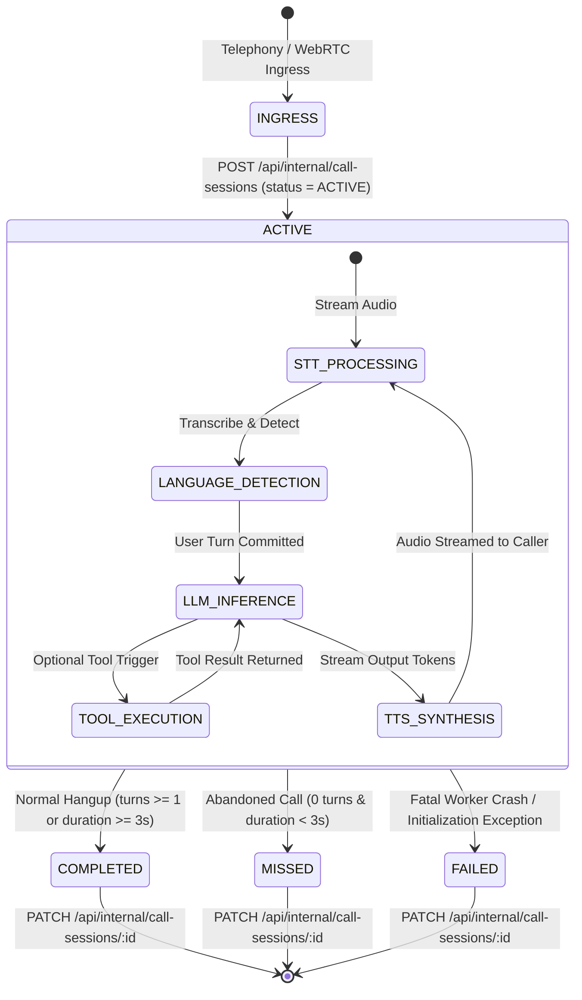

# NextLite Voice V3 — Telephony & Call Runtime Architecture
## Document 10: Inbound/Outbound Telephony, Plivo Transport & Call Session Lifecycle

> **Document Type**: Telephony Transport & Call Session State Machine Architecture  
> **Status**: Verified from Implementation (Read-Only)  
> **Owning Services**: `apps/api/src/services/phoneNumber.ts`, `callSession.ts`, `livekit.ts`, `apps/pipecat-worker/app/main.py`  
> **Timestamp**: 2026-09-09  

---

## 1. End-to-End Telephony Ingress & Call Routing Architecture

```
[Incoming Caller: +919876543210]
   │
   ▼ (Dials Plivo DID Number: +918045678900)
[Plivo Telephony Infrastructure]
   │
   ├─► Inbound Telephony Webhook / Answer XML / WebSocket
   │
   ▼
[NextLite Control Plane: GET /api/internal/phone-numbers/lookup?phoneNumber=+918045678900]
   │
   ├─► Queries phone_numbers table WHERE phone_number = '+918045678900'
   ├─► Resolves:
   │     - tenantId: 'c0a80101-0000-0000-0000-000000000001'
   │     - agentId: 'a0a80101-0000-0000-0000-000000000001'
   │     - deploymentId: 'd0a80101-0000-0000-0000-000000000001' (Active PRODUCTION Deployment)
   │
   ▼
[Voice Worker (LiveKit / Pipecat)]
   │  - Fetches RuntimeAgentConfig for deploymentId
   │  - Initializes call session for resolved tenantId & agentId
```

---

## 2. Inbound & Outbound Telephony Execution Flows

### 2.1 Inbound Telephony Flow
1. **PSTN Ingress**: Caller dials the business phone number assigned to an agent.
2. **Plivo Webhook / Stream Trigger**: Plivo initiates call handling via configured Answer XML `<Stream>` or SIP Domain.
3. **Number Resolution**: NextLite resolves the destination DID in `phone_numbers` table. If the number is active and bound to a `deploymentId`, routing proceeds.
4. **WebSocket / SIP Ingress**:
   - **LiveKit Path**: Routed to LiveKit SIP Inbound Trunk &rarr; LiveKit room created with `deploymentId` metadata &rarr; LiveKit worker assigned.
   - **Pipecat Path**: Plivo Stream connects directly to `wss://.../ws/plivo` with `streamId`, `callId`, and dialed DID &rarr; Pipecat pipeline executes.

### 2.2 Outbound Telephony Flow (Phone Testing / Callbacks)
1. **Trigger**: Admin initiates outbound test call via UI (`POST /api/admin/clients/:cId/agents/:aId/phone-test`).
2. **Validation**: Validates destination number in strict E.164 format (`isValidE164`).
3. **Deployment Resolution**: Resolves active `TEST` deployment for the agent.
4. **SIP Outbound Trunk**: LiveKit `SipClient.createSipParticipant()` dials destination via `LIVEKIT_SIP_TRUNK_ID`.

---

## 3. Telephony Identifiers & Stream Metadata

| Identifier | Source | Purpose | Trust Level | Usage |
|---|---|---|---|---|
| `phoneNumber` (DID) | Inbound telephony header | Identifies target business number | **Authoritative** (Verified via DB `phone_numbers` table lookup) | Resolves `tenantId` and `deploymentId`. |
| `callerNumber` (CLI) | Inbound telephony header | Identifies calling customer's phone number | **Trusted Telephony Ingress** | Stored in `call_sessions.caller_number`; used for appointment/lead contact phone fallback. |
| `streamId` | Plivo WebSocket initial `start` event | Identifies unique bidirectional media stream | **Plivo Session Identifier** | Required for `PlivoFrameSerializer` to route outbound audio packets back to Plivo. |
| `callId` | Plivo telephony call UUID | Identifies Plivo billing/CDR record | **Plivo Telephony Call ID** | Used for automated Plivo call termination / hangup via REST API. |

---

## 4. How the Worker Securely Knows Tenant, Agent, and Deployment

### Explicit Answer to Core Architectural Requirement:

> **"How does the worker securely know WHICH tenant, agent, and deployment this call belongs to?"**

1. **The worker does NOT trust caller-provided metadata or user speech.**
2. **Inbound Path Resolution**:
   - The dialed Plivo DID (the number the caller called) is matched against the database `phone_numbers` table (`apps/api/src/services/phoneNumber.ts:lookupPhoneNumber`).
   - The database record explicitly provides the authoritative `deploymentId` (which is linked to the active `PRODUCTION` deployment of the assigned agent).
3. **Worker Config Resolution**:
   - The worker takes this verified `deploymentId` and calls `GET /api/internal/runtime-config/:deploymentId`.
   - The Control Plane API authoritatively resolves `tenant.tenantId`, `agent.agentId`, `deployment.versionId`, and compiled system prompt from the database.
4. **Result**: Multi-tenant isolation is enforced at the database level. An inbound caller cannot spoof or manipulate which tenant or agent answers their call.

---

## 5. Call Session State Machine & Lifecycle



### 5.1 Call Lifecycle Execution Steps:
1. **Creation of `ACTIVE` Session**: Worker sends `POST /api/internal/call-sessions` with `tenantId`, `agentId`, `deploymentId`, `roomName`, `callerNumber`, `direction`, `status: 'ACTIVE'`, `startedAt`.
2. **Turn & Metric Accumulation**: In-memory `DebugTranscriptCollector` records user speech, agent responses, tool calls, tool results, and language switches. `RealtimeTimingTracker` records monotonic STT, TTFT, TTFB, and turn latencies.
3. **Session Finalization**: On disconnect, worker computes duration, formats plain transcript, compiles metrics JSON, resolves final status (`COMPLETED`, `MISSED`, or `FAILED`), and sends `PATCH /api/internal/call-sessions/:id`.

### 5.2 Failure Behaviors Matrix:

| Failure Mode | Worker Action | Control Plane State | Impact on CRM / Dashboard |
|---|---|---|---|
| **Normal Hangup** | Executes finalizer with status `COMPLETED`. | `call_sessions.status = 'COMPLETED'` | Call duration and full transcript immediately available in Client Dashboard. |
| **Instant Caller Abandon (<3s, 0 turns)** | Executes finalizer with status `MISSED`. | `call_sessions.status = 'MISSED'` | Displayed as "Missed Call" in Analytics and Calls feed. |
| **Worker Initialization Crash** | Catch block executes finalizer with status `FAILED`. | `call_sessions.status = 'FAILED'` | Logged with error diagnostics in `metrics_json.errors`. |
| **Internal API Temporary Outage** | Worker catches error, logs warning, and completes audio session gracefully. | Session remains `ACTIVE` in DB or retried on graceful shutdown. | Prevents audio dialogue crash mid-sentence. |
| **STT / TTS Service Disconnect** | Worker emits session error event, debug collector logs error, finalizer closes session. | `call_sessions.status = 'COMPLETED'` or `'FAILED'` | Errors recorded in `metricsJson.errors`. |
| **Tool Execution Error** | Tool returns structured `{ success: false, message: "..." }`; LLM communicates polite fallback. | `call_sessions` records tool error in debug transcript. | Call continues without crashing telephony pipeline. |
