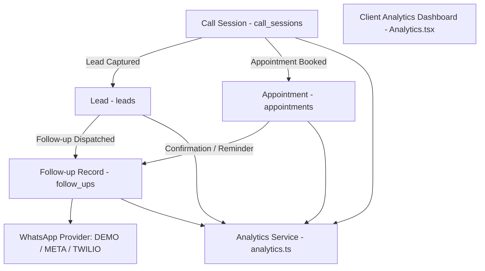

# NextLite Voice V3 — CRM Business Architecture
## Document 11: Client CRM Portal, Leads, Appointments & Follow-Up Messaging

> **Document Type**: Business Domain & CRM Architecture  
> **Status**: Verified from Implementation (Read-Only)  
> **Owning Services**: `apps/api/src/services/lead.ts`, `appointment.ts`, `callSession.ts`, `whatsapp.ts`, `followUp.ts`, `analytics.ts`  
> **Frontend Pages**: `apps/web/src/pages/client/*`  
> **Timestamp**: 2026-09-09  

---

## 1. CRM Entity Relationships & Lifecycle Flow

---

## 2. Core CRM Business Domains

### 2.1 Appointments (`appointments` Table)
- **Status Semantics**:
  - `REQUESTED` (**Default**): Voice agent records booking request during call. Team or clinic staff reviews doctor schedule, availability, and confirms.
  - `CONFIRMED`: Staff or backend integration verifies slot availability and confirms the appointment with the customer.
  - `CANCELLED`: Appointment cancelled by customer or staff.
- **Sequential Display Numbering (`tenant_appointment_counters`)**:
  - PostgreSQL concurrency-safe counter generates tenant-scoped identifiers (e.g., `A-001`, `A-002`, `A-003`).
  - Stored in `appointments.appointment_number`.
  - Unique constraint: `uniqueIndex('appointments_tenant_appointment_number_idx').on(table.tenantId, table.appointmentNumber)`.
- **UUID Suppression Rule**:
  - Voice agents and tools **NEVER** pronounce or return raw database UUIDs (e.g. `550e8400-e29b-41d4-a716-446655440000`).
  - `getUserSafeDisplayId()` in `packages/shared/src/runtimeConfig.ts` extracts only safe reference numbers (`A-001`).

---

### 2.2 Leads (`leads` Table)
- **Status Semantics**:
  - `NEW` (**Default**): Fresh callback request or product inquiry captured by the voice agent.
  - `CONTACTED`: Staff reached out to customer via phone call, WhatsApp, or email.
  - `QUALIFIED`: Customer interest validated as high priority / qualified lead.
  - `CLOSED`: Deal won, inquiry resolved, or customer lost.
- **Fields**: `customerName`, `customerPhone`, `customerEmail`, `interestCategory`, `notes`, `metadata`.

---

### 2.3 Follow-ups & WhatsApp Messaging (`follow_ups` Table)
- **Supported Channels**: `WHATSAPP`, `SMS`, `EMAIL`.
- **Supported Providers**:
  - `DEMO` (**Default**): Simulates message delivery instantly; logs structured preview in `follow_ups.metadata`.
  - `META`: Meta Cloud WhatsApp Business API.
  - `TWILIO`: Twilio WhatsApp / Programmable SMS API.
- **Message Types**: `APPOINTMENT_REQUEST`, `APPOINTMENT_CONFIRMATION`, `LEAD_CALLBACK`, `CUSTOM`.
- **Status Semantics**: `PENDING` &rarr; `SENT` &rarr; `DELIVERED` &rarr; `FAILED`.

---

### 2.4 Realtime Analytics Aggregation (`analytics.ts`)
- Computes dynamic on-the-fly metrics across all CRM tables:
  - Total calls, connected calls, average duration, call outcomes breakdown (`completed`, `missed`, `failed`, `active`).
  - 7-day volume trend matrix (`dateMap`).
  - Lead funnel conversion rates (`new` &rarr; `contacted` &rarr; `qualified` &rarr; `closed`).
  - Appointment statuses (`requested`, `confirmed`, `cancelled`).
  - Language distribution percentages.
  - Inbound vs outbound vs web test call direction ratios.
  - Tool execution counts (`query_knowledge_base`, `book_appointment`, `create_callback_lead`).
  - Average turn latencies (STT, LLM TTFT, TTS TTFB).

---

## 3. Client Role-Based Permissions in CRM

| Role | Read Calls / Leads / Appts / Analytics | Update Lead / Appt Status | Send WhatsApp Message | Edit Agent Configuration |
|---|---|---|---|---|
| **ADMIN** | **YES** (All tenants) | **YES** | **YES** | **YES** |
| **CLIENT_OWNER** | **YES** (Own tenant only) | **YES** | **YES** | **NO** (Admin Studio only) |
| **CLIENT_VIEWER** | **YES** (Own tenant only) | **NO** (`403 Forbidden`) | **NO** (`403 Forbidden`) | **NO** |
