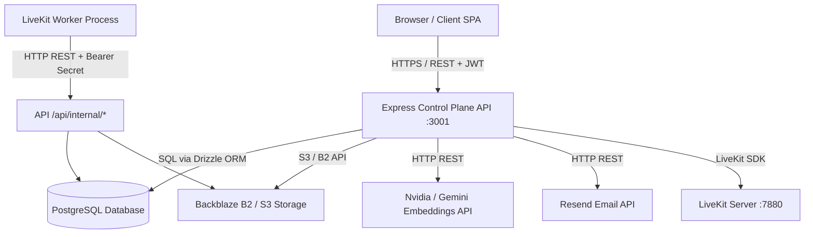
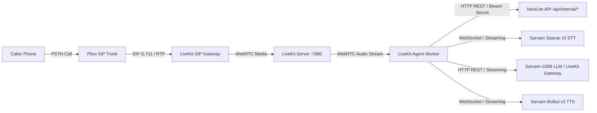
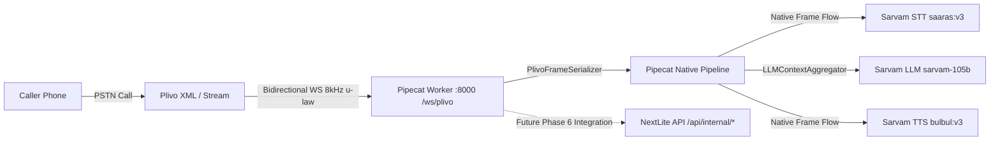

# NextLite Voice V3 — Complete Production Architecture

> **Audit Type**: Code-Verified Runtime Architecture  
> **Status**: Verified from Implementation (Read-Only)  
> **Timestamp**: 2026-09-09  

---

## 1. Web Application & Control Plane Architecture

### End-to-End Control Plane Flow

| Step | Source | Destination | Protocol / Endpoint | Auth | Payload | Responsible File | Failure Behavior |
|---|---|---|---|---|---|---|---|
| **1. User Authentication** | Browser | API | `POST /api/auth/login` | None (Credentials in body) | `{ email, password }` | `src/routes/auth.ts` | 401 Unauthorized with error message |
| **2. Admin Config Save** | Admin SPA | API | `PUT /api/admin/clients/:cId/agents/:aId/config` | Bearer JWT (ADMIN) | `{ configuration, notes }` | `src/routes/agents.ts`, `src/services/agent.ts` | 400 Validation error or 404 Client/Agent not found |
| **3. Agent Publish** | Admin SPA | API | `POST /api/admin/clients/:cId/agents/:aId/publish` | Bearer JWT (ADMIN) | Empty / Trigger | `src/routes/agents.ts`, `src/services/agent.ts` | 400 Checklist failure with specific violation list |
| **4. Web Voice Test Token** | Admin SPA | API | `POST /api/admin/clients/:cId/agents/:aId/test-token` | Bearer JWT (ADMIN) | Empty / Trigger | `src/routes/agents.ts`, `src/services/livekit.ts` | 503 if LiveKit unconfigured; 502 on dispatch failure |
| **5. Knowledge Upload** | Admin SPA | API | `POST /api/admin/knowledge/upload` | Bearer JWT (ADMIN) | Multipart Form (`file`, `agentId`) | `src/routes/knowledge.ts`, `src/services/knowledge.ts` | 400 Invalid file type; 500 Storage/Embedding error |
| **6. Client CRM View** | Client SPA | API | `GET /api/client/calls`, `/leads`, `/appointments` | Bearer JWT (CLIENT_*) | Query params (`limit`, `offset`, `status`) | `src/routes/client.ts`, `src/services/*` | 403 No tenant context; 404 if entity missing |
| **7. WhatsApp Follow-up** | Client SPA | API | `POST /api/client/follow-ups/send-whatsapp` | Bearer JWT (CLIENT_OWNER) | `{ customerPhone, message, leadId }` | `src/routes/client.ts`, `src/services/whatsapp.ts` | 403 Read-only role rejection; 500 Provider error |

---

## 2. Telephony & Realtime Voice Engine Architectures

### 2.1 Current Architecture: Plivo → LiveKit SIP → LiveKit Agent Worker → Sarvam

#### Detailed Flow (LiveKit Current Production Reference):
1. **Inbound Call Initiation**:
   - PSTN phone calls Plivo rented number.
   - Plivo routes call via SIP URI to LiveKit SIP Outbound/Inbound Trunk (`LIVEKIT_SIP_DOMAIN`).
   - LiveKit SIP Gateway accepts SIP call, creates WebRTC room (`sip-call-...`), and embeds SIP attributes in room metadata.
2. **Worker Assignment & Config Resolution**:
   - LiveKit Server assigns job to connected LiveKit Worker (`apps/livekit-worker/src/main.ts`).
   - Worker extracts `deploymentId` from `room.metadata`.
   - Worker calls `GET /api/internal/runtime-config/:deploymentId` with `LIVEKIT_WORKER_SECRET`.
   - NextLite API resolves `RuntimeAgentConfig` authoritatively from database deployment & version snapshot.
3. **Session Initialization**:
   - Worker calls `POST /api/internal/call-sessions` with status `ACTIVE`.
   - Worker initializes `ConversationLanguageManager`, Sarvam STT (`saaras:v3`), Sarvam TTS (`bulbul:v3`), and LLM (`SarvamLLM` or `inference.LLM`).
   - Worker prepends `buildTemporalInstruction()` and `buildCalendarInstruction()` to `compiledSystemPrompt`.
4. **Speech-to-Text & Language Handling**:
   - WebRTC audio frames stream to Sarvam Saaras v3.
   - Final transcription events fire `UserInputTranscribed`.
   - `ConversationLanguageManager` evaluates transcript against 12 Indic explicit patterns and Hinglish/Minglish marker filters.
   - If switched: updates TTS target language and dynamic LLM instruction.
5. **LLM & Tool Execution**:
   - Sarvam-105B processes turn. If function tool called (`query_knowledge_base`, `create_callback_lead`, `book_appointment`), worker executes tool factory.
   - Tool calls authenticated internal API endpoint (`/api/internal/*`) using trusted `deploymentId` and `callerPhone`.
   - Internal API writes to PostgreSQL and returns customer-facing reference (e.g. `A-001`).
   - LLM articulates concise response in 1–2 sentences without UUID pronunciation.
6. **Text-to-Speech & Interruption**:
   - LLM tokens stream to Sarvam Bulbul v3 TTS.
   - Synthesized PCM audio streams back to caller via LiveKit WebRTC & SIP Gateway.
   - In-process turn detector (`v1-mini`) handles user barge-in / speech interruption with adaptive threshold.
7. **Session Finalization**:
   - On disconnect or `close`, worker calculates duration, generates plain text transcript from debug turn collector, builds metrics payload (`usage`, `latency`, `toolsUsed`), and calls `PATCH /api/internal/call-sessions/:id` setting status to `COMPLETED` (or `MISSED` if < 3s and 0 turns).

---

### 2.2 Target Architecture: Plivo → WebSocket → Pipecat Worker → Sarvam

#### Detailed Flow (Pipecat Telephony Engine — Phases 1–4 Verified):
1. **WebSocket Handshake**:
   - Plivo triggers Answer XML `<Stream bidirectional="true">wss://.../ws/plivo</Stream>`.
   - Plivo opens bidirectional WebSocket to `apps/pipecat-worker/app/main.py`.
   - Receives initial Plivo `start` event containing `streamId` and `callId`.
2. **Native Pipeline Setup**:
   - Instantiates `PlivoFrameSerializer(stream_id, call_id, plivo_sample_rate=8000)`.
   - Instantiates `FastAPIWebsocketTransport` for raw audio streaming.
   - Instantiates `SarvamSTTService(model="saaras:v3")`.
   - Instantiates `LLMContext` and `LLMContextAggregatorPair` for native multi-turn message accumulation.
   - Instantiates `SarvamLLMService(model="sarvam-105b")`.
   - Instantiates `SarvamTTSService(model="bulbul:v3", voice="shubh")`.
   - Instantiates `RealtimeStreamingTimingMonitor` for turn-to-turn latency instrumentation.
3. **Conversational Turn Pipeline**:
   - 8kHz μ-law audio frames flow: `transport.input()` &rarr; `stt_service` &rarr; `timing_monitor` &rarr; `context_aggregator.user()` &rarr; `llm_service` &rarr; `tts_service` &rarr; `transport.output()` &rarr; `context_aggregator.assistant()`.
   - VAD signals (`on_speech_started`, `on_speech_stopped`) track caller turn-taking.
   - TTS synthesis streams 8kHz audio directly back to Plivo WebSocket without transcode latency.
   - On interruption (`InterruptionFrame`), Plivo audio buffer is immediately cleared.
4. **Current Status & Stopping Boundary**:
   - Stopped cleanly at Phase 5.
   - No direct DB access; no control plane bypass.
   - Phase 6+ will connect Pipecat to `/api/internal/runtime-config/:deploymentId`, `ConversationLanguageManager`, tool factories, and call session persistence.
