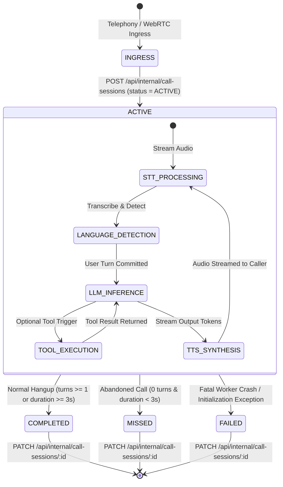

# NextLite Voice V3 — Call Session Lifecycle & State Machine Audit

> **Contract Reference**: `packages/shared/src/types.ts` (`CallSession`, `CallStatus`, `CallDirection`)  
> **Owning Service**: `apps/api/src/services/callSession.ts`  
> **Worker Lifecycle**: `apps/livekit-worker/src/main.ts`, `apps/livekit-worker/src/callLifecycle.ts`, `debugTranscript.ts`  
> **Status**: Verified from Codebase (Read-Only)  
> **Timestamp**: 2026-09-09  

---

## 1. Call Session State Machine



---

## 2. Step-by-Step Call Execution Trace

### Step 1: Ingress & Call Context Detection
- **Trigger**: Telephony call connects to worker.
- **Context Parsing** (`apps/livekit-worker/src/callLifecycle.ts:detectCallContext`):
  - Room name prefix `phone-test-` or `sip-` &rarr; `direction = 'OUTBOUND'`
  - Room name prefix `test-` &rarr; `direction = 'WEB_TEST'`
  - Telephony inbound &rarr; `direction = 'INBOUND'`
  - Extracts caller phone number from participant identity or SIP header.

### Step 2: Creation of `ACTIVE` Call Session
- **API Call**: `POST /api/internal/call-sessions`
- **Request Payload**:
  ```json
  {
    "tenantId": "c0a80101-0000-0000-0000-000000000001",
    "agentId": "a0a80101-0000-0000-0000-000000000001",
    "deploymentId": "d0a80101-0000-0000-0000-000000000001",
    "roomName": "sip-call-9876543210-1725890000",
    "callerNumber": "+919876543210",
    "direction": "INBOUND",
    "status": "ACTIVE",
    "primaryLanguage": "hi-IN",
    "startedAt": "2026-09-09T13:15:00.000Z"
  }
  ```
- **Database Result**: Row created in `call_sessions` table with status `ACTIVE`. ID returned as `callSessionId`.

### Step 3: Turn & Metric Accumulation during Dialogue
- In-memory `DebugTranscriptCollector` records every turn:
  - `recordUserTurn`: `{ transcript, detectedLanguage, activeLanguageBefore, activeLanguageAfter, languageDecision }`
  - `recordAgentMessage`: `{ response, activeLanguage, interrupted, metrics }`
  - `recordToolCall` & `recordToolResult`: `{ toolName, callId, args, resultCount, isError }`
- In-memory `RealtimeTimingTracker` records monotonic latencies:
  - STT latency, LLM TTFT (time to first token), TTS TTFB (time to first byte), total turn latency.

### Step 4: Call Session Finalization & Status Mapping
- **Trigger**: Caller hangs up, WebSocket disconnects, or worker shutdown callback executes.
- **Session Finalizer** (`apps/livekit-worker/src/main.ts:finalizeCallSession`):
  1. Computes `durationSeconds = Math.round((Date.now() - sessionStartMs) / 1000)`.
  2. Extracts all accumulated turns from `DebugTranscriptCollector`.
  3. Formats human-readable plain text transcript (`formatPlainTranscript`).
  4. Status Resolution Logic:
     ```typescript
     let status: 'COMPLETED' | 'FAILED' | 'MISSED' = finalStatus;
     if (status === 'COMPLETED' && turns.length === 0 && durationSeconds < 3) {
       status = 'MISSED';
     }
     ```
  5. Compiles `metricsJson`: `{ totalTurns, executedToolsCount, errorsCount, usage, latencies }`.
  6. Sends `PATCH /api/internal/call-sessions/:callSessionId`:
     ```json
     {
       "tenantId": "c0a80101-0000-0000-0000-000000000001",
       "status": "COMPLETED",
       "durationSeconds": 47,
       "endedAt": "2026-09-09T13:15:47.000Z",
       "primaryLanguage": "hi-IN",
       "transcriptText": "User: नमस्ते, मुझे डॉक्टर शर्मा से मिलना है...\nAssistant: नमस्ते! डॉक्टर शर्मा...",
       "turnsJson": [ ... ],
       "toolsUsed": ["query_knowledge_base", "book_appointment"],
       "metricsJson": { "totalTurns": 6, "executedToolsCount": 2, "errorsCount": 0 }
     }
     ```

---

## 3. Failure Behaviors Matrix

| Failure Mode | Worker Action | Control Plane State | Impact on CRM / Dashboard |
|---|---|---|---|
| **Normal Hangup** | Executes finalizer with status `COMPLETED`. | `call_sessions.status = 'COMPLETED'` | Call duration and full transcript immediately available in Client Dashboard. |
| **Instant Caller Abandon (<3s, 0 turns)** | Executes finalizer with status `MISSED`. | `call_sessions.status = 'MISSED'` | Displayed as "Missed Call" in Analytics and Calls feed. |
| **Worker Initialization Crash** | Catch block executes finalizer with status `FAILED`. | `call_sessions.status = 'FAILED'` | Logged with error diagnostics in `metrics_json.errors`. |
| **Internal API Temporary Outage** | Worker catches error, logs warning, and completes audio session gracefully. | Session remains `ACTIVE` in DB or retried on graceful shutdown. | Prevents audio dialogue crash mid-sentence. |
| **STT / TTS Service Disconnect** | Worker emits session error event, debug collector logs error, finalizer closes session. | `call_sessions.status = 'COMPLETED'` or `'FAILED'` | Errors recorded in `metricsJson.errors`. |
| **Tool Execution Error** | Tool returns structured `{ success: false, message: "..." }`; LLM communicates polite fallback. | `call_sessions` records tool error in debug transcript. | Call continues without crashing telephony pipeline. |

---

## 4. Pipecat Lifecycle Parity Requirements (Phase 6+)

To achieve 100% parity with LiveKit:
1. Pipecat WebSocket handler (`apps/pipecat-worker/app/main.py`) MUST call `POST /api/internal/call-sessions` upon receiving Plivo `start` event.
2. Pipecat MUST accumulate transcription and LLM response frames in an in-memory turn collector.
3. Pipecat MUST call `PATCH /api/internal/call-sessions/:id` in its `finally:` block when the WebSocket closes, passing the exact same `CallSession` payload.
