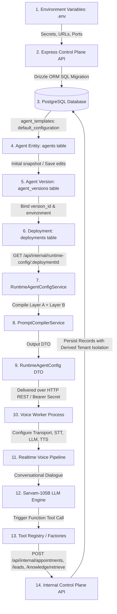

# NextLite Voice V3 — Complete Configuration Dependency Graph

> **Domain**: End-to-End Configuration & Data Flow Graph  
> **Status**: Verified from Codebase (Read-Only)  
> **Timestamp**: 2026-09-09  

---

## 1. Visual Dependency Graph

---

## 2. Step-by-Step Flow Annotations

| Arrow / Step | Data Transferred | Authentication | Transformation Applied | Owning Component |
|---|---|---|---|---|
| **ENV &rarr; API** | `DATABASE_URL`, `JWT_SECRET`, `SARVAM_API_KEY`, `WORKER_API_SECRET`, etc. | Local file / OS env | Zod schema validation & normalization (`apps/api/src/config/env.ts`) | Platform Infrastructure |
| **API &rarr; DB** | Schema DDL, seed data, templates | PostgreSQL Connection String | Drizzle ORM schema mapping (`apps/api/src/db/schema.ts`) | Data Architecture |
| **DB &rarr; Agent** | `templateId`, `tenantId`, `name` | Session JWT (ADMIN) | Clones template config into version v1 (`apps/api/src/services/agent.ts`) | Agent Service |
| **Agent &rarr; Version** | `configuration` (JSONB), `versionNumber` | Session JWT (ADMIN) | Increments version number; normalizes tool bindings (`apps/api/src/services/agent.ts`) | Agent Service |
| **Version &rarr; Deployment** | `versionId`, `agentId`, `tenantId`, `environment` | Session JWT (ADMIN) | Binds active version to `TEST` (on save) or `PRODUCTION` (on publish) | Deployment Service |
| **Deployment &rarr; Resolver** | `deploymentId` (UUID) | Worker Secret (`x-worker-secret`) | Resolves active deployment, agent, and linked version snapshot (`apps/api/src/services/runtimeAgentConfig.ts`) | Control Plane API |
| **Resolver &rarr; Compiler** | `AgentConfiguration` JSONB | In-memory function call | Compiles Layer A safety rules + Layer B customer persona & phases (`apps/api/src/services/promptCompiler.ts`) | Prompt System |
| **Compiler &rarr; RuntimeConfig**| `compiledSystemPrompt` (String) | In-memory function call | Maps to pure `RuntimeAgentConfig` DTO conforming to `@nextlite/shared` | Shared Contract |
| **RuntimeConfig &rarr; Worker** | JSON payload over HTTP REST | Bearer `WORKER_API_SECRET` | Deserialized in worker memory; injects temporal and calendar instructions | Worker Runtime |
| **Worker &rarr; Pipeline** | Sample rate, models, voices, languages | In-process instantiation | Initializes STT (`saaras:v3`), LLM (`sarvam-105b`), TTS (`bulbul:v3`), `ConversationLanguageManager` | Voice Pipeline |
| **Pipeline &rarr; LLM** | User audio frames &rarr; Transcriptions | In-process frame flow | Accumulated in `LLMContext` / user message turn | Speech Recognition |
| **LLM &rarr; Tools** | Function tool call arguments (`query`, `customerName`, `bookingDate`) | In-process function execution | Validates with Zod schema; injects trusted `deploymentId` and `callerPhone` | Tool Registry |
| **Tools &rarr; Internal API** | `{ deploymentId, ...toolArgs }` | Bearer `WORKER_API_SECRET` | HTTP POST to `/api/internal/appointments`, `/leads`, `/knowledge/retrieve` | Worker HTTP Client |
| **Internal API &rarr; DB** | Verified SQL insert / update with derived `tenantId` | PostgreSQL Connection Pool | Concurrency-safe sequencing (`tenant_appointment_counters`); inserts into `appointments`/`leads` | Database Layer |
