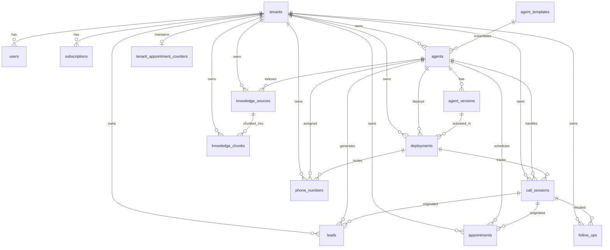

# NextLite Voice V3 — Complete Database & Data Model Audit

> **ORM / Schema File**: `apps/api/src/db/schema.ts`  
> **Migrations Directory**: `apps/api/drizzle/`  
> **Status**: Verified from Codebase (Read-Only)  
> **Timestamp**: 2026-09-09  

---

## 1. Relational Entity Relationship Diagram

---

## 2. Table-by-Table Data Dictionary & Access Control Matrix

### Table 1: `tenants`
- **Columns**: `id` (UUID PK), `name` (varchar 255), `slug` (varchar 255 UNIQUE), `status` (varchar 50 default 'active'), `created_at` (timestamp), `updated_at` (timestamp).
- **Written By**: `apps/api/src/routes/admin.ts` (Admin onboarding).
- **Read By**: All services for tenant validation and profile rendering.
- **Owning Service**: Tenant / Organization Service.
- **Authoritative**: **YES**.
- **Worker Direct Access**: **NO**. Worker never touches this table directly.

---

### Table 2: `users`
- **Columns**: `id` (UUID PK), `tenant_id` (UUID FK &rarr; `tenants.id`), `email` (varchar 255 UNIQUE), `password_hash` (text), `role` (`user_role`: `'ADMIN' | 'CLIENT_OWNER' | 'CLIENT_VIEWER'`), `email_verified` (boolean), `created_at` (timestamp), `updated_at` (timestamp).
- **Written By**: `apps/api/src/routes/auth.ts`, `apps/api/src/routes/admin.ts`.
- **Read By**: Auth middleware, JWT verification.
- **Owning Service**: Auth Service.
- **Authoritative**: **YES**.
- **Worker Direct Access**: **NO**.

---

### Table 3: `agent_templates`
- **Columns**: `id` (UUID PK), `name` (varchar 255), `description` (text), `industry` (varchar 100), `default_configuration` (JSONB), `is_system` (boolean default true), `created_at` (timestamp).
- **Written By**: System seed script / DB migration.
- **Read By**: `apps/api/src/services/template.ts` (Template discovery & agent creation).
- **Owning Service**: `TemplateService`.
- **Authoritative**: **YES** (for baseline presets).
- **Worker Direct Access**: **NO**.

---

### Table 4: `agents`
- **Columns**: `id` (UUID PK), `tenant_id` (UUID FK &rarr; `tenants.id`), `template_id` (UUID FK &rarr; `agent_templates.id`), `name` (varchar 255), `status` (`agent_status`: `'DRAFT' | 'READY' | 'LIVE' | 'PAUSED' | 'ARCHIVED'`), `created_at` (timestamp), `updated_at` (timestamp).
- **Written By**: `apps/api/src/services/agent.ts` (`createAgent`, `updateAgent`, `publishAgent`).
- **Read By**: `apps/api/src/services/agent.ts`, `apps/api/src/services/runtimeAgentConfig.ts`.
- **Owning Service**: `AgentService`.
- **Authoritative**: **YES** (for agent entity metadata).
- **Worker Direct Access**: **NO**.

---

### Table 5: `agent_versions`
- **Columns**: `id` (UUID PK), `agent_id` (UUID FK &rarr; `agents.id`), `version_number` (integer), `configuration` (JSONB), `status` (`version_status`: `'DRAFT' | 'PUBLISHED' | 'ARCHIVED'`), `created_by` (UUID FK &rarr; `users.id`), `notes` (text), `created_at` (timestamp).
- **Written By**: `apps/api/src/services/agent.ts` (`createAgent`, `saveConfiguration`, `publishAgent`).
- **Read By**: `apps/api/src/services/agent.ts`, `apps/api/src/services/runtimeAgentConfig.ts`.
- **Owning Service**: `AgentService`.
- **Authoritative**: **YES (The primary JSONB source of truth for all agent behavior)**.
- **Worker Direct Access**: **NO**.

---

### Table 6: `deployments`
- **Columns**: `id` (UUID PK), `tenant_id` (UUID FK &rarr; `tenants.id`), `agent_id` (UUID FK &rarr; `agents.id`), `version_id` (UUID FK &rarr; `agent_versions.id`), `environment` (`deployment_environment`: `'TEST' | 'PRODUCTION'`), `status` (`deployment_status`: `'ACTIVE' | 'INACTIVE' | 'ROLLED_BACK'`), `created_by` (UUID FK &rarr; `users.id`), `deployed_at` (timestamp), `created_at` (timestamp), `updated_at` (timestamp).
- **Constraints / Indices**:
  - `uniqueIndex('active_deployment_per_agent_env_idx').on(table.agentId, table.environment).where(sql`status = 'ACTIVE'`)`
- **Written By**: `apps/api/src/services/agent.ts` (`createAgent`, `saveConfiguration`, `publishAgent`).
- **Read By**: `apps/api/src/services/runtimeAgentConfig.ts`, `apps/api/src/services/livekit.ts`.
- **Owning Service**: `AgentService`.
- **Authoritative**: **YES (The exact binding between environment and version)**.
- **Worker Direct Access**: **NO**.

---

### Table 7: `call_sessions`
- **Columns**: `id` (UUID PK), `tenant_id` (UUID FK &rarr; `tenants.id`), `agent_id` (UUID FK &rarr; `agents.id`), `deployment_id` (UUID FK &rarr; `deployments.id`), `room_name` (varchar 255), `caller_number` (varchar 50), `direction` (`call_direction`: `'INBOUND' | 'OUTBOUND' | 'WEB_TEST'`), `status` (`call_status`: `'ACTIVE' | 'COMPLETED' | 'FAILED' | 'MISSED'`), `duration_seconds` (integer), `primary_language` (varchar 50), `started_at` (timestamp), `ended_at` (timestamp), `transcript_text` (text), `turns_json` (JSONB), `tools_used` (JSONB), `metrics_json` (JSONB), `created_at` (timestamp).
- **Written By**: `apps/api/src/services/callSession.ts` via `POST/PATCH /api/internal/call-sessions`.
- **Read By**: `apps/api/src/services/callSession.ts`, `apps/api/src/services/analytics.ts`.
- **Owning Service**: `CallSessionService`.
- **Authoritative**: **YES**.
- **Worker Direct Access**: **NO (Worker communicates exclusively via authenticated REST endpoints)**.

---

### Table 8: `leads`
- **Columns**: `id` (UUID PK), `tenant_id` (UUID FK &rarr; `tenants.id`), `agent_id` (UUID FK &rarr; `agents.id`), `call_session_id` (UUID FK &rarr; `call_sessions.id`), `customer_name` (varchar 255), `customer_phone` (varchar 50), `customer_email` (varchar 255), `interest_category` (varchar 255), `status` (`lead_status`: `'NEW' | 'CONTACTED' | 'QUALIFIED' | 'CLOSED'`), `notes` (text), `metadata` (JSONB), `created_at` (timestamp), `updated_at` (timestamp).
- **Written By**: `apps/api/src/services/lead.ts` via `POST /api/internal/leads` (Worker tool execution) or client dashboard.
- **Read By**: `apps/api/src/services/lead.ts`, `apps/api/src/services/analytics.ts`.
- **Owning Service**: `LeadService`.
- **Authoritative**: **YES**.
- **Worker Direct Access**: **NO**.

---

### Table 9: `appointments`
- **Columns**: `id` (UUID PK), `tenant_id` (UUID FK &rarr; `tenants.id`), `agent_id` (UUID FK &rarr; `agents.id`), `call_session_id` (UUID FK &rarr; `call_sessions.id`), `appointment_number` (varchar 50), `customer_name` (varchar 255), `customer_phone` (varchar 50), `title` (varchar 255), `resource_name` (varchar 255), `booking_date` (varchar 50), `booking_time` (varchar 50), `status` (`appointment_status`: `'REQUESTED' | 'CONFIRMED' | 'CANCELLED'`), `notes` (text), `metadata` (JSONB), `created_at` (timestamp), `updated_at` (timestamp).
- **Constraints / Indices**:
  - `uniqueIndex('appointments_tenant_appointment_number_idx').on(table.tenantId, table.appointmentNumber)`
- **Written By**: `apps/api/src/services/appointment.ts` via `POST /api/internal/appointments` (Worker tool execution) or client dashboard.
- **Read By**: `apps/api/src/services/appointment.ts`, `apps/api/src/services/analytics.ts`.
- **Owning Service**: `AppointmentService`.
- **Authoritative**: **YES**.
- **Worker Direct Access**: **NO**.

---

### Table 10: `tenant_appointment_counters`
- **Columns**: `tenant_id` (UUID PK FK &rarr; `tenants.id`), `last_number` (integer default 0), `updated_at` (timestamp).
- **Written By**: `apps/api/src/services/appointment.ts` (Atomic PostgreSQL `INSERT ... ON CONFLICT DO UPDATE SET last_number = last_number + 1`).
- **Read By**: `AppointmentService`.
- **Owning Service**: `AppointmentService`.
- **Authoritative**: **YES (Guarantees no race conditions or duplicate appointment numbers)**.
- **Worker Direct Access**: **NO**.

---

### Table 11: `phone_numbers`
- **Columns**: `id` (UUID PK), `tenant_id` (UUID FK &rarr; `tenants.id`), `agent_id` (UUID FK &rarr; `agents.id`), `deployment_id` (UUID FK &rarr; `deployments.id`), `phone_number` (varchar 50 UNIQUE), `provider` (varchar 50 default 'plivo'), `status` (varchar 50 default 'ACTIVE'), `created_at` (timestamp), `updated_at` (timestamp).
- **Written By**: `apps/api/src/services/phoneNumber.ts`.
- **Read By**: `apps/api/src/services/phoneNumber.ts` (`lookupPhoneNumber`).
- **Owning Service**: `PhoneNumberService`.
- **Authoritative**: **YES**.
- **Worker Direct Access**: **NO**.

---

### Table 12: `follow_ups`
- **Columns**: `id` (UUID PK), `tenant_id` (UUID FK &rarr; `tenants.id`), `lead_id` (UUID FK &rarr; `leads.id`), `appointment_id` (UUID FK &rarr; `appointments.id`), `call_session_id` (UUID FK &rarr; `call_sessions.id`), `customer_name` (varchar 255), `customer_phone` (varchar 50), `channel` (varchar 50 default 'WHATSAPP'), `provider` (varchar 50 default 'DEMO'), `message_type` (varchar 50 default 'CUSTOM'), `message_text` (text), `status` (`follow_up_status`: `'PENDING' | 'SENT' | 'DELIVERED' | 'FAILED'`), `provider_message_id` (varchar 255), `is_demo` (boolean default true), `sent_at` (timestamp), `delivered_at` (timestamp), `failed_at` (timestamp), `metadata` (JSONB), `created_at` (timestamp), `updated_at` (timestamp).
- **Written By**: `apps/api/src/services/whatsapp.ts`.
- **Read By**: `apps/api/src/services/followUp.ts`, `apps/api/src/services/analytics.ts`.
- **Owning Service**: `WhatsAppService` / `FollowUpService`.
- **Authoritative**: **YES**.
- **Worker Direct Access**: **NO**.

---

### Table 13: `knowledge_sources` & `knowledge_chunks`
- **Columns `knowledge_sources`**: `id` (UUID PK), `agent_id` (UUID FK &rarr; `agents.id`), `tenant_id` (UUID FK &rarr; `tenants.id`), `file_name` (varchar 255), `file_path` (text), `file_type` (varchar 50), `chunk_count` (integer), `content_hash` (varchar 64), `status` (`knowledge_source_status`: `'PROCESSING' | 'READY' | 'FAILED'`), `created_at` (timestamp).
- **Columns `knowledge_chunks`**: `id` (UUID PK), `source_id` (UUID FK &rarr; `knowledge_sources.id`), `agent_id` (UUID FK &rarr; `agents.id`), `tenant_id` (UUID FK &rarr; `tenants.id`), `content` (text), `embedding` (JSONB / number array), `chunk_index` (integer), `token_count` (integer), `metadata` (JSONB), `created_at` (timestamp).
- **Written By**: `apps/api/src/services/knowledge.ts`.
- **Read By**: `apps/api/src/services/knowledge.ts` (`retrieveRelevant`).
- **Owning Service**: `KnowledgeService`.
- **Authoritative**: **YES**.
- **Worker Direct Access**: **NO**.

---

### Table 14: `agent_tools` (DEPRECATED)
- **Columns**: `id` (UUID PK), `agent_id` (UUID FK &rarr; `agents.id`), `tool_name` (varchar 255), `tool_config` (JSONB), `enabled` (boolean), `created_at` (timestamp).
- **Status**: **DEPRECATED**. Retained for backward compatibility. Not used in V3 production runtime. Runtime tool bindings are derived authoritatively from `agent_versions.configuration.tools.bindings`.

---

## 3. Database Access Rules for Workers (LiveKit & Pipecat)

> [!CRITICAL]
> **ABSOLUTE ARCHITECTURAL BOUNDARY: WORKERS MUST NEVER ACCESS POSTGRESQL DIRECTLY.**

1. Neither the LiveKit worker (`apps/livekit-worker`) nor the Pipecat worker (`apps/pipecat-worker`) has database driver dependencies (`postgres`, `pg`, `psycopg2`, `drizzle-orm`, etc.).
2. All database mutations (creating call sessions, recording leads, booking appointments, looking up phone numbers) and queries (resolving runtime config, knowledge vector retrieval) **MUST** occur through the NextLite Control Plane REST API (`/api/internal/*`).
3. This guarantees:
   - Centralized tenant isolation enforcement.
   - Atomic concurrency-safe counters (`tenant_appointment_counters`).
   - Audit logging and domain event hooks.
   - Zero exposure of PostgreSQL database credentials to voice worker nodes.
