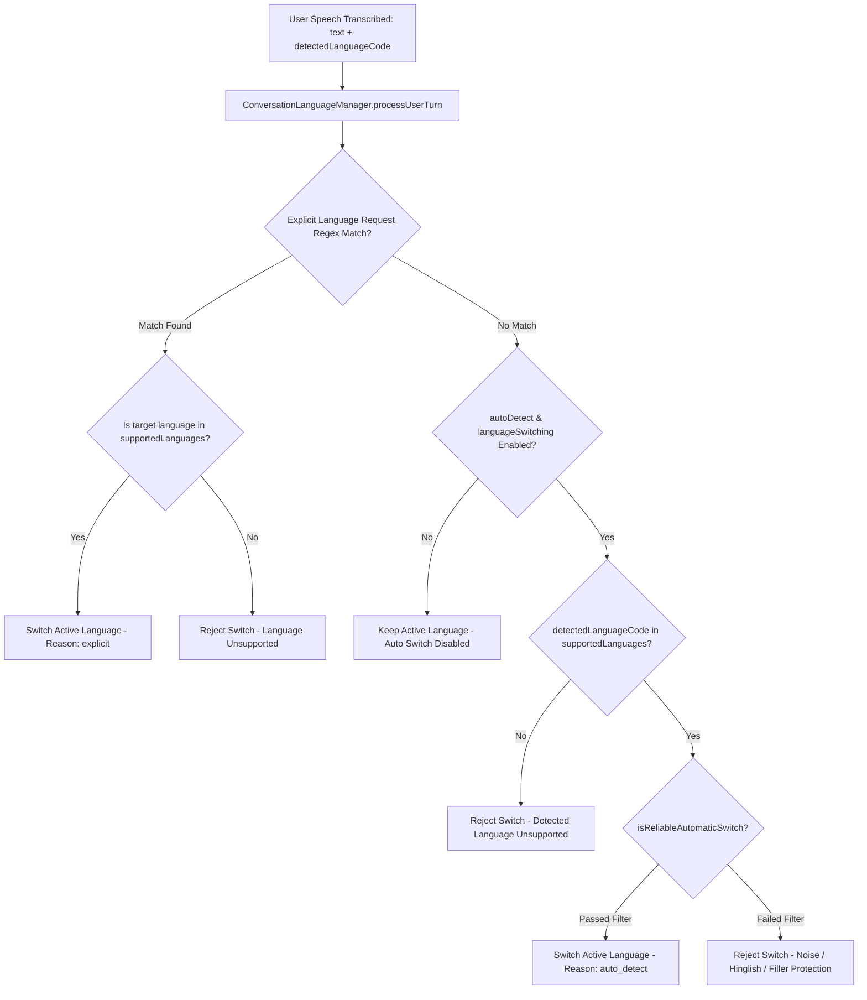

# NextLite Voice V3 — Multilingual & Language Switching Architecture

> **Domain**: Multilingual Speech Recognition, Indic Code-Switching, and Dynamic Language Manager  
> **Owning File**: `apps/livekit-worker/src/languageManager.ts`  
> **Status**: Verified from Codebase (Read-Only)  
> **Timestamp**: 2026-09-09  

---

## 1. Multilingual Decision Pipeline

---

## 2. Supported Indic Languages & BCP-47 Normalization

The system recognizes and normalizes 22 Indian languages to standard BCP-47 tags:
- **English**: `en-IN` (Indian English)
- **Hindi**: `hi-IN`
- **Marathi**: `mr-IN`
- **Bengali**: `bn-IN`
- **Gujarati**: `gu-IN`
- **Kannada**: `kn-IN`
- **Malayalam**: `ml-IN`
- **Odia**: `od-IN` / `or-IN`
- **Punjabi**: `pa-IN`
- **Tamil**: `ta-IN`
- **Telugu**: `te-IN`
- **Assamese**: `as-IN`
- **Urdu**: `ur-IN`
- **Nepali**: `ne-IN`
- **Sanskrit**: `sa-IN`
- **Sindhi**: `sd-IN`
- **Konkani**: `kok-IN`
- **Kashmiri**: `ks-IN`
- **Maithili**: `mai-IN`
- **Dogri**: `doi-IN`
- **Santali**: `sat-IN`
- **Manipuri**: `mni-IN`
- **Bodo**: `brx-IN`

---

## 3. Explicit Language Request Detection

- **Rule**: If the user explicitly asks to speak in a language, this takes absolute priority over STT auto-detection.
- **Pattern Matchers (`EXPLICIT_LANGUAGE_RULES`)**:
  - **English**: `"speak in english"`, `"talk to me in english"`, `"english please"`, `"switch to english"`, `"english mein baat karo"`, `"english madhe bola"`, `"i prefer english"`.
  - **Hindi**: `"हिंदी में बात करो"`, `"हिंदी में बताइए"`, `"hindi mein bolo"`, `"switch to hindi"`, `"hindi please"`, `"क्या आप हिंदी में बात कर सकते हैं"`.
  - **Marathi**: `"मराठीत बोला"`, `"मराठी मध्ये सांगा"`, `"marathit bola"`, `"marathi madhe sanga"`, `"switch to marathi"`, `"marathi please"`.
  - **Bengali, Gujarati, Kannada, Malayalam, Punjabi, Tamil, Telugu, Odia**: Equivalent native script and Latin romanized patterns.
- **Safety Boundary**: If the user requests an explicit language that is **NOT** in the agent's `supportedLanguages` list, the switch is **REJECTED** to prevent unsupported audio failure.

---

## 4. False-Switch Prevention (Hinglish & Minglish Protections)

### 4.1 The Problem:
Callers speaking conversational Hindi or Marathi frequently use borrowed English words (e.g. *"Doctor Sharma ka appointment lena hai"*, *"Mere pass phone number nahi hai"*). Naive STT detectors falsely classify these as English speech, causing speech assistants to awkwardly switch completely to English.

### 4.2 The Solution (`isReliableAutomaticSwitch`):
1. **Length Threshold**: Single words, greetings, or utterances with `< 3 words` (e.g. *"Okay"*, *"Haan"*, *"Doctor"*) are **never** permitted to trigger an automatic language switch.
2. **Indic Script Detection**: If text contains Devanagari / Indic Unicode characters (`[\u0900-\u0D7F]`), it is rejected from switching to English.
3. **Latin Hinglish Grammatical Marker Filter**:
   - Regex: `/\b(?:ka|ki|ke|hai|hain|tha|thi|hoga|hogi|kya|chahiye|batao|bataiye|karo|kijiye|sakta|sakti|sakte|milna|lena|denge|aaj|kal|samay|tarikh|nahi|nahin|haan|mujhe|aap|kaha|bolo|baat|liye|mein|se|ko)\b/i`
   - If active language is Hindi and transcript matches any Hindi particle, switching to English is **BLOCKED**.
4. **Latin Minglish Grammatical Marker Filter**:
   - Regex: `/\b(?:madhe|cha|chi|che|chya|ahe|aahe|ahet|hota|hoti|kay|hava|sanga|bola|kara|shakta|bhetayche|ghyayche|dya|aaj|udya|vel|tarikh|nahi|nahin|sathi|mala|tumhi|kiti|kuthe)\b/i`
   - If active language is Marathi and transcript matches any Marathi particle, switching to English is **BLOCKED**.

---

## 5. Dynamic Prompt Directive Injection

When an active language switch is accepted, the system dynamically updates:
1. **TTS Synthesis Target Language**: `tts.updateOptions({ targetLanguageCode: newLang })`.
2. **LLM System Prompt Instruction**: `buildFullInstructions(basePrompt, newLang)`.
   - Injects conversational code-switching rules:
     - *"Speak natural conversational Hinglish (Hindi + English). Do not force archaic or textbook translations."*
     - *"Keep everyday business terms in English naturally (appointment, booking, timing, phone number, team, fees, pricing, WhatsApp, payment)."*
     - *"DO NOT switch the entire conversation to English merely because the caller uses English words."*

---

## 6. Reusability for Pipecat (Phase 6+)

`ConversationLanguageManager` in `apps/livekit-worker/src/languageManager.ts` is 100% pure, self-contained business logic with zero LiveKit SDK dependencies. In Phase 6+, it can be ported directly or mirrored in Python (`app/language_manager.py`) to give Pipecat identical multilingual switching intelligence.
