# NextLite Voice V3 — RAG & Knowledge Architecture Audit

> **Domain**: Knowledge Ingestion, Chunking, Vector Storage, and Runtime Retrieval  
> **Owning Services**: `apps/api/src/services/knowledge.ts`, `embedding.ts`, `storage.ts`, `chunking.ts`  
> **Status**: Verified from Codebase (Read-Only)  
> **Timestamp**: 2026-09-09  

---

## 1. Complete Knowledge Pipeline Flow

```mermaid
graph TD
    subgraph Ingestion [Ingestion Pipeline - apps/api]
        AdminUpload[Admin Document Upload] -->|POST /api/admin/knowledge/upload| KnowledgeRoute[src/routes/knowledge.ts]
        KnowledgeRoute --> SHA256[SHA-256 Content Deduplication]
        SHA256 --> StorageUpload[Upload Object to Backblaze B2 / S3]
        StorageUpload --> Normalizer[Normalize Text & Markdown Parsing]
        Normalizer --> Chunker[Sliding Window Chunking - 500 chars / 100 overlap]
        Chunker --> EmbeddingAdapter[Nvidia / Gemini Embeddings API]
        EmbeddingAdapter --> DBInsert[Insert into knowledge_sources & knowledge_chunks]
    end

    subgraph RuntimeRetrieval [Runtime Retrieval Pipeline]
        CallerQuery[Caller asks knowledge question] --> LLMToolCall[LLM triggers query_knowledge_base]
        LLMToolCall --> WorkerTool[knowledgeTool in LiveKit / Pipecat]
        WorkerTool -->|POST /api/internal/knowledge/retrieve| InternalRoute[src/routes/internal.ts]
        InternalRoute --> RuntimeConfigCheck[Validate deploymentId & knowledge.enabled]
        RuntimeConfigCheck --> QueryEmbed[Embed Search Query - query mode]
        QueryEmbed --> VectorSearch[Cosine Similarity Search over Tenant Chunks]
        VectorSearch --> ScoreFilter[Apply optional scoreThreshold & topK limit]
        ScoreFilter --> ToolResultJSON[Return Clean Text Results JSON to Worker]
        ToolResultJSON --> LLMResponse[LLM articulates factual voice answer]
    end
```



---

## 2. Ingestion & Storage Architecture

### 2.1 File Storage (`apps/api/src/services/storage.ts`)
- **Storage Provider**: Backblaze B2 (S3-compatible API) via `@aws-sdk/client-s3`.
- **Storage Path**: `knowledge/{tenantId}/{agentId}/{sourceId}/{safeFileName}`.
- **Deduplication**: Computes SHA-256 hash of document buffer. If a record in `knowledge_sources` with the same `tenant_id`, `agent_id`, and `content_hash` already exists, returns existing source ID without duplicate uploads.

### 2.2 Text Chunking (`apps/api/src/services/chunking.ts`)
- **Chunk Size**: 500 characters.
- **Overlap**: 100 characters.
- **Strategy**: Normalizes whitespace, extracts clean markdown text, splits by paragraphs/sentences with sliding window overlap, preserving metadata (`chunkIndex`, `tokenCount`, `fileName`).

### 2.3 Vector Embedding Providers (`apps/api/src/services/embedding.ts`)
- **Default Provider**: Nvidia (`nvidia/nemotron-3-embed-1b`, 2048 dimensions) via `https://integrate.api.nvidia.com/v1/embeddings`.
- **Alternative Provider**: Google Gemini (`gemini-embedding-001`, 2048 dimensions) via Google Generative Language API.
- **Vector Storage**: Stored in `knowledge_chunks.embedding` column as a float vector.

---

## 3. Runtime Retrieval & Isolation (`apps/api/src/routes/internal.ts`)

- **Endpoint**: `POST /api/internal/knowledge/retrieve`
- **Authentication**: `x-worker-secret` / Bearer `WORKER_API_SECRET`
- **Request Body**:
  ```json
  {
    "deploymentId": "e2a4a754-0123-4567-89ab-cdef01234567",
    "query": "What are your OPD hours for cardiology?",
    "topK": 3
  }
  ```
- **Isolation Enforcement**:
  1. `runtimeAgentConfigService.resolveRuntimeAgentConfig(deploymentId)` authoritatively derives `tenantId` and `agentId`.
  2. If `runtimeConfig.knowledge.enabled === false`, returns `{ results: [] }` immediately.
  3. SQL query strictly filters chunks: `where: and(eq(knowledgeChunks.tenantId, tenantId), eq(knowledgeChunks.agentId, agentId))`.
  4. Cross-tenant or cross-agent chunk leakage is mathematically impossible at the database query boundary.
- **Response Structure**:
  ```json
  {
    "results": [
      {
        "content": "Cardiology OPD runs Monday to Friday from 10:00 AM to 2:00 PM with Dr. Sharma.",
        "score": 0.89,
        "sourceId": "550e8400-e29b-41d4-a716-446655440000"
      }
    ]
  }
  ```

---

## 4. What Pipecat Needs to Know vs What NextLite Owns

### Explicit Answer to Architecture Requirement:

> **"What does Pipecat need to know about RAG, and what must remain exclusively inside NextLite?"**

| Responsibility | NextLite API (Owner) | Pipecat Worker (Consumer Only) |
|---|---|---|
| **Document Storage & S3 / B2 Keys** | **EXCLUSIVELY NEXTLITE** | **NEVER** exposed to Pipecat. |
| **Chunking Logic & Token Counting** | **EXCLUSIVELY NEXTLITE** | **NEVER** touched by Pipecat. |
| **Embedding Model & API Keys** | **EXCLUSIVELY NEXTLITE** | **NEVER** handled by Pipecat. |
| **Vector Similarity Calculation** | **EXCLUSIVELY NEXTLITE** | **NEVER** computed in Pipecat. |
| **Tenant & Agent Boundary Filtering** | **EXCLUSIVELY NEXTLITE** | **NEVER** trusted to Pipecat. |
| **Tool Calling Contract** | NextLite defines endpoint & schema | Pipecat registers tool: `query_knowledge_base(query: str)`. |
| **Tool Execution** | NextLite executes search & returns text results | Pipecat sends `POST /api/internal/knowledge/retrieve` with `{ deploymentId, query }`. |
| **LLM Context Injection** | NextLite returns sanitized chunk strings | Pipecat passes chunk text into native LLM tool output frame. |

> [!IMPORTANT]
> Pipecat is **strictly a consumer** of RAG via the `POST /api/internal/knowledge/retrieve` REST API. Pipecat must NOT install vector databases, embedding SDKs, or chunking libraries.
